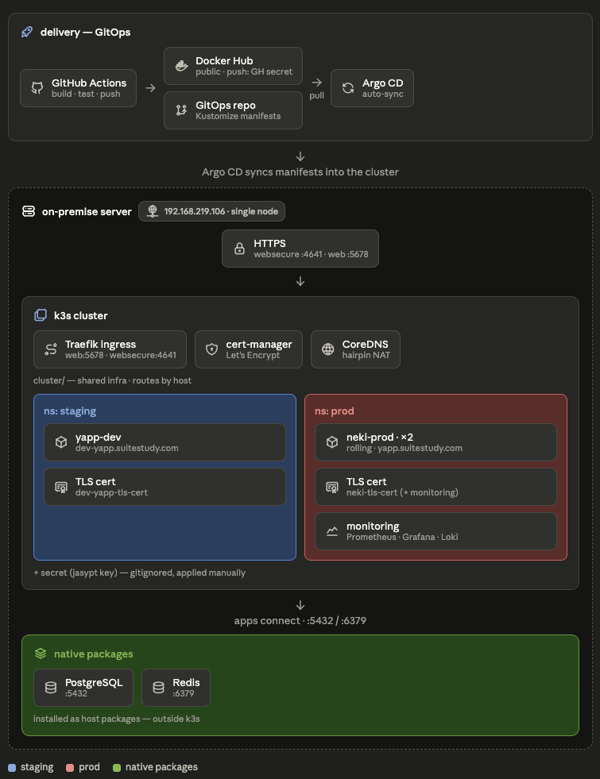

# 

> "Neki, 네컷의 순간이 이어지는 곳"

### 네컷사진의 시작부터 보관까지, 당신의 기록을 완성하는 서비스

####  QR 스캔 한 번으로 앨범에 즉시 저장
흩어져 있던 종이 사진과 디지털 파일을 NEKI 하나로 끝내세요. QR 스캔 한 번으로 앱에서 바로 저장하고, 날짜별/폴더별로 정리됩니다.
####  QR이 없어도 걱정 NO
예전에 찍어둔 사진이나 QR 유효기간이 지난 사진도 직접 업로드하여 동일하게 관리할 수 있습니다.
####  "오늘 뭐 하지?" 포즈 고민 해결
카메라 앞에서 당황하지 마세요! NEKI가 제안하는 트렌디한 포즈와 '랜덤 포즈' 기능이 당신의 자연스러운 촬영을 도와드립니다.
####  원하는 브랜드만 쏙쏙! 완벽한 네컷 지도
지금 바로 찍고 싶을 때, 주변의 사진관을 확인하세요. 브랜드 필터를 사용해 내가 선호하는 브랜드만 골라 찾을 수 있습니다.
####  추억을 테마별로 관리
친구, 연인, 특별한 기념일 등 목적에 맞춰 폴더를 만들고 소중한 순간들을 테마별로 기록하세요.


<br>

## Tech Stack

| 분류 | 기술 |
|------|------|
| Language | Kotlin 2.0, Java 21 |
| Framework | Spring Boot 3.5 |
| Database | PostgreSQL 14 (PostGIS), Redis 6 |
| ORM | JPA + QueryDSL |
| Migration | Flyway |
| Auth | JWT, OAuth 2.0 (Kakao, Apple OIDC) |
| Storage | AWS S3 (LocalStack for local) |
| API Docs | SpringDoc OpenAPI (Swagger) |
| Test | Kotest, MockK |
| Code Style | ktlint (Spotless) |
| CI/CD | GitHub Actions |
| Infra | k3s (staging / prod) |

<br>

## 패키지 아키텍처

도메인별로 패키지를 나누고, 각 도메인 내부는 **Clean Architecture** 기반의 계층으로 구성됩니다.

```
api          HTTP 요청/응답 처리 (Controller, DTO, Converter)
application  비즈니스 로직 (UseCase, Port, Command/Query, Result)
infra        외부 의존성 구현체 (JPA, Redis, S3, 외부 API 등)
```

핵심 엔티티와 도메인 규칙은 별도 모듈 `domain`으로 분리되어 있습니다. 의존성 방향은 항상 `api → application → domain` 단방향이며, `infra`는 `application`의 Port 인터페이스를 구현합니다. 도메인 간 직접 import는 금지하고, 필요한 경우 Port를 통해 통신합니다.

Gradle 멀티 모듈로 구성되어 있습니다. `core`는 공유 커널, `domain`은 JPA 엔티티,
`apps/api`은 api·application·infra 어댑터를 담는 실행 모듈이며,
`modules/*`는 외부 의존성의 연결 설정만 관리합니다.

```
apps/api/src/main/kotlin/com/neki/
├── common/          공통 예외 처리, BaseResponse, JWT 필터, 설정 등
├── user/            회원가입, 로그인, 프로필, 탈퇴
├── photo/           사진 업로드, 폴더 관리, 즐겨찾기
├── pose/            포즈 추천, 스크랩
├── map/             네컷 지도, 부스 위치 검색
├── media/           S3 Presigned URL 발급, 미디어 관리
├── support/         약관, 앱 버전
└── notification/    Discord 알림
```

<br>

## 인프라 구성



<br>

## 로컬 개발 환경 설정

**사전 준비**: Docker Desktop, JDK 21

### 1. 인프라 실행

```bash
docker compose up -d
```

PostgreSQL(5432), Redis(6379), LocalStack S3(4566)가 함께 올라옵니다.

### 2. 애플리케이션 실행

```bash
./gradlew bootRun
```

`local` 프로파일이 기본으로 적용됩니다. 의존성별 설정은 `modules/{module}/src/main/resources/application-{module}.yaml` 에 프로파일 문서로 나뉘어 있습니다. 환경변수나 추가 설정이 필요한 경우 팀 노션을 참고하세요.

### 3. 빌드 및 테스트

```bash
./gradlew build          # 전체 빌드
./gradlew test           # 전체 테스트
./gradlew spotlessApply  # 코드 포맷 적용 (커밋 전 필수)
```

<br>

## DB 스키마 관리

스키마 변경은 반드시 **Flyway 마이그레이션 파일**로 관리합니다.

```
modules/postgres/src/main/resources/db/migration/
├── V1__create_users_table.sql
├── V2__create_folder_and_photo_image_table.sql
└── ...
```

- 파일명 규칙: `V{버전}__{설명}.sql`
- 한 번 적용된 마이그레이션 파일은 수정하지 않습니다
- `@Column` 길이·타입·제약조건 변경 시 반드시 다음 버전 파일을 추가해야 합니다

<br>

## 브랜치 전략

```
main      프로덕션 배포
feat/#이슈번호  기능 개발
fix/#이슈번호   버그 수정
```

작업은 `feat/#이슈번호` 브랜치에서 진행하고 `main`으로 PR을 올립니다.

<br>

## 커밋 컨벤션

```
feat:     새로운 기능
fix:      버그 수정
refactor: 리팩토링 (기능 변경 없음)
chore:    빌드, 설정, 의존성 등 기타 작업
docs:     문서 수정
test:     테스트 코드
```

예시: `feat: 포즈 스크랩 기능 구현`

<br>

## 코드 컨벤션

- **포맷**: `./gradlew spotlessApply` (ktlint 기반, 커밋 전 필수)
- **응답**: 모든 API 응답은 `BaseResponse`로 래핑
- **예외**: 비즈니스 예외는 `BusinessException` 사용
- **타입 선언**: 메서드/함수 호출 결과를 변수에 담을 때 명시적 타입 선언
  ```kotlin
  // 메서드 호출 결과 → 타입 명시
  val result: GetUserResult = getUserUseCase.execute(userId)

  // 생성자, 리터럴 → 타입 추론
  val result = GetUserResult(userId = 1L, name = "test")
  ```
- **테스트**: E2E 테스트(`E2ETestBase` 상속) + UseCase 단위 테스트(MockK)

<br>


