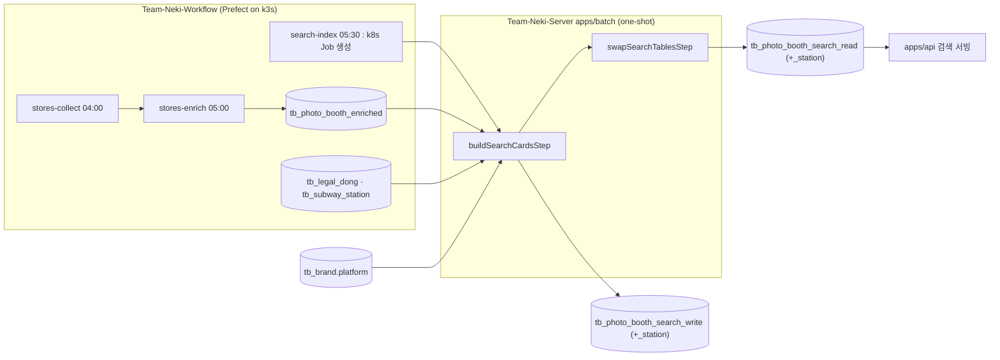

# 포토부스 검색 색인 High-Level Design

이 문서는 포토부스 통합 검색이 읽는 검색 색인을 어떻게 만들고 교체하는지를 다룹니다. 2026-10-04 As-Built 기준이며 확인 기준 코드는 `main`(`98ce050a`)입니다. 실제 구현 상태는 코드가 정본이고, 진행 상황과 남은 작업은 plan 과 Sprint 티켓에서 관리합니다. 검색 색인을 읽는 쪽은 서빙 HLD(`docs/hld/2026-10-04-search-serving-hld.md`)가 다룹니다.

## 0. Executive Summary

- 해결하는 문제 : 검색 API 가 "이 지역의 부스", "이 역 근처의 부스" 를 요청마다 계산하지 않고 인덱스 하나로 답할 수 있도록, 수집한 지점 데이터를 검색 전용 형태로 미리 가공해 둠
- 핵심 구조 : Workflow(Prefect) 가 매일 수집·보강한 `tb_photo_booth_enriched` 를 Server 의 one-shot Spring Batch 잡 `searchIndexJob` 이 읽어 검색 색인 `tb_photo_booth_search_write` 를 전량 재생성하고, 한 트랜잭션에서 `_read` 와 이름을 맞바꿈
- 책임 : 수집·좌표 보강·실행 시각은 Workflow, 색인 규칙(지점명 정리, 정규화, 지역 계층 펼치기, 역 1km 매핑)과 교체는 Server(apps/batch). 서빙은 `_read` 이름만 읽음
- 변경하는 것 : `apps/batch` 의 `searchIndexJob`, 검색 색인 테이블 두 벌(V33), `tb_brand.platform`(V32). 변경하지 않는 것 : Workflow 의 수집·보강 flow, 지도 API, 지점 마스터(`TB_PHOTO_BOOTH_LOCATION`)
- 가장 중요한 결정 : (1) Elasticsearch 대신 PostgreSQL 에 미리 계산한 색인 (2) 증분 갱신 대신 전량 재생성 + `_read`/`_write` 두 벌 이름 맞바꾸기 (3) 지역 계층과 역 반경을 색인 시점에 미리 펼쳐 두기
- 미결 : 지점 마스터의 관리자 보정값(`override_*`)을 색인에 반영할지, 정규화 규칙 변경 시 재색인 절차

## 1. Background / Goals / Scope

### 1.1 Background

지도 화면은 현재 위치 반경이나 화면 영역으로만 부스를 찾을 수 있었습니다. 통합 검색은 "강남구", "강남역 2호선" 처럼 사용자가 고른 지역·역에 딸린 부스를 지도에 한 번에 그려야 합니다. 그런데 원천 데이터에는 이 질문에 바로 답할 수 있는 값이 없습니다.

- 지역 : 부스에는 주소 문자열과 좌표만 있음. "강남구에 속하는가" 를 답하려면 법정동 코드가 있어야 하고, 시군구를 고르면 그 아래 읍면동까지 포함해야 함
- 역 : "강남역 1km 안" 을 답하려면 부스와 역 사이 거리를 계산해야 함. 역은 노선마다 승강장 위치가 달라 노선별로 따로 계산해야 함
- 지점명 : 수집한 이름에 브랜드명이 붙어 있는 경우가 있어("포토시그니처 고현점") 그대로 쓰면 화면과 검색이 어긋남

따라서 검색 요청마다 이 값을 계산하는 대신, 하루 한 번 미리 계산해 둔 검색 색인을 만들어 서빙이 인덱스 하나로 답하게 하는 구조가 필요했습니다.

### 1.2 Goals

- 지역(어느 계층이든)과 역(노선별 1km) 질의가 각각 인덱스 하나로 끝남
- 색인을 다시 만드는 동안에도 검색 API 는 완성된 직전 세대를 계속 읽음
- 입력이 비었거나 일부 유실되면 서빙 중인 색인을 덮지 않음
- 색인 규칙(정규화, 지점명 정리)이 한 곳에만 있어 색인과 질의가 같은 규칙을 씀

### 1.3 Requirements

| ID | 요구사항 | 범위 |
|---|---|---|
| R-1 | 수집·보강된 지점마다 검색 행 한 개를 만든다 (원천 키 platform + idx) | 포함 |
| R-2 | 지역 검색을 위해 법정동 코드를 시도·시군구·읍면동·법정동으로 펼쳐 둔다 | 포함 |
| R-3 | 역 검색을 위해 노선별 역 1km 안 지점을 미리 연결해 둔다 | 포함 |
| R-4 | 브랜드는 서버의 `tb_brand` 와 연결해 브랜드 id·이름·코드를 붙인다 | 포함 |
| R-5 | 하루 한 번 전량 재생성하고, 교체는 원자적으로 한다 | 포함 |
| R-6 | 지점의 실시간 반영 (수집 즉시 검색 노출) | Spec-out |
| R-7 | 관리자 보정값(지점명·주소·좌표 override)의 색인 반영 | Spec-out, Open Issue |

### 1.4 Non-goals

- 수집과 좌표·법정동 보강 : Workflow 의 `stores-collect`, `stores-enrich` 책임
- 법정동·지하철역 마스터 적재 : Workflow 의 `legal-dong`, `subway-station` flow 책임
- 지점 마스터(`TB_PHOTO_BOOTH_LOCATION`) 동기화 : Workflow 의 `stores-sync`(BACKEND-153) 책임. 색인과 별개 경로
- 검색어 해석과 응답 조립 : 서빙 HLD 범위
- 형태소 분석, 오타 교정, 랭킹

## 2. As-Is 와 설계를 결정한 제약

- 수집 데이터는 Workflow 가 소유한다 : 원천 사이트 11곳의 지점 목록을 Workflow 가 수집하고, 좌표로 법정동 코드를 보강해 `tb_photo_booth_enriched` 에 현재 세대로 남깁니다. Server 는 이 테이블의 계약 8열(platform, idx, name, address, longitude, latitude, source_dt, b_code)만 알고, 나머지 운영 열은 모르도록 했습니다. **이 경계 때문에 색인은 Workflow 와 테이블 하나로만 만나는 별도 단계가 되었습니다.**
- 검색 조건이 정해져 있다 : 검색 정책상 질의는 "고른 지역", "고른 역", "브랜드" 로 정해져 있고 데이터는 수천 건 규모입니다. 자유 형태의 전문 검색이 아니라 정해진 질의를 빠르게 답하는 문제라서, 별도 검색 엔진보다 질의마다 맞춘 인덱스가 맞았습니다.
- 서빙 테이블은 Flyway 가 소유한다 : 이 저장소의 스키마는 api 가 Flyway 로 migrate 합니다. 색인을 매번 새 테이블로 만들고 지우면 Flyway 가 모르는 테이블이 생기므로, 테이블은 마이그레이션으로 고정하고 내용만 갈아 끼워야 했습니다.
- 실행 주체가 따로 있다 : 실행 시각과 재시도는 Workflow(Prefect)가 정합니다. Server 쪽 실행 모듈은 상주 스케줄러가 아니라 한 번 실행하고 종료 코드로 결과를 알리는 프로세스여야 Prefect 가 성공·실패를 판단할 수 있었습니다(BACKEND-128).
- 수집은 부분 실패를 허용한다 : 한 브랜드 수집이 실패해도 나머지는 적재하고, 보강에서 좌표를 못 찾은 지점은 법정동 코드 없이 남습니다. 색인은 이런 부분 입력을 받아도 서빙을 망가뜨리지 않아야 했습니다.

## 3. To-Be Architecture

### 3.1 Responsibility Boundary

| 책임 | Workflow | apps/batch (searchIndexJob) | apps/api (서빙) |
|---|---|---|---|
| 지점 수집, 좌표·법정동 보강 | O | | |
| 법정동·역 마스터 적재 | O | | |
| 색인 실행 시각, 재시도, 중복 실행 방지 | O | | |
| 브랜드 연결 (platform -> tb_brand) | | O | |
| 파생 필드 계산 (지점명, 정규화, 지역 계층, 역 1km) | | O | |
| 입력 하한 검사, 세대 교체 | | O | |
| 색인 테이블 스키마 migrate | | | O (Flyway) |
| `_read` 조회 | | | O |
| 실패 알림 | O (Prefect Automation -> Discord) | 종료 코드만 | |

### 3.2 Core Concept

- 검색 색인 : `tb_photo_booth_search_*` 테이블. 서빙이 읽는 이름은 `_read`, 잡이 채우는 이름은 `_write` 이고, 두 물리 테이블(슬롯 a, b)이 이름을 번갈아 가짐
- 색인 행 : 검색 색인의 한 행. 수집 지점 하나(원천 키 platform + idx)에 해당. 코드에서는 `PhotoBoothSearch`(읽기)와 `PhotoBoothSearchWrite`(쓰기)
- 원천 키 : (platform, idx). 수집 사이트와 그 사이트의 지점 id. 세대를 넘어 유지되는 유일한 식별자이며, 서빙은 이 키로 지점 마스터와 짝지음
- 세대 : 색인 잡 한 번이 만든 색인 행 전체. 행마다 `business_date`(색인 기준일)와 `source_dt`(원천 수집일)를 따로 남김
- 지역 계층 (`region_ids`) : 법정동 코드 10자리에서 시도·시군구·읍면동·법정동 코드 4개를 뽑아 배열로 저장한 값
- 역 연결 (`_station`) : 색인 행과 1km 안 역(역명, 노선명, 거리 m)의 연결 행
- 정규화 규칙 (`SearchNormalizer`) : 소문자화와 공백·`-`·`_` 제거. 색인과 질의가 같은 함수를 씀

### 3.3 Architecture Invariants

- 서빙은 `_read` 이름만 읽고, `_read` 는 언제나 완성된 한 세대다. 만드는 중인 세대는 `_write` 에만 있다
- 세대 교체(이름 맞바꾸기)는 한 트랜잭션이다. 밖에서는 직전 세대와 새 세대 중 하나만 보인다
- 입력이 0건이거나 서빙 중 행 수의 절반 미만이면 `_write` 를 건드리기 전에 실패한다. 실패해도 `_read` 는 그대로다
- 두 슬롯의 스키마는 같다. 색인 테이블을 바꾸는 마이그레이션은 두 벌에 함께 적용한다
- 파생 필드는 `PhotoBoothSearchWrite.of()` 한 곳만 계산하고, 정규화 규칙은 `SearchNormalizer` 한 곳에만 있다. 규칙을 바꾸면 색인을 다시 만들어야 한다
- 색인 행 id 는 세대마다 새로 생기므로 외부에 식별자로 내주지 않는다. 세대를 넘는 식별자는 원천 키다
- batch 는 Flyway `validate` 만 하고 migrate 는 api 가 한다
- 교체 트랜잭션 안에는 외부 호출이나 추가 DB 작업을 넣지 않는다 (락을 쥐고 있는 시간이 늘어나므로)

### 3.4 API Boundary

색인은 HTTP API 를 내지 않습니다. 경계는 테이블과 실행 계약입니다.

| 경계 | 답하는 질문 |
|---|---|
| `tb_photo_booth_enriched` 8열 (Workflow -> 색인) | 지금 세대에 어떤 지점이 어디에 있는가 |
| `searchIndexJob` 실행 계약 (`businessDate`, `force`, 종료 코드) | 이번 색인이 성공했는가 |
| `tb_photo_booth_search_read` (+`_station`) (색인 -> 서빙) | 이 지역·이 역에 딸린 부스는 무엇인가 |

### 3.5 Data Flow

1. 실행 : Prefect `search-index` flow 가 batch 이미지로 k8s Job 을 만들고 `--spring.batch.job.name=searchIndexJob businessDate=<사이클>` 로 실행
2. 입력 읽기 : enriched 전체, `tb_brand`(platform 이 있는 것), 지하철역 전체를 읽음
3. 행 조립 : 지점마다 platform 으로 브랜드를 찾고, 좌표가 있으면 `PhotoBoothSearchWrite.of()` 가 지점명 정리, 정규화 문자열, 지역 계층, 원천 사이트 키, 1km 안 역을 계산. 브랜드가 없거나 좌표가 없는 지점은 건너뛰고 건수를 남김
4. 하한 검사 : 0건이거나 서빙 중 행 수의 절반 미만이면 실패 (`force=true` 면 절반 검사만 건너뜀)
5. `_write` 채우기 : `_write` 와 연결 테이블을 비우고 새 행을 넣은 뒤 `ANALYZE` (갓 채운 테이블의 통계가 비어 첫 질의가 seq scan 을 고르지 않도록)
6. 교체 : 다음 step 이 한 트랜잭션에서 `lock_timeout` 1초를 걸고 `_read -> _tmp`, `_write -> _read`, `_tmp -> _write` 로 이름을 회전
7. 종료 : 종료 코드 0(성공) 또는 0 아님(실패). Prefect 가 이 값으로 flow 결과를 정하고 실패면 Discord 로 알림

2~5 는 `buildSearchCardsStep`, 6 은 `swapSearchTablesStep` 입니다. step 을 나눈 이유는 오래 걸리는 채우기와 락을 쥐는 교체를 다른 트랜잭션으로 분리하기 위해서입니다.

## 4. Architecture Decisions

### DEC-1. 검색 엔진 대신 PostgreSQL 에 미리 계산한 색인

- Context : 질의가 정해져 있고(지역, 역, 브랜드) 데이터가 수천 건이다
- Decision : 기존 PostgreSQL(PostGIS) 에 검색 전용 테이블을 두고, 질의마다 인덱스를 맞춘다 (`region_ids` GIN, 역 연결 테이블 인덱스, `location` GIST)
- Alternatives : Elasticsearch 등 별도 검색 엔진, 요청마다 기존 지도 테이블에서 계산
- Why : 별도 색인 파이프라인과 클러스터를 운영하지 않아도 되고, 트랜잭션 안에서 세대를 원자적으로 교체할 수 있음
- Trade-off : 형태소 분석, 오타 교정, 랭킹 같은 전문 검색 기능이 없고, 부분 일치는 인덱스 없이 풀스캔이 됨
- Consequence : 이 가운데 하나가 요구사항이 되면 검색 엔진 도입을 다시 검토해야 함

### DEC-2. 전량 재생성 + `_read`/`_write` 두 벌 이름 맞바꾸기

- Context : 색인은 하루 한 번 바뀌는 원천 전체를 반영해야 하고, 재생성 중에도 서빙이 끊기면 안 된다
- Decision : V33 이 두 벌을 한 번만 만들고, 잡은 `_write` 만 갈아엎은 뒤 이름을 맞바꾼다
- Alternatives : 한 트랜잭션 `DELETE + INSERT` / 실행마다 새 테이블 `CREATE` 후 교체·`DROP` / 원천 키 기준 증분 upsert
- Why : `DELETE + INSERT` 는 재생성 내내 서빙 테이블에 쓰기 락이 걸림. 매번 `CREATE/DROP` 은 Flyway 가 모르는 테이블을 만들어 마이그레이션 소유와 충돌함. 증분은 사라진 지점 삭제와 세대 일관성을 따로 관리해야 함
- Trade-off : 이름 변경은 ACCESS EXCLUSIVE 락이라 긴 조회가 앞에 있으면 뒤따르는 검색 요청이 잠깐 줄을 섬. 색인 스키마를 바꾸는 마이그레이션을 두 벌에 함께 적용해야 함
- Consequence : 직전 세대가 다음 실행 전까지 `_write` 에 남아, 교체를 한 번 더 하면 되돌릴 수 있음. 인덱스·제약 이름은 테이블을 따라가므로 테이블 이름이 아니라 슬롯(a, b)으로 지음

### DEC-3. 지역 계층과 역 반경을 색인 시점에 펼쳐 둔다

- Context : 지역은 어느 계층을 골라도 그 아래를 포함해야 하고, 역은 노선별 1km 안이어야 한다
- Decision : 지역은 법정동 코드에서 4계층 코드를 뽑아 `region_ids` 배열로 저장하고, 역은 색인 시점에 행 x 역 전수 비교(haversine)로 1km 안 역을 연결 테이블에 남긴다
- Alternatives : 질의 시점에 법정동 계층을 조인하거나 코드 접두사로 비교 / 질의 시점에 PostGIS `ST_DWithin` 으로 반경 계산 / 색인 시점에 `ST_DWithin` 으로 연결
- Why : 어느 계층이든 질의가 배열 포함 검사 하나(GIN)로 같아지고, 역 질의도 연결 테이블 조회 하나로 끝남. haversine 은 서빙이 사용자 거리에 쓰는 함수와 같아 값이 어긋나지 않음
- Trade-off : 반경이 1km 로 고정되어 사용자가 바꿀 수 없음. haversine 은 1km 경계에서 회전타원체 계산과 수 m 차이가 날 수 있음. 전수 비교는 행 수 x 역 수에 비례
- Consequence : 데이터가 수만 x 수천 규모로 늘면 연결 계산을 `ST_DWithin` 으로 옮겨야 함 (코드에 `ponytail:` 주석으로 표시)

### DEC-4. 색인 조립은 Server 의 one-shot Spring Batch, 실행은 Workflow

- Context : 색인 규칙(정규화, 지점명 정리)은 서빙과 같은 코드여야 하고, 실행 시각과 재시도는 Workflow 가 이미 관리한다
- Decision : `apps/batch` 의 Spring Batch 잡으로 만들고, Prefect 가 k8s Job 으로 한 번 실행한 뒤 종료 코드로 성공·실패를 판단한다
- Alternatives : Workflow(Python) 에서 색인까지 만들기 / Server 에 상주 스케줄러와 트리거 API 두기
- Why : 정규화 규칙을 서빙(Kotlin)과 한 함수로 공유할 수 있음. 상주 모드를 두지 않아 실행 주체가 하나(Prefect)로 모임
- Trade-off : Server 와 Workflow 두 저장소에 걸친 배포가 필요하고(배치 이미지 태그는 GitOps 가 정본), Prefect 가 클러스터 밖에서 보이지 않아 운영 확인 경로가 길어짐
- Consequence : `RunIdIncrementer` 로 같은 `businessDate` 도 항상 새 실행이므로 잡은 처음부터 다시 돌아도 같은 결과여야 함. 중복 실행 방지는 Prefect concurrency limit 이 맡음

### DEC-5. 입력 하한 검사로 서빙 색인을 지킨다

- Context : 보강이 아직 돌지 않았거나 일부 브랜드만 적재된 날에도 잡은 돈다
- Decision : 만들 행이 0건이면 실패, 서빙 중 행 수의 절반 미만이면 실패. 의도한 감소면 `force=true` 로 절반 검사만 건너뜀
- Alternatives : 검사 없이 교체 / 브랜드별 건수 비교
- Why : 0건이나 대량 유실 세대로 교체하면 검색이 통째로 비거나 줄어듦. 전체 건수 비교가 가장 단순하게 큰 사고를 막음
- Trade-off : 절반 이상 남은 부분 유실(브랜드 하나가 빠진 경우 등)은 통과함
- Consequence : 브랜드 단위 유실은 건너뛴 건수 로그와 `BATCH_STEP_EXECUTION` 의 filter count 로 사후에 확인함

### DEC-6. 브랜드 연결은 `tb_brand.platform` 컬럼으로

- Context : 수집 쪽 브랜드 식별자(platform)와 서버 브랜드(`tb_brand`)가 다르다
- Decision : V32 로 `tb_brand.platform` 을 추가하고 색인 시점에 이 값으로 조인한다. platform 이 없는 브랜드의 지점은 색인에서 빠지고 경고만 남긴다
- Alternatives : Kotlin 상수표로 매핑
- Why : 브랜드 추가·변경을 배포 없이 데이터로 맞출 수 있음
- Trade-off : platform 을 채우지 않은 브랜드는 조용히 빠질 수 있음 (경고 로그로만 드러남)
- Consequence : 새 브랜드를 수집하면 `tb_brand.platform` 을 함께 채워야 검색에 나옴
- Superseded (BACKEND-228, V38) : 수집 쪽 platform 값을 `tb_brand.code` 로 바꾸고 `tb_brand.platform` 을 지웠다. 색인은 `tb_brand.code` 로 조인한다. 그래서 운영 중 브랜드 code 를 바꾸면 수집 원천 키와 어긋난다

## 5. Data / Index Dependencies

| 데이터 | 소유 | 갱신 | 색인이 쓰는 방식 |
|---|---|---|---|
| `tb_photo_booth_enriched` (8열) | Workflow | 매일 05:00 KST, 이름 교체 방식 | 지점 원천. 좌표 없는 행은 건너뜀, `b_code` 없는 행은 `region_ids` 빈 배열 |
| `tb_subway_station` | Workflow | 매월 1일 06:00 KST | 역 1km 연결 |
| `tb_brand` (`platform`) | Server | 관리자·마이그레이션 | 브랜드 id·이름·코드 스냅샷 |
| `BATCH_*` 메타 | Server (Notification 앱과 공동) | 실행마다 | 실행 이력, write/filter count |

색인은 05:30 KST 에 돌며 앞 단계와 시각으로만 순서를 맞춥니다. 앞 단계가 늦으면 그 시점의 현재 세대로 색인하고 다음 날 따라잡습니다. 그래서 "오늘 색인이 오늘 수집분인가" 는 보장하지 않고, 행마다 `source_dt` 와 `business_date` 를 따로 남겨 사후에 구분합니다.

## 6. Impacted Systems

- apps/batch : `searchIndexJob`(두 step), 스캔 범위에 `com.neki.domain.search` 와 map 영속 어댑터 추가
- domain/search : 색인 엔티티 두 벌, 원천 읽기 전용 엔티티(`PhotoBoothEnriched`, `SubwayStation`), `SearchNormalizer`, 저장소 포트와 어댑터
- modules/postgres : V32(`tb_brand.platform`), V33(색인 테이블 두 벌)
- Workflow : `search-index` flow 가 batch 이미지로 Job 을 만듦 (Workflow 저장소)
- 변경하지 않음 : 지도 API, 지점 마스터, 수집·보강 flow

## 7. Failure & Degradation

| 상황 | 동작 | 서빙에 보이는 결과 |
|---|---|---|
| 보강이 아직 안 돎, enriched 비어 있음 | 0건 검사로 실패 | 직전 세대 그대로 |
| 일부 브랜드 수집 실패 | 절반 이상 남으면 교체, 미만이면 실패 | 빠진 브랜드만 사라지거나 직전 세대 그대로 |
| 좌표 없는 지점 | 그 지점만 건너뜀 | 그 지점이 검색에 없음 |
| `b_code` 없는 지점 | `region_ids` 빈 배열로 색인 | 지역 검색에서만 빠지고 역 검색에는 나옴 |
| platform 없는 브랜드 | 그 브랜드 지점 전부 건너뜀, 경고 로그 | 그 브랜드가 검색에 없음 |
| 교체 시 락 획득 실패 (1초) | 교체 step 실패, 회전 전체 롤백 | 직전 세대 그대로. 잡을 다시 실행 |
| Job 실패 | 종료 코드 0 아님 -> Prefect flow 실패 -> Discord 알림 | 직전 세대 그대로 |

failure isolation 단위는 세대입니다. 어느 step 에서 실패해도 `_read` 는 바뀌지 않으므로 서빙은 직전 세대를 계속 읽습니다. 반대로 실패가 이어지면 서빙 색인이 계속 오래된 상태로 남을 수 있으므로, 실패 알림과 `business_date` 로 신선도를 확인합니다.

## 8. NFR / Observability

- 신선도 : 하루 한 번. 교체 순간에만 새 세대로 넘어감
- 교체 락 : 이름 변경은 ACCESS EXCLUSIVE. `lock_timeout` 1초는 락을 얻기까지 기다리는 시간만 제한하고, 얻은 락은 step 메타데이터 갱신과 커밋까지 유지됨. 교체 중 검색 응답 지연은 저트래픽 시각(05:30)과 오라클 O-R-7 의 관찰로 확인
- 규모 가정 : 행 수천 x 역 1,100 안팎. 역 연결 전수 비교와 `_write` 전체 재작성이 이 규모를 전제로 함
- 관측 : step 완료 로그(색인 건수, 역 연결 수, 건너뛴 건수, 서빙 중 건수), `BATCH_STEP_EXECUTION` 의 write/filter count, Prefect flow 상태와 Discord 알림
- 탐지 공백 : 절반 이상 남은 부분 유실은 실패가 아니므로 건너뛴 건수와 브랜드별 건수 로그로만 드러남

## 9. Risks

- 테스트가 H2 로 돎 : 교체 SQL(`lock_timeout`, `ANALYZE`)과 PostgreSQL DDL 롤백은 H2 와 문법·동작이 달라, PostgreSQL 에서의 롤백은 테스트로 보장되지 않음. Testcontainers 로 옮기면 이 분기를 지울 수 있음
- 정규화 규칙 변경 : `SearchNormalizer` 를 바꾸면 색인과 질의가 어긋나므로 규칙 변경과 재색인이 함께 배포되어야 함
- 두 벌 스키마 드리프트 : 마이그레이션이 한 벌에만 적용되면 교체 직후 서빙이 깨질 수 있음
- 관리자 보정 미반영 : 색인은 enriched(수집 원문)를 읽으므로, 지점 마스터에 관리자가 고친 지점명·주소·좌표는 검색 결과에 나오지 않음

## 10. Open Issues

- 관리자 보정값(`override_*`)을 색인에 반영할지, 반영한다면 색인 입력을 지점 마스터로 바꿀지 - Owner: BACKEND / Blocking: no
- 정규화 규칙이 바뀔 때의 재색인 절차(배포 순서, 강제 실행) - Owner: BACKEND / Blocking: no
- 같은 자리 지점 묶음 키(`site_key`)와 부분 일치용 `search_text` 는 색인에 있지만 서빙이 아직 쓰지 않음. 쓰지 않기로 하면 열을 정리할지 - Owner: BACKEND / Blocking: no

## Appendix A. Source of Truth

| 관심사 | Source of Truth |
|---|---|
| 실제 구현 | 코드 (`apps/batch/search`, `domain/search`) |
| 색인 테이블 스키마 | Flyway V33 (`modules/postgres`) |
| 원천 입력 계약 | BACKEND-64 (enriched 8열) |
| 실행 계약 (one-shot, 종료 코드) | BACKEND-128, `docs/superpowers/specs/2026-09-23-batch-module-design.md` |
| 완료 판정 | `docs/oracle/search-index-job.md` |
| 배치 이미지 태그 | Team-Neki-GitOps `overlays/prefect/images.env` |

## Appendix B. Decision History

- 재생성 방식 : 티켓 초안은 한 트랜잭션 `DELETE + INSERT` 였으나, 재생성 내내 서빙 테이블에 락이 걸리는 문제로 두 벌 이름 맞바꾸기로 바꿈 (DEC-2)
- 조립 위치 : 처음에는 domain 에 색인 서비스와 브랜드 client 를 두었으나, api 가 `com.neki` 전체를 스캔하면서 어댑터 빈이 없어 기동이 깨져 조립을 batch 의 Tasklet 으로 옮김. Tasklet 이 step 트랜잭션 안의 일의 단위라 별도 UseCase 계층도 두지 않음
- 실행 모드 : 상주 스케줄러와 트리거 API 를 두었다가 one-shot 실행으로 바꿈 (DEC-4)
- 역 매핑 : PostGIS `ST_DWithin` 대신 haversine 전수 비교 (DEC-3)

## Appendix C. Related Documents

- 서빙 HLD : `docs/hld/2026-10-04-search-serving-hld.md`
- Sprint 위키 "검색 아키텍처" (`cmuisstuf0007ix01uu2r159s`), "검색 정책" (`cms4lm8we000vf801wnq6ku4t`)
- PR #326 (searchIndexJob), PR #327 (apps/batch)
