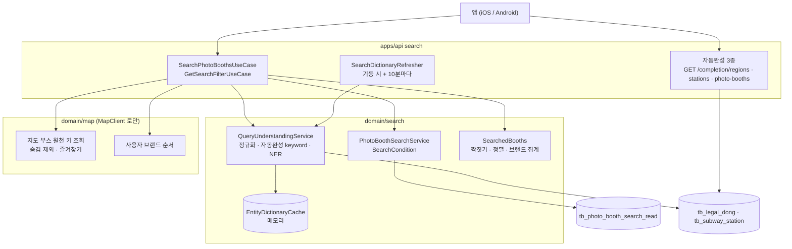

# 포토부스 검색 서빙 High-Level Design

이 문서는 검색 색인을 읽어 사용자 검색어에 답하는 서빙 구조를 다룹니다. 2026-10-04 As-Built 기준이며, 확인 기준 코드는 자동완성이 `feat/BACKEND-152`(`c6d853ef`), 부스 목록·브랜드 필터가 `feat/BACKEND-123` 입니다. 실제 구현 상태는 코드가 정본이고 API 세부 계약은 Swagger 를 따릅니다. 검색 색인을 만드는 쪽은 색인 HLD(`docs/hld/2026-10-04-search-indexing-hld.md`)가 다룹니다.

## 0. Executive Summary

- 해결하는 문제 : 사용자가 검색어로 후보(지역·역·부스)를 고르고, 고른 지역·역에 딸린 부스를 지도와 바텀시트에 한 번에 그림. 같은 범위에서 실제로 있는 브랜드만 칩으로 띄움
- 핵심 구조 : 자동완성 API 가 후보 keyword 를 내리고, 부스 목록·필터 API 는 그 keyword 를 QU(정규화 -> 자동완성 keyword 확인 | NER -> Intent)로 이해해 검색 색인을 조회한 뒤, 지도 부스(map)와 짝지어 id·즐겨찾기를 붙이고 정렬·집계함
- 책임 : 검색어 해석과 색인 조회는 search 도메인, 부스 id·즐겨찾기·숨김·사용자 브랜드 순서는 map 도메인, 둘을 잇는 순서는 유스케이스
- 변경하는 것 : search API 와 도메인, map 도메인의 원천 키 조회. 변경하지 않는 것 : 검색 색인 잡, 지도 API 동작, 스키마
- 가장 중요한 결정 : (1) 자동완성 keyword 를 정확 일치로 먼저 보고 나머지는 QU/NER 로 해석 (2) 응답 id 는 색인 행 id 가 아니라 원천 키로 찾은 지도 부스 id (3) 지역·역은 범위, 브랜드는 조건 (4) NER 사전은 메모리에 두고 10분마다 갱신 (5) 결과 없음은 에러가 아니라 빈 목록
- 미결 : 부스 목록 페이징(정책 13장과 iOS 계약은 20개 페이징), 자동완성 후보에 브랜드를 어떻게 실어 보낼지, 여러 지역·역을 함께 적었을 때 합집합과 교집합

## 1. Background / Goals / Scope

### 1.1 Background

검색 정책(Sprint 위키 "검색 정책")은 검색을 두 단계로 나눕니다. 검색어를 입력하면 통합검색 후보 목록을 보여 주고, 사용자가 후보를 골랐을 때만 지도검색을 실행합니다. 지도검색 범위는 고른 후보에 따라 정해집니다(자치구 전체, 역 1km, 자치구·역 + 브랜드).

검색 색인은 "이 지역·이 역의 부스" 를 이미 미리 계산해 두었지만, 서빙이 풀어야 할 문제가 남아 있었습니다.

- 검색어 해석 : 자동완성에서 고른 값(`서울특별시 강남구`, `강남역 2호선`)과 사용자가 직접 친 문장(`강남구 포토이즘`, `포토이즘 강남역`)을 모두 지역·역·브랜드로 바꿔야 함
- 식별자 : 색인 행 id 는 하루마다 새로 생기는데, 클라이언트는 응답 id 로 즐겨찾기와 상세 조회를 함
- 사용자별 값 : 즐겨찾기와 브랜드 칩 순서는 사용자마다 다르고 map 도메인이 정본임
- 일관성 : 같은 범위에서 브랜드 칩의 개수와 목록 건수가 달라지면 안 됨

### 1.2 Goals

- 자동완성으로 고른 후보와 자유 검색어가 같은 API 로 같은 결과에 도달함
- 응답 id 가 지도 API·즐겨찾기 API 와 같은 부스 id 라서 클라이언트가 그대로 이어 쓸 수 있음
- 목록과 브랜드 필터가 항상 같은 부스 집합을 봄
- 결과 순서를 서버가 확정해 iOS·Android 가 같은 순서를 보여 줌

### 1.3 Requirements

| ID | 요구사항 | 범위 |
|---|---|---|
| R-1 | 지역 자동완성 (법정동 이름·전체 경로 접두 일치, 시도 제외) | 포함 |
| R-2 | 역 자동완성 (역명 접두 일치, 노선별 한 후보, 위치가 있으면 가까운 순) | 포함 |
| R-3 | 부스 자동완성 (이름 앞부분 일치, 또는 낱말마다 브랜드명·지점명·주소에 포함) | 포함 |
| R-4 | 고른 지역·역의 부스 목록 (지역은 하위 구역 포함, 역은 1km) | 포함 |
| R-5 | 자치구·역 + 브랜드 자유 검색어 (단어 순서 무관, 정책 19장) | 포함 |
| R-6 | 목록에 실제로 있는 브랜드만 칩으로, 사용자 브랜드 순서로 | 포함 |
| R-7 | 정렬 : 위치가 있으면 거리 -> 지점명, 없으면 브랜드 -> 지점명 | 포함 |
| R-8 | 부스마다 내 즐겨찾기 여부 | 포함 |
| R-9 | 결과 없음과 지원하지 않는 검색은 같은 빈 결과 (정책 20장) | 포함 |
| R-10 | 부스 목록 20개 페이징과 전체 건수 (정책 13장) | Spec-out. 전체를 한 번에 내림, Open Issue |
| R-11 | 브랜드 동의어·오타 (정책 18장) | Spec-out |
| R-12 | 서울 밖 지역의 자유 검색어 해석 (정책 1장) | Spec-out. 자동완성 keyword 로는 전국 지역을 고를 수 있음 |

### 1.4 Non-goals

- 검색 색인의 생성과 교체 : 색인 HLD 범위
- 지점 마스터 동기화(수집 지점을 `TB_PHOTO_BOOTH_LOCATION` 에 upsert) : Workflow `stores-sync`(BACKEND-153)
- 화면 이동 시 재검색, 브랜드만 고른 후보의 화면(viewport) 검색 : 기존 지도 API 범위
- 검색 결과 랭킹, 개인화

## 2. As-Is 와 설계를 결정한 제약

- 검색 색인은 원천 키만 안정적이다 : 색인 행 id 는 세대마다 다시 만들어지고, 세대를 넘어 유지되는 값은 원천 키 (platform, idx) 뿐입니다. 반면 즐겨찾기(`TB_FAVORITE_MAP`)는 지점 마스터 id(`TB_PHOTO_BOOTH_LOCATION.id`)를 참조합니다. **그래서 응답 id 는 색인이 아니라 지점 마스터에서 와야 했고, V34 가 마스터에 원천 키를 둔 것이 이 연결을 가능하게 했습니다.**
- 도메인 격리 : search 와 map 은 서로 import 할 수 없고, 다른 도메인 호출은 유스케이스가 `client` 인터페이스로 합니다(ArchUnit 검사). 즐겨찾기와 브랜드 순서는 map 이 정본이므로 search 는 map 을 client 로만 부릅니다.
- batch 와 도메인을 공유한다 : `apps/batch` 가 `com.neki.domain.search` 를 스캔하므로, search 도메인 빈이 apps/api 에만 있는 빈(map client 어댑터)에 기대면 batch 기동이 깨집니다. 다른 도메인 호출이 유스케이스에 있어야 하는 이유가 하나 더 생겼습니다.
- 클라이언트 계약 : mock 단계에서 요청은 `keyword` 쿼리 파라미터 + `filterGroup` body 로 합의했고, 자동완성 응답은 `keyword` 문자열입니다. iOS 는 후보와 결과의 순서를 서버 응답 그대로 씁니다(IOS-17).
- 데이터 규모 : 지역 2만여 행(시군구 269), 역 1,100 안팎(역 x 노선), 부스 수천 건. 사전 전체를 메모리에 두고, 목록을 페이징 없이 한 번에 내려도 되는 크기입니다.

## 3. To-Be Architecture

### 3.1 Responsibility Boundary

| 책임 | 자동완성 (BACKEND-152) | QU | 색인 조회 (`PhotoBoothSearchService`) | map 도메인 | 유스케이스 | `SearchedBooths` |
|---|---|---|---|---|---|---|
| 검색어 -> 후보 keyword 목록 | O | | | | | |
| keyword -> 지역·역·브랜드 (QueryIntent) | | O | | | | |
| 범위와 브랜드 조건 계산 (SearchCondition) | | | O | | | |
| 색인에서 범위의 부스 조회 | | | O | | | |
| 부스 id, 숨김 제외, 즐겨찾기 | | | | O | | |
| 사용자 브랜드 순서 | | | | O | | |
| 색인 행과 지도 부스 짝짓기 | | | | | | O |
| 정렬, 브랜드별 개수 | | | | | | O |
| 호출 순서 (QU -> 조회 -> map -> 짝짓기) | | | | | O | |

### 3.2 Core Concept

- 자동완성 keyword : 자동완성 응답의 후보 문자열. 지역은 시도부터 이어 붙인 전체 경로(`서울특별시 강남구`), 역은 `역명역 노선명`(`강남역 2호선`), 부스는 `브랜드명 지점명`(`포토이즘 강남1호점`)
- QueryIntent : 검색어를 어떻게 이해했는가. 정규화 검색어, 인식한 엔티티(범위 순), 남은 조각. 조회 조건이 아니며 `QueryIntent.of()` 로만 만듦
- SearchTarget : 검색어가 가리킨 대상. `Area`(혼자서 범위가 되는 것 : `Region`, `Station`)와 `Brand`(범위 안을 거르는 조건)로 나뉨
- NER 사전 (`EntityDictionary`) : 정규화한 이름 -> 대상. 서울 자치구 이름과 줄임말(`강남구`, `강남`), `역명역`(노선마다 한 항목), 색인에 있는 브랜드 이름으로 만듦
- SearchCondition : QueryIntent 와 요청 브랜드 필터를 조회 조건으로 바꾼 것. 범위(지역·역 목록)와 브랜드 id 목록
- 지도 부스 (`MapBooth`) : 색인 행과 원천 키가 같은 지점 마스터의 id 와 내 즐겨찾기 여부. map 이 정본
- SearchedBooths : 색인 행과 지도 부스를 짝지은 결과 집합. 목록과 필터가 같은 집합을 씀

### 3.3 Architecture Invariants

- 같은 keyword 와 필터에서 브랜드 필터의 count 합계는 부스 목록 건수와 같다 (`SearchedBooths` 하나에서 정렬과 집계를 함께 꺼냄, E2E 로 검증)
- 응답 id 는 지도 부스 id(`TB_PHOTO_BOOTH_LOCATION.id`)다. 색인 행 id 는 밖으로 나가지 않는다
- 지도에 없거나 `admin_hidden` 인 부스는 목록과 필터 모두에서 빠진다
- 검색어 해석은 QU 한 곳에서만 한다. 자동완성 keyword 정확 일치가 NER 보다 먼저다
- 정규화 규칙은 `SearchNormalizer` 하나이며 사전 키와 검색어가 같은 함수를 거친다
- 지역·역은 범위이고 서로 합집합, 브랜드는 조건이고 요청 브랜드 필터와 교집합이다. 범위가 없으면 결과는 빈 목록이다
- 결과 순서는 서버가 확정한다. 클라이언트는 재정렬하지 않는다
- search 도메인은 map 을 `MapClient` 로만 부르고, 그 호출은 유스케이스가 한다
- 정상적인 결과 없음과 지원하지 않는 검색어는 같은 응답(200, 빈 목록)이다

### 3.4 API Boundary

| API | 답하는 질문 |
|---|---|
| `GET /api/search/completion/regions` | 이 검색어로 고를 수 있는 지역 후보는 무엇인가 |
| `GET /api/search/completion/stations` | 이 검색어로 고를 수 있는 역(노선별) 후보는 무엇인가 |
| `GET /api/search/completion/photo-booths` | 이 검색어로 고를 수 있는 부스 후보는 무엇인가 |
| `POST /api/search/photo-booths?keyword=` | 고른 지역·역(과 브랜드)의 부스는 누구이고 어떤 순서인가 |
| `POST /api/search/filter?keyword=` | 그 부스들 안에 어떤 브랜드가 몇 개 있는가 |

부스 id 를 내리는 API 는 부스 목록 하나뿐이고, 그 id 는 지도 API 와 같은 원천(지점 마스터)에서 옵니다. 필터는 브랜드 id 와 개수만 내리고, 브랜드 이미지는 기존 브랜드 조회 API 의 값을 클라이언트가 id 로 맞춰 씁니다. 자동완성은 후보 문자열만 내리고 부스 id 를 내리지 않습니다.

### 3.5 Data Flow

부스 목록 한 번의 흐름입니다. 필터는 5단계까지 같고 마지막에 브랜드별로 셉니다.

1. Normalization : 앞뒤·연속 공백을 정리한 검색어로 자동완성 keyword 를 비교하고, NER 은 소문자·공백 제거 규칙으로 정규화한 문자열 위에서 돎
2. Understanding : 지역 전체 경로(법정동 `full_name` 정확 일치)와 역 keyword(`역명역 노선명` 을 PK 로 조회)를 종류마다 확인해 맞는 것을 모두 담음. 하나도 맞지 않으면 메모리 사전으로 NER 을 돌려 지역·역·브랜드를 뽑음
3. Condition : 지역·역은 범위, 브랜드는 요청 필터와 교집합. 범위가 없거나 교집합이 비면 조회 없이 빈 목록
4. Retrieval : 범위마다 색인을 조회(지역은 `region_ids` 배열 포함, 역은 연결 테이블 조인)하고 합집합
5. Map booth resolution : 조회한 색인 행의 원천 키로 map 에서 지도 부스를 찾음. 숨긴 지점은 빠지고, 같은 트랜잭션에서 내 즐겨찾기를 확인
6. Pairing : 원천 키가 같은 색인 행과 지도 부스를 짝지음. 지도에 없는 색인 행은 여기서 빠짐
7. Ordering : 위치가 있으면 거리 -> 지점명, 없으면 브랜드 -> 지점명 (필터는 브랜드별 개수를 사용자 브랜드 순서로)
8. Assembly : 부스 정보는 색인 행, id 와 즐겨찾기는 지도 부스 값으로 응답을 만듦

2 -> 4 -> 5 는 앞 단계의 결과가 다음 질의를 정하므로 순차입니다. 4 의 범위별 조회는 서로 독립이지만 범위가 보통 하나라 순차로 둡니다.

## 4. Architecture Decisions

### DEC-1. 자동완성 keyword 를 먼저 보고, 나머지는 QU/NER 로 해석한다

- Context : 클라이언트는 자동완성 후보를 골라 그 문자열을 그대로 보내지만, 정책 19장은 `강남구 포토이즘` 같은 섞인 검색어도 지역 + 브랜드로 해석하기를 요구한다
- Decision : 종류별 정확 일치(지역 전체 경로, `역명역 노선명`)를 먼저 보고, 맞지 않으면 QU(정규화 -> NER -> Intent)로 서울 자치구·역·브랜드를 뽑는다
- Alternatives : 요청 body 에 지역 코드·역 식별자를 따로 받기(초기 mock 스키마) / 자동완성 keyword 만 받고 나머지는 결과 없음 / 자유 검색어 전체를 텍스트 조건까지 포함해 해석(이전 NER 설계)
- Why : 클라이언트가 법정동 코드나 노선 식별자를 몰라도 됨. 정확 일치를 먼저 보지 않으면 서울 밖 지역(`경상남도 진주시 강남동`)이 사전의 `강남`(강남구)으로 잘못 잡힘. 남은 조각을 텍스트 조건으로 쓰지 않아 색인의 부분 일치 풀스캔이 필요 없음
- Trade-off : NER 이 인식하지 못한 조각(지점명, 사전에 없는 말)은 결과를 좁히지 않아 `강남구 아무말` 은 강남구 전체가 나옴. 사전에 `역` 없는 역명이 없어 `홍대입구 포토이즘` 은 범위를 찾지 못함
- Consequence : 자동완성 keyword 형식이 바뀌면 QU 의 정확 일치도 함께 바꿔야 함 (역 형식은 `SubwayStation` 한 곳에 있음)

### DEC-2. 응답 id 는 원천 키로 찾은 지도 부스 id

- Context : 색인 행 id 는 하루마다 바뀌고, 즐겨찾기는 지점 마스터 id 를 참조한다
- Decision : 색인 행의 원천 키 (platform, idx) 로 지점 마스터를 찾아 그 id 와 즐겨찾기를 내리고, 마스터에 없거나 숨긴 부스는 뺀다
- Alternatives : 색인 행 id 를 그대로 내리고 즐겨찾기는 항상 false / 색인에 지점 마스터 id 를 함께 저장
- Why : 응답 id 를 지도·즐겨찾기 API 와 그대로 이어 쓸 수 있고, 관리자 숨김이 검색에도 바로 반영됨
- Trade-off : 지점 마스터 동기화(stores-sync)가 돌지 않은 부스는 색인에 있어도 검색에 나오지 않음. 요청마다 map 조회가 한 번 늘어남
- Consequence : 서빙은 stores-sync 를 선행 조건으로 가짐. 색인에 마스터 id 를 저장하는 방식은 색인과 동기화의 실행 순서를 엮게 되어 택하지 않음

### DEC-3. 지역·역은 범위, 브랜드는 조건

- Context : 정책 7장에서 지역·역은 지도검색의 범위이고, 브랜드만 고르면 이 API 가 아니라 화면 영역 검색이다
- Decision : `SearchTarget.Area`(지역·역)와 `SearchTarget.Brand` 를 타입으로 나누고, 조회는 `Area` 만 받는다. 여러 범위는 합집합, 브랜드는 요청 필터와 교집합
- Alternatives : 모든 엔티티를 같은 조건으로 AND / 브랜드만 있는 검색어는 전국 검색
- Why : 브랜드가 범위로 잘못 넘어가는 것을 컴파일러가 막음. 검색어 브랜드와 칩 필터가 함께 있을 때 둘 다 만족하는 것이 사용자가 기대하는 결과임
- Trade-off : `강남구 역삼역` 처럼 범위를 둘 적으면 교집합이 더 자연스러울 수 있음
- Consequence : 범위 결합 규칙은 Open Issue 로 남김

### DEC-4. NER 사전은 메모리에 두고 10분마다 다시 만든다

- Context : 사전은 자치구 25개, 역 1,100 안팎, 브랜드 십여 개로 작고, NER 은 검색어 하나에 사전 조회를 수백 번 한다
- Decision : 앱이 뜰 때 동기로 사전을 만들어 메모리에 올리고(readiness 전), 10분마다 새로 만들어 참조 하나만 바꿔 끼운다. 저장소는 `EntityDictionaryCache` 인터페이스로 두어 Redis 등으로 바꿀 수 있게 함
- Alternatives : 요청마다 DB 에서 사전 만들기 / 색인 교체 시각에만 갱신 / Redis 공유 사전
- Why : 요청마다 사전용 쿼리 3번이 사라짐. 갱신 중에도 요청은 이전 사전이나 새 사전 하나를 통째로 봄
- Trade-off : 색인에 새 브랜드가 생기거나 역 마스터가 바뀌어도 최대 10분 늦게 반영됨. 인스턴스마다 사전을 따로 만듦
- Consequence : 사전 갱신이 실패하면 이전 사전을 계속 씀. 처음부터 실패하면 자유 검색어만 빈 결과가 되고 자동완성 keyword 는 동작함

### DEC-5. 결과 없음은 에러가 아니라 빈 목록

- Context : 정책 20장은 결과 없음과 지원하지 않는 검색을 같은 화면으로 안내하고, iOS 도 같은 빈 결과로 처리한다(IOS-21)
- Decision : 범위를 찾지 못한 검색어도 200 과 빈 목록을 내린다
- Alternatives : 가리키는 지역·역이 없으면 D-04 (초기 계약)
- Why : 클라이언트가 같은 화면을 위해 에러와 빈 배열을 따로 처리하지 않아도 됨
- Trade-off : 클라이언트가 "지원하지 않는 검색어" 와 "결과 없음" 을 구분할 수 없음. 서버 쪽에서도 장애로 생긴 빈 결과와 구분하려면 로그를 봐야 함
- Consequence : 초기 mock 명세의 D-04 계약과 달라 클라이언트에 알려야 함

### DEC-6. 목록과 필터는 흐름을 각자 드러내고, 불변식은 테스트가 지킨다

- Context : 두 API 는 3단계(이해, 조회, 지도 부스)가 같고 마지막만 다르다
- Decision : 두 유스케이스가 각자 흐름을 명시하고, 짝짓기·정렬·집계는 도메인 컬렉션 `SearchedBooths` 하나에 둔다. "칩 개수 합계 = 목록 건수" 는 E2E 로 검증한다
- Alternatives : 공통 단계를 도메인 서비스로 내리기 / 유스케이스 하나에 두 진입점
- Why : 공통 단계에 map 호출이 있어 도메인 서비스로 내릴 수 없고(도메인 격리, batch 스캔), 유스케이스에서 흐름이 그대로 읽힘
- Trade-off : 호출 세 줄이 두 곳에 중복되어 한쪽만 바뀌면 어긋날 수 있음
- Consequence : 어긋남은 불변식 테스트가 잡음

### DEC-7. 부스 목록은 페이징하지 않는다

- Context : 지도에 고른 범위의 부스를 한 번에 그린다. 반면 정책 13장과 iOS 계약(IOS-17, 19)은 20개씩 페이징을 적고 있다
- Decision : 전체를 한 번에 내린다 (mock 명세와 같음)
- Alternatives : page/size 와 전체 건수를 받는 페이징
- Why : 지도 마커와 목록이 같은 전체 집합을 써야 하고, 자치구 하나의 부스는 수십~수백 건이라 한 번에 내릴 수 있음
- Trade-off : 범위가 넓어지면 응답 크기에 상한이 없음. 클라이언트 계약 문서와 다름
- Consequence : 클라이언트와 정렬이 필요한 Open Issue

## 5. Data / Index Dependencies

| 데이터 | 소유 | 갱신 | 서빙이 쓰는 방식 |
|---|---|---|---|
| `tb_photo_booth_search_read` | Server (색인 잡) | 매일 05:30 KST 교체 | 범위 조회, 부스 표시 정보, 사전의 브랜드 |
| `TB_PHOTO_BOOTH_LOCATION` (원천 키, `admin_hidden`) | Server 스키마, Workflow `stores-sync` 가 적재 | stores-sync 주기 | 응답 id, 숨김 제외 |
| `TB_FAVORITE_MAP`, `TB_USER_BRAND_ORDER` | Server (map) | 사용자 요청 즉시 | 즐겨찾기, 칩 순서 |
| `tb_legal_dong`, `tb_subway_station` | Workflow | 매월 1일 | 자동완성, 정확 일치, 사전 |
| NER 사전 (메모리) | apps/api | 기동 시 + 10분 | NER |

검색 결과는 캐시하지 않습니다. 요청마다 색인과 지도 부스를 다시 읽으므로 즐겨찾기 변경은 바로 반영되고, 색인 교체는 교체 직후 요청부터 반영됩니다.

## 6. Impacted Systems

- apps/api search : 부스 목록·필터 컨트롤러와 유스케이스, `SearchMapClient`(map 호출 어댑터), `SearchDictionaryRefresher`, `@EnableScheduling`
- domain/search : `service/qu`(QU, NER), `models/qu`(QueryIntent, 사전), `SearchCondition`, `SearchedBooths`, `PhotoBoothSearchService`, 색인 조회 쿼리, 사전 캐시
- domain/map : 지점 마스터의 원천 키·숨김 매핑, 원천 키 조회, 이를 쓰는 조회 유스케이스
- 변경하지 않음 : 검색 색인 잡과 스키마, 지도·즐겨찾기 API 의 동작

## 7. Failure & Degradation

| 상황 | 동작 | 화면에 보이는 결과 |
|---|---|---|
| 사전 갱신 실패 (기동 후) | 이전 사전 유지, error 로그, 10분 뒤 재시도 | 변화 없음 |
| 사전 적재 실패 (기동 시) | 빈 사전으로 기동, 10분 뒤 재시도 | 자유 검색어만 빈 결과. 자동완성 keyword 는 정상 |
| stores-sync 미적재 | 색인 행이 지도 부스와 짝지어지지 않음 | 빈 결과 (정상 결과 없음과 같은 모양) |
| 색인 비어 있음 | 조회 결과 없음 | 빈 결과 |
| map·색인 DB 조회 오류 | 예외 전파, 5xx | 오류 화면. 결과를 캐시하지 않아 고착되지 않음 |
| 법정동·역 테이블 조회 오류 | 자동완성과 정확 일치 실패, 5xx | 오류 화면 |

failure isolation 단위는 요청입니다. 결과를 캐시하지 않으므로 일시 장애가 빈 화면으로 고착되지 않습니다. 대신 stores-sync 미적재나 사전 적재 실패는 정상적인 결과 없음과 같은 빈 응답을 만들기 때문에 응답만으로는 구분할 수 없습니다. 이 경우는 8장의 로그로 구분합니다.

## 8. NFR / Observability

- 요청당 쿼리 : 정확 일치 확인 최대 2번(역은 `역 ` 형식일 때만 PK 조회), 범위마다 색인 조회 1번, map 원천 키 조회와 즐겨찾기 조회. 필터는 브랜드 순서 조회가 더해짐
- 응답 크기 : 페이징이 없어 범위의 부스 수에 비례
- 검색 로그 : `[SEARCH] api=photo-booths keyword=... entities=[...] remainingTerms=[...] indexed=N results=M`. `indexed > 0` 인데 `results = 0` 이면 지도 부스와 짝지어지지 않은 것(stores-sync 미적재 또는 전부 숨김)을 의심할 수 있음
- 사전 로그 : `[SEARCH] dictionary refreshed entries=N heapUsedMb=...`. entries 가 0 이면 사전 원천(법정동·역·색인)을 확인. 갱신을 거듭해도 heap 이 계속 오르면 이전 사전이 회수되지 않는 것을 의심
- 지역 조회 인덱스 : `region_ids @> array[...]` 는 GIN 을 쓸 수 있는 형태로 나감. 행이 적으면 planner 가 seq scan 을 고를 수 있음

## 9. Risks

- 계약 변경 : 결과 없음이 D-04 에서 빈 목록으로 바뀜(DEC-5). 클라이언트가 D-04 를 기다리면 빈 화면 처리가 어긋남
- 부스 자동완성 keyword 를 목록 API 에 넘기는 경우 : `포토이즘 강남1호점` 의 `강남1호점` 은 지점명으로 해석되어 범위가 없으므로 빈 결과. 정책상 부스 후보는 목록 API 를 부르지 않지만 클라이언트 흐름 확인이 필요함
- 자동완성이 브랜드를 떼어 냄 : 지역·역 자동완성은 `강남 포토이즘` 에서 브랜드 낱말을 빼고 후보를 내므로, 그 후보를 고르면 브랜드 조건이 사라짐
- 사전 범위 : 역 사전은 전국 역이라 `송정역` 은 서울과 부산 두 역이 모두 범위가 됨. 서울 밖 `부산 중구` 는 사전의 서울 `중구` 로 잡힐 수 있음
- 관리자 보정 미반영 : 부스 이름·주소·좌표는 색인 스냅샷이라 지점 마스터의 관리자 보정이 보이지 않음
- 테스트 환경 : 테스트는 H2 라 PostgreSQL 에서의 `array_contains` 렌더링(`@>`)과 실행 계획은 배포 후 확인함

## 10. Open Issues

- 부스 목록 페이징 : 정책 13장·iOS 계약(20개, 전체 건수)과 현재 계약(전체 한 번에)을 맞춤 - Owner: BACKEND, iOS / Blocking: 클라이언트 연동
- 자치구·역 + 브랜드 후보 : 정책 4장의 `강남구 포토이즘` 후보를 자동완성이 어떤 keyword 로 내릴지 (예: `서울특별시 강남구 포토이즘` 을 내리면 목록 API 는 NER 로 해석함) - Owner: BACKEND(152, 123) / Blocking: no
- 범위 결합 : 지역과 역을 함께 적은 검색어를 합집합으로 둘지 교집합으로 바꿀지 - Owner: BACKEND / Blocking: no
- 남은 조각 : 사전에 없는 말을 텍스트 조건(`search_text`)으로 좁힐지 - Owner: BACKEND / Blocking: no
- `역` 없는 역명(`홍대입구`)을 사전에 넣을지. 자치구 줄임말과 겹치는 이름(`강남`)의 처리 규칙이 함께 필요 - Owner: BACKEND / Blocking: no
- 브랜드 동의어·오타 사전 (정책 18장) - Owner: 기획, BACKEND / Blocking: no

## Appendix A. Source of Truth

| 관심사 | Source of Truth |
|---|---|
| 실제 구현 | 코드 (`apps/api/search`, `domain/search`, `domain/map`) |
| API 세부 계약 | Swagger (`SearchController`) |
| 검색 동작 정책 | Sprint 위키 "검색 정책" |
| 완료 판정, staging 검증 절차 | `docs/oracle/search-api.md`, `http/search.http` |
| 검색 색인 구조 | 색인 HLD, Flyway V33 |
| 부스 id·즐겨찾기·브랜드 순서 | map 도메인 (`TB_PHOTO_BOOTH_LOCATION`, `TB_FAVORITE_MAP`, `TB_USER_BRAND_ORDER`) |

## Appendix B. Decision History

- 요청 스키마 : 초기 mock 은 `regionFilter`/`stationFilter` body 였고, 클라이언트 합의로 `keyword` 쿼리 파라미터 + `filterGroup` body 로 바뀜
- keyword 해석 : 자유 검색어 NER(검색 projection, 번들 CSV 사전, 텍스트 조건 포함)을 먼저 구현했다가 색인 잡이 생기며 자동완성 keyword 정확 일치만 남겼고, 정책 19장(자치구·역 + 브랜드)을 다시 반영해 QU/NER 를 색인 위로 옮김. 텍스트 조건과 fallback 은 옮기지 않음
- 결과 없음 : D-04 에서 빈 목록으로 (DEC-5)
- NER 사전 : 요청마다 만들다가 메모리 캐시와 주기 갱신으로 (DEC-4)
- 정렬 : 위치가 없을 때 정책 21장의 강남역 기본 위치 대신 브랜드·지점명 순을 유지 (mock 명세와 같음)

## Appendix C. Related Documents

- 색인 HLD : `docs/hld/2026-10-04-search-indexing-hld.md`
- Sprint 위키 "검색 정책" (`cms4lm8we000vf801wnq6ku4t`), "검색 아키텍처" (`cmuisstuf0007ix01uu2r159s`), "검색 Mock API 명세서" (`cmu44o4ew0027kb01b5jxn2ii`)
- iOS 티켓 IOS-17, IOS-19, IOS-21
