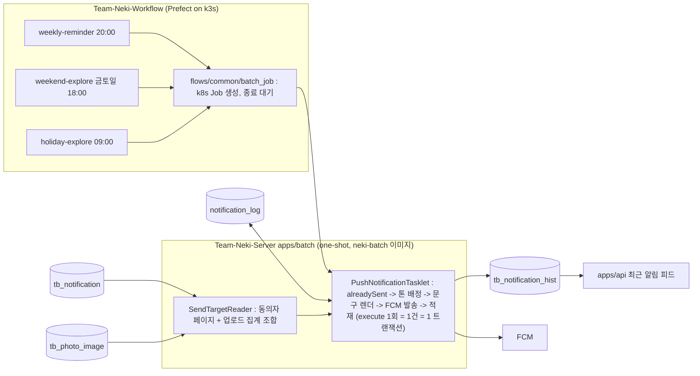

# 알림 발송 배치 High-Level Design

이 문서는 Team-Neki-Notification 저장소의 푸시 알림 배치 잡 3종을 이 저장소의 `apps/batch` 로 옮기고, 스케줄을 Prefect 로 빼며, 데이터 접근을 jOOQ 에서 JPA 로 바꾸는 설계를 다룹니다. 2026-10-06 기준 proposed 이며 구현이 끝나면 as-built 로 갱신합니다. 잡별 동작(대상 조건, 변수, 문구)은 `docs/lld/notification-push/` 가 다루고, 이 문서는 경계와 결정만 다룹니다.

## 0. Executive Summary

- 해결하는 문제 : 알림 배치가 별도 저장소에 있어 도메인 모델과 리포지터리를 두 벌(JPA, jOOQ)로 유지해야 하고, 상주 스케줄러·트리거 API·자체 Flyway history 같은 운영 장치를 따로 들고 있음. Notification 저장소는 폐기 예정
- 핵심 구조 : Prefect deployment 3개가 cron 에 맞춰 `neki-batch` 이미지를 k8s Job 으로 띄우고, 잡 3개(`weeklyReminderJob`, `weekendExploreJob`, `holidayExploreJob`)가 같은 tasklet 루프(대상 조회 → 중복 판정·문구 렌더 → FCM 발송·이력 적재)으로 돌며 종료 코드로 결과를 알림
- 책임 : 실행 시각·재시도·동시 실행 방지·실패 알림은 Workflow(Prefect). 대상 조회 조합과 커밋 단위(1건)는 `apps/batch`. 문구·톤·중복 판정 규칙과 발송 이력 엔티티는 `domain/notification`. 업로드 집계는 `domain/photo` 포트. FCM 은 기존 `FcmPushNotificationAdapter`
- 변경하는 것 : `domain/notification`(모델·정책·`NotificationLog` 엔티티·포트), `domain/photo`(포트 메서드 2개), `apps/batch`(잡 3개), Flyway V35, Workflow flow 3개, GitOps(Secret 키, Notification Deployment 제거). 변경하지 않는 것 : 알림 API, 앱의 최근 알림 피드, 동의 모델(`tb_notification.push_agreed`), 발송 정책
- 가장 중요한 결정 : (1) 잡은 3개로 두고 종류를 잡 이름으로 드러냄 (2) 교차 도메인 조회는 포트 2개를 batch 가 조합함 (3) FCM 어댑터를 재사용하고 미설정은 조용한 SKIPPED 가 아니라 잡 실패로 (4) `notification_log` 는 이름과 데이터를 그대로 편입
- 미결 : Prefect 가 지금 어느 환경 DB 를 가리키는지(전환 전제), FCM 페이로드가 바뀌는 것에 대한 앱 표시 확인, `notification_log` 의 `tb_` 접두 rename 시점

## 1. Background / Goals / Scope

### 1.1 Background

Team-Neki-Notification 은 2026-06 에 별도 저장소로 시작한 Spring Batch 앱입니다. 서버와 같은 PostgreSQL 을 쓰면서 서버 소유 테이블(`tb_notification`, `tb_photo_image`, `tb_notification_hist`)을 jOOQ 이름 기반 참조로 읽고 쓰고, 자기 소유 테이블(`notification_log`, `BATCH_*`)은 전용 Flyway history(`flyway_schema_history_notification`)로 관리했습니다. 상주 Deployment 하나가 `@Scheduled` cron 으로 잡을 띄웠습니다.

그 사이 이 저장소에 `apps/batch`(BACKEND-128)가 생겨 Prefect 가 k8s Job 으로 띄우는 one-shot 실행 계약이 자리잡았고, `searchIndexJob`(BACKEND-65)이 그 계약 위에서 돌고 있습니다. 알림 배치만 다른 저장소, 다른 스케줄러, 다른 데이터 접근 스택으로 남아 있는 상태라 다음 비용이 계속 발생합니다.

- 서버 소유 테이블 스키마가 바뀌면 Notification 쪽 이름 기반 쿼리가 부팅이 아니라 발송 시점에 깨짐
- `BATCH_*` 메타 테이블을 두 앱이 공동 소유 (V31 이 `IF NOT EXISTS` 로 편입)
- 알림 도메인 모델(`Notification`, `NotificationHist`)과 FCM 어댑터가 두 저장소에 두 벌

### 1.2 Goals

- 알림 배치 3종이 `apps/batch` 의 one-shot 계약으로 돌고, 발송 정책(대상·동의·중복·변수·문구)은 그대로임
- 스케줄·재시도·동시 실행 방지·실패 알림이 Prefect 한 곳으로 모임
- 데이터 접근이 이 저장소의 JPA/QueryDSL 포트로 통일되고 도메인 격리 규칙을 지킴
- prod 의 `notification_log` 데이터(중복 방지 이력)를 끊김 없이 인계받음
- Notification 저장소와 그 Deployment 를 안전한 순서로 내릴 수 있음

### 1.3 Requirements

| ID | 요구사항 | 범위 |
|---|---|---|
| R-1 | `WEEKLY_REMINDER`(매일 20:00), `WEEKEND_EXPLORE`(금·토·일 18:00), `HOLIDAY_EXPLORE`(매일 09:00) 세 발송이 종전과 같은 대상·변수·문구로 돈다 | 포함 |
| R-2 | 동의 판정은 `tb_notification.push_agreed = true` 하나이고, 중복 방지 키는 `(user_id, notification_type, business_date)` 다 | 포함 |
| R-3 | 발송 성공분은 앱의 최근 알림 피드(`tb_notification_hist`)에도 남는다 | 포함 |
| R-4 | 잡은 `--spring.batch.job.name=<잡> businessDate=<날짜>` 로 한 번 돌고 종료 코드로 성패를 알린다 (BACKEND-128) | 포함 |
| R-5 | 스케줄은 Prefect deployment 가 갖고, 같은 `businessDate` 로 다시 돌려도 중복 발송이 없다 | 포함 |
| R-6 | prod 에 있는 `notification_log` 테이블과 데이터를 그대로 쓴다 | 포함 |
| R-7 | 공휴일 원천을 Google Sheet 로 전환 (Notification 이슈 #17) | Spec-out |
| R-8 | 마케팅 약관 동의와의 이중 게이트, 클릭 이벤트 수집, 다중 인스턴스 발송 | Spec-out |

### 1.4 Non-goals

- 알림 API 와 앱의 최근 알림 피드 변경
- 발송 정책 변경 (대상 조건, 문구, 톤 배정 규칙은 Notification 저장소 2026-10 기준 그대로)
- Testcontainers 전환 (BACKEND-171 에서 별도 진행. 이 작업의 테스트는 H2)
- `notification_log` 의 `tb_` 접두 rename 과 `flyway_schema_history_notification` 정리 (폐기 뒤 후속)

## 2. As-Is 와 설계를 결정한 제약

- one-shot 실행 계약이 이미 있다 : `apps/batch` 는 잡 하나를 돌리고 `SpringApplication.exit` 의 종료 코드로 끝납니다. `RunIdIncrementer` 라 같은 파라미터로 다시 돌려도 항상 새 JobInstance 이고, 재시도는 처음부터 다시 돕니다. **따라서 잡은 멱등해야 하고, 중복 실행 방지는 프로세스 밖(Prefect concurrency limit)의 책임입니다.** Notification 의 `launchedAt` 파라미터와 `findRunningJobExecutions` 가드는 이 계약과 겹치므로 가져오지 않습니다
- 마이그레이션은 api 가 소유한다 : batch 는 Flyway `validate` 만 합니다. Notification 이 자체 history 로 만든 테이블을 이 저장소가 쓰려면 이 저장소의 Flyway 에 편입해야 하고, 그 방법은 V31(`BATCH_*`)이 이미 보여 준 `CREATE TABLE IF NOT EXISTS` 입니다
- 도메인은 서로 import 하지 않는다 : 발송 대상 조회는 `tb_notification`(notification 도메인)과 `tb_photo_image`(photo 도메인)를 함께 봅니다. `ArchitectureRulesTest` 가 도메인 간 의존을 막으므로 한 쿼리로 조인할 수 없고, BACKEND-65 에서 정한 대로 두 도메인 포트를 잇는 조립은 `apps/batch` 가 합니다
- FCM 어댑터와 자격증명 경로가 이미 있다 : `modules/firebase` 의 `FirebaseConfig` 는 `firebase.credentials-location` 에 파일이 있을 때만 `FirebaseMessaging` 빈을 만들고, `FcmPushNotificationAdapter` 는 빈이 없으면 `PUSH_NOT_CONFIGURED`, 전송 실패면 `PUSH_SEND_FAILED` 를 던집니다. staging/prod 경로(`/etc/firebase/firebase-service-account.json`)는 Notification 과 같습니다
- Prefect 는 단일 인스턴스다 : flow run 파드와 batch Job 파드는 `prefect` 네임스페이스에 뜨고, batch 가 어느 DB 를 보는지는 Secret `prefect-workflow` 의 `SPRING_PROFILES_ACTIVE` 가 정합니다. Notification 은 `prod` 네임스페이스에서 prod DB 를 봅니다. **Prefect 가 prod 를 가리키지 않는 동안에는 Notification 을 내릴 수 없습니다** (10절 미결, 11절 전제)
- Firebase 자격증명이 `prefect` 네임스페이스에 없다 : Notification Deployment 는 `prod/neki-secrets` 의 키를 볼륨으로 마운트합니다. batch Job 파드에 같은 파일을 주려면 `prefect-workflow` Secret 에 키를 더하고 Job 매니페스트에 볼륨을 걸어야 합니다

## 3. To-Be Architecture

### 3.1 Responsibility Boundary

| 책임 | Workflow (Prefect) | apps/batch | domain/notification | domain/photo | apps/api |
|---|---|---|---|---|---|
| 실행 시각(cron 3개), `businessDate`, 재시도, 동시 실행 방지, 실패 알림 | O | | | | |
| 대상 조회 조합, keyset 페이징, 커밋 단위 | | O | | | |
| 문구·톤·폴백·중복 판정 규칙 | | | O | | |
| `notification_log` 엔티티와 포트, 동의자 페이지 조회 | | | O | | |
| 업로드 집계(soft-delete 제외) | | | | O | |
| FCM 클라이언트, 발송 어댑터 | | | O (기존 infra/fcm) | | |
| `tb_notification_hist` 적재 (`NotificationService.recordSentPush`) | | | O (기존) | | |
| 스키마 migrate (V35) | | validate 만 | | | O (Flyway) |
| 최근 알림 피드 읽기 | | | | | O (기존) |
| 공휴일 원천(CSV) 과 발송일 판정 | | O | | | |

### 3.2 Core Concept

- 발송 종류 (`NotificationType`) : `WEEKLY_REMINDER`, `WEEKEND_EXPLORE`, `HOLIDAY_EXPLORE`. 잡 하나가 종류 하나를 맡음
- `businessDate` : 발송의 논리적 날짜. Prefect 가 run 예약 시각(KST)에서 정해 잡 파라미터로 넘김. 중복 방지 키와 톤 배정의 입력
- 발송 대상 (`SendTarget`) : `userId`, `deviceToken`, 변수 맵. 동의자 페이지(`tb_notification`, `push_agreed = true`)에서 시작해 잡별 조건으로 거른 결과
- 변수 (`MessageVariable`) : `[최근 업로드 요일]`(WEEKLY), `[공휴일명]`(HOLIDAY). 값이 없으면 그 종류의 폴백 톤 문구로 내려감
- 톤 (`MessageTone`) : `INFORMATIVE`, `FRIENDLY`, `SUGGESTIVE`. `floorMod(userId + businessDate.epochDay, 3)` 로 발송 건마다 결정적으로 배정
- 중복 방지 키 : `(user_id, notification_type, business_date)`. `notification_log` 의 unique 제약이 최종 방어선
- 발송 이력 (`notification_log`) vs 알림 피드 (`tb_notification_hist`) : 전자는 전 결과(SUCCESS/FAILED)를 남기는 중복 방지의 원천, 후자는 유저가 실제 받은 알림만 보여 주는 앱 피드. 둘은 목적이 달라 둘 다 씀

### 3.3 Architecture Invariants

- 동의 필터의 단일 출처는 `NotificationRepository.findPushAgreedAfter` 하나다. 잡별 리더는 이 페이지를 거를 뿐 동의를 다시 판정하지 않는다
- 중복 판정은 커밋된 `notification_log` 만 본다. execute() 1회 = 발송 1건 = 커밋 1건이고, 재실행 시 중복 창은 "발송 뒤 적재 전에 죽은 그 1건" 으로 한정된다
- 잡은 멱등하다. 같은 `businessDate` 로 다시 돌리면 이미 적재된 유저는 `ALREADY_SENT` 로 걸러져 발송이 0건이다
- 도메인 규칙(톤, 문구, 폴백, 중복 판정)은 `domain/notification` 의 순수 함수에만 있고 batch 는 조립만 한다
- batch 는 Flyway `validate` 만 하고 migrate 는 api 가 한다. `notification_log` 는 V35 가 소유한다
- 발송 미설정(`PUSH_NOT_CONFIGURED`)은 잡 실패다. 조용히 전 건을 건너뛰고 COMPLETED 로 끝나는 경로는 없다

### 3.4 API Boundary

알림 배치는 HTTP API 를 내지 않습니다. 경계는 실행 계약과 테이블입니다.

| 경계 | 답하는 질문 |
|---|---|
| 잡 실행 계약 (`--spring.batch.job.name=<잡> businessDate=<날짜>`, 종료 코드) | 이 날짜의 이 종류 발송이 끝났는가 |
| `tb_notification`, `tb_photo_image` (읽기) | 누구에게 보낼 수 있고, 누가 조건에 맞는가 |
| `notification_log` (읽기·쓰기) | 이 유저에게 이 종류를 이 날짜에 이미 보냈는가 |
| `tb_notification_hist` (쓰기) | 앱 피드에 무엇을 보여 줄 것인가 |
| Secret `prefect-workflow` 의 `firebase-service-account.json` | 어느 Firebase 프로젝트로 보내는가 |

### 3.5 Data Flow

1. 실행 : Prefect deployment 가 cron 시각에 flow run 을 만들고, flow 가 `neki-batch` 이미지로 k8s Job 을 띄움. 인자는 `--spring.batch.job.name=weekendExploreJob businessDate=2026-10-06`
2. 대상 읽기 : `tb_notification` 에서 `push_agreed = true AND user_id > 커서` 를 `user_id` 오름차순 100건씩 읽음. WEEKLY 는 `tb_photo_image` 로 "D-7 당일 업로드" 를, HOLIDAY 는 "D-1개월 이후 업로드" 를 거르고 변수를 채움. WEEKEND 는 거르지 않음
3. 판정 : 유저마다 `notification_log` 에 `(user_id, type, businessDate)` 가 있으면 건너뜀. 없으면 톤을 배정하고 문구를 렌더함
4. 발송·적재 : FCM 으로 보내고 결과(SUCCESS/FAILED)로 `notification_log` 에 1행, SUCCESS 면 `tb_notification_hist` 에 1행. 1건이 한 트랜잭션
5. 종료 : 모든 페이지를 소진하면 COMPLETED(종료 코드 0). 발송 미설정이나 DB 오류면 FAILED(0 아님). Prefect 가 종료 코드로 flow 결과를 정하고 실패면 Discord 로 알림

## 4. Architecture Decisions

### DEC-1. 잡은 3개, 종류는 잡 이름으로

- Context : 세 발송은 tasklet 루프가 같고 대상 조건·변수·스케줄만 다르다
- Decision : `weeklyReminderJob`, `weekendExploreJob`, `holidayExploreJob` 세 Job 빈을 두고, Reader 만 종류별 클래스로 나눈다. 판정·발송·적재는 `PushNotificationTasklet` 하나를 공유하고(execute 1회 = 1건 = 1 트랜잭션), Step 은 `NotificationPushStepConfig`, Job 은 `NotificationPushJobConfig` 가 조립한다 (search 와 같은 `job/` + `tasklet/`. JobConfig 에는 Job 빈만)
- Alternatives : 잡 하나 + `type` 파라미터 / Notification 의 `NotificationStepFactory` 컴포넌트 그대로 / chunk 지향 Step(Reader·Processor·Writer, chunk=1)
- Why : 잡 이름이 곧 발송 종류라 `BATCH_JOB_INSTANCE`, Prefect deployment, 실패 알림에서 한눈에 구분된다. 없는 잡 이름은 Boot 가 기동 시점에 거부한다. 종류를 더할 때 기존 Reader 의 `when` 을 고치는 대신 클래스를 더한다. chunk 는 커밋 단위가 1건이라 묶음 효과가 없고 Reader·Processor·Writer 와 @StepScope 빈 6개의 배선만 남아, 같은 커밋 단위를 주는 tasklet 으로 접었다
- Trade-off : Job 빈과 Reader 클래스가 종류마다 하나씩 늘어난다
- Consequence : Prefect 도 deployment 3개를 두고 각자 잡 이름을 넘긴다

### DEC-2. 스케줄·재시도·동시 실행 방지·실패 알림은 Prefect

- Context : `apps/batch` 는 one-shot 이고 `searchIndexJob` 이 이미 Prefect 로 돈다
- Decision : Notification 의 `@Scheduled` 스케줄러, `NotificationJobLauncher`, 테스트 트리거 API, 기동 시 공휴일 적재 리스너, 운영 타임존 `Clock` 빈을 가져오지 않는다. 재실행 식별은 `launchedAt` 파라미터 대신 `RunIdIncrementer`, 동시 실행 방지는 deployment 의 `concurrency_limit=1`
- Alternatives : 상주 모드 유지
- Why : 실행 주체가 Prefect 하나로 모이고, 수동 실행 경로도 Prefect UI 와 `prefect deployment run` 하나가 된다
- Trade-off : 수동 실행과 로그 확인이 클러스터 안(SSH 터널)의 Prefect 를 거친다
- Consequence : 단건 푸시 스모크는 api 의 `POST /api/notifications/push` 로 한다

### DEC-3. jOOQ 를 버리고 포트 2개를 batch 가 조합

- Context : 대상 조회가 `tb_notification` 과 `tb_photo_image` 를 함께 본다
- Decision : `NotificationRepository.findPushAgreedAfter(afterUserId, limit)` 로 동의자 페이지를 읽고, `PhotoImageRepository.findUserIdsUploadedBetween`, `findLastUploadedAtByUserIds` 로 업로드 집계를 받아 batch Reader 가 메모리에서 거른다. 구현은 기존 JPA/QueryDSL 어댑터
- Alternatives : notification 도메인에 `tb_photo_image` 네이티브 쿼리 / jOOQ 를 이 저장소에 추가
- Why : 도메인 격리 규칙과 BACKEND-65 의 "포트 조합은 batch" 선례를 그대로 따른다. `PhotoImage` 의 `@SQLRestriction(deleted_at IS NULL)` 이 쿼리마다 soft-delete 제외를 보장한다
- Trade-off : 페이지당 쿼리가 1개에서 2~3개로 는다. 100건 단위라 발송 1건의 FCM 왕복보다 훨씬 작다
- Consequence : 동의자 페이지를 가져온 뒤 거르므로 한 페이지가 0건이 될 수 있다. 커서는 거르기 전 페이지의 마지막 `user_id` 로 따로 넘겨 조기 종료를 막는다 (LLD pipeline)

### DEC-4. FCM 어댑터 재사용, 미설정은 잡 실패

- Context : 이 저장소에 `PushNotificationSender` 포트와 `FcmPushNotificationAdapter`, `modules/firebase` 가 있다
- Decision : tasklet 이 `PushNotificationSender.send` 를 부른다. `PUSH_SEND_FAILED` 는 `PushSendStatus.FAILED` 로 적재하고 계속, `PUSH_NOT_CONFIGURED` 는 예외를 그대로 올려 잡을 FAILED 로 끝낸다. `PushSendStatus.SKIPPED` 는 새로 생기지 않는다 (enum 은 기존 데이터 때문에 유지)
- Alternatives : Notification 의 `FcmPushSender`/`LoggingPushSender` 이식 (미설정이면 전 건 SKIPPED 로 COMPLETED)
- Why : one-shot 에서 "전 건 SKIPPED 인데 COMPLETED" 는 알림 없이 지나가는 가장 위험한 조용한 실패다. 어댑터 두 벌을 유지할 이유도 없다
- Trade-off : 페이로드가 api 발송과 같아진다. Notification 은 `notification{title, body}` 만 보냈고 기존 어댑터는 `data{title, body}` + Android/APNs 설정 + `analytics_label=server_push` 를 보낸다. 앱에서 표시·탭 동작이 같은지 확인이 필요하다 (오라클 manual)
- Consequence : 로컬에서 키 파일 없이 잡을 돌리면 첫 발송에서 실패한다. 테스트는 stub 을 쓴다

### DEC-5. `tb_notification_hist` 적재를 같은 트랜잭션에서

- Context : Notification 은 외부 소유 테이블이라 `REQUIRES_NEW` + `try/catch` 로 best-effort 격리했다
- Decision : tasklet 이 `notification_log` 와 `tb_notification_hist` 를 같은 트랜잭션(execute 1회)에서 쓴다. 격리와 예외 흡수를 두지 않는다
- Alternatives : best-effort 유지
- Why : 같은 저장소, 같은 Flyway 라 스키마 드리프트가 없다. 적재가 실패하면 그것은 버그이고, one-shot 계약에서는 크게 실패해 알림을 받는 쪽이 맞다
- Trade-off : hist 적재 실패 시 그 1건의 log 도 롤백되어 재실행 때 1건 중복 발송이 가능하다. log 적재 실패와 같은 창이다
- Consequence : `NotificationHistBestEffortTest` 는 가져오지 않는다

### DEC-6. 중복 판정 의미 유지

- Context : Notification 은 `fcm_result` 와 무관하게 `(user_id, type, business_date)` 존재 여부로 판정했다
- Decision : 그대로 둔다. FAILED 로 적재된 유저도 그날은 다시 보내지 않는다
- Alternatives : FAILED 는 재시도 허용
- Why : 정책 변경은 이 작업의 범위가 아니다. unique 제약이 같은 기준이라 애플리케이션 판정과 DB 제약이 어긋나지 않는다
- Consequence : FAILED 재시도가 필요해지면 unique 제약과 판정을 함께 바꾸는 별도 결정이 필요하다

### DEC-7. 공휴일은 domain 포트 하나와 번들 CSV

- Context : Notification 은 `holidays.csv` 를 기동 시 인메모리로 적재했다
- Decision : `Holiday` 모델과 `HolidayRepository` 포트를 `domain/notification` 에 두고, `infra/csv/CsvHolidayRepositoryAdapter` 가 domain 리소스 `holidays.csv` 를 빈 생성 시 읽는다. Notification 의 3단 추상화(`HolidaySource`, `HolidayStore`, `HolidayCalendar`)는 포트 하나로 줄인다. 발송일이 아니면 0건으로 COMPLETED
- Alternatives : Prefect 가 발송일을 판정해 `holidayName` 을 넘김 / Google Sheet 원천 (#17)
- Why : 규칙이 한 저장소에 남고, one-shot 이라 "기동 시 1회 적재" 와 "실행마다 읽기" 가 같다
- Trade-off : 공휴일 갱신이 곧 batch 배포다
- Consequence : `holidayExploreJob` 은 매일 돌되 대부분의 날은 0건이다

### DEC-8. `notification_log` 는 이름·스키마 그대로 편입

- Context : prod 에는 Notification 이 만든 `notification_log` 와 발송 이력 데이터가 있고, Notification 은 폐기 전까지 거기에 계속 쓴다
- Decision : V35 가 `CREATE TABLE IF NOT EXISTS notification_log` 로 같은 DDL 을 편입한다. 테이블 이름은 `tb_` 접두 없이 유지한다
- Alternatives : 지금 `tb_notification_log` 로 rename
- Why : 전환 중 두 앱이 같은 테이블을 봐야 dedup 이 이어진다. V31 과 같은 편입 방식이라 새 패턴이 아니다
- Trade-off : 테이블 명명 규약(`TB_`)과 어긋난 이름이 남는다
- Consequence : 폐기 뒤 후속 티켓에서 rename 과 `flyway_schema_history_notification` 삭제를 한 마이그레이션으로 처리한다

## 5. Data / Index Dependencies

| 데이터 | 소유 | 방향 | 쓰는 방식 |
|---|---|---|---|
| `tb_notification` (`user_id`, `device_token`, `push_agreed`) | Server (V21) | 읽기 | 동의자 페이지. `push_agreed = true AND user_id > ?` ORDER BY `user_id` LIMIT 100 |
| `tb_photo_image` (`user_id`, `created_at`, `deleted_at`) | Server (V2, V12) | 읽기 | WEEKLY 의 D-7 당일 업로드, HOLIDAY 의 최근 1달 업로드, `[최근 업로드 요일]`. `@SQLRestriction` 으로 삭제 제외 |
| `notification_log` | Notification 이 만들고 V35 로 편입 | 읽기·쓰기 | 중복 판정, 전 결과 적재. unique `(user_id, notification_type, business_date)` |
| `tb_notification_hist` | Server (V22) | 쓰기 | SUCCESS 만 적재. `type` 은 enum 이름 |
| `BATCH_*` | Server (V31) | 쓰기 | 실행 이력. Notification 이 남긴 같은 잡 이름의 행과 `JOB_KEY` 가 달라 충돌 없음 |
| `holidays.csv` | domain 리소스 (`HolidayRepository` 포트, CSV 어댑터) | 읽기 | `holiday_date,name,notify_offset_days` |
| Secret `prefect-workflow` | GitOps (수동 apply) | 읽기 | `SPRING_PROFILES_ACTIVE`, `JASYPT_PASSWORD`, `firebase-service-account.json` |

## 6. Impacted Systems

- domain/notification : 모델 8개, 정책 3개, `NotificationLog` 엔티티, `NotificationLogRepository`·`HolidayRepository` 포트와 어댑터(JPA, CSV), `NotificationRepository.findPushAgreedAfter`
- domain/photo : `PhotoImageRepository.findUserIdsUploadedBetween`, `findLastUploadedAtByUserIds`
- apps/batch : Job 3개(`job/`), Step 3개와 `PushNotificationTasklet`, Reader 3개(`tasklet/`), 스캔 범위에 `com.neki.domain.notification`, `com.neki.domain.photo.infra.persist`, `com.neki.config.firebase` 추가, `application-firebase.yaml` import, `modules:firebase` 의존
- modules/postgres : V35
- Team-Neki-Workflow : `flows/common/batch_job.py`(search-index 의 Job 실행을 일반화), flow 3개, deployment 3개, `docs/spec/notification-push.md`
- Team-Neki-GitOps : `overlays/prefect/workflow-secret.example.yaml` 키 추가, `overlays/prod/notification-deployment.yaml` 제거
- Team-Neki-Notification : 아카이브
- 변경하지 않음 : 알림 API, 최근 알림 피드, 동의 모델, `searchIndexJob` 의 계약

## 7. Failure & Degradation

| 상황 | 동작 | 결과 |
|---|---|---|
| Firebase 키 파일이 파드에 없음 | 첫 발송에서 `PUSH_NOT_CONFIGURED` -> 잡 FAILED | 0건 발송. Prefect 실패 알림 |
| 토큰 무효·FCM 거부 (`FirebaseMessagingException`) | 그 건 `FAILED` 로 적재, 다음 건 계속 | 잡 COMPLETED. 그 유저는 그날 재발송 없음 (DEC-6) |
| FCM 네트워크 장애 (예외가 `FirebaseMessagingException` 이 아님) | 잡 FAILED | 이미 보낸 건은 적재됨. 재실행하면 나머지만 보냄 |
| 발송 뒤 적재 전에 파드 종료 | 그 1건의 log 없음 | 재실행 시 그 1건 중복 발송 가능 (at-least-once) |
| 같은 `businessDate` 재실행 | 전원 `ALREADY_SENT` | 0건 발송, COMPLETED |
| `holidayExploreJob` 이 발송일 아님 | Reader 가 빈 페이지 | 0건, COMPLETED |
| `businessDate` 누락·형식 오류 | Reader 빈 생성 실패 -> 잡 FAILED | Prefect 실패 알림 |
| 대상이 많아 flow 타임아웃 | Job `activeDeadlineSeconds` 로 파드 종료, flow 실패 | 보낸 만큼 적재됨. 재실행하면 이어서 보냄 |
| Notification 앱이 먼저 끝난 뒤 돎 (전환 중) | 늦게 돈 쪽이 `ALREADY_SENT` | 0건 발송 |
| Notification 앱과 동시에 돎 (전환 중) | 판정(`exists`)과 적재 사이에 FCM 호출이 있어, 양쪽이 적재 전에 같은 키를 조회하면 둘 다 보낸다. unique 는 적재 시점에만 막는다 | 겹친 구간의 유저마다 중복 발송 가능. 전환 중 동시 실행 금지 (11절) |

failure isolation 단위는 발송 1건입니다. 어디서 실패해도 이미 커밋된 발송은 유지되고, 재실행은 남은 유저만 보냅니다.

## 8. NFR / Observability

- 처리량 : 커밋 단위가 1건이라 발송 1건마다 FCM 왕복(수십~수백 ms)과 커밋이 있습니다. 대상 1만 명이면 수십 분이 걸릴 수 있어 flow 타임아웃을 색인(1,800초)보다 긴 3,600초로 둡니다. 대상이 더 늘면 `FirebaseMessaging.sendEach` 로 묶는 것이 업그레이드 경로입니다 (코드의 `ponytail:` 주석)
- 관측 : step 완료 로그(읽은 수, 걸러진 수, 발송 수), `BATCH_STEP_EXECUTION` 의 read/filter/write count, `notification_log` 의 `fcm_result` 분포, Prefect flow 상태와 Discord 알림
- 탐지 공백 : `FAILED` 가 많아도 잡은 COMPLETED 라 알림이 없습니다. `select fcm_result, count(*) from notification_log where business_date = current_date group by 1` 로 확인합니다

## 9. Risks

- Prefect 환경 : Prefect 가 staging DB 를 가리키는 동안 prod 발송을 옮길 수 없습니다. 전환 전에 `prefect-workflow` Secret 의 `SPRING_PROFILES_ACTIVE` 를 확인해야 합니다
- FCM 페이로드 변경 : 앱이 `notification` 페이로드만 처리하고 `data` 를 무시하면 표시는 되지만 탭 동작이 달라질 수 있습니다. 기기 확인 전에는 prod 스케줄을 켜지 않습니다
- H2 테스트 : `TIMESTAMP WITH TIME ZONE`(`sent_at`) 과 unique 제약은 H2 에서도 재현되지만, PostgreSQL 의 트랜잭션 abort 동작은 재현되지 않습니다
- 이중 발송 창 : Notification Deployment 를 내리기 전에 Prefect 스케줄을 켜면 같은 날 두 번 돌 수 있습니다. 11절 순서를 지킵니다

## 10. Open Issues

- Prefect 의 `prefect-workflow` Secret 이 어느 환경(`SPRING_PROFILES_ACTIVE`)을 가리키는가. staging 이면 prod 전환은 Prefect 환경 승격 뒤 - Owner: BACKEND / Blocking: yes (11절 4단계 이후)
- 바뀐 FCM 페이로드로 앱 표시·탭이 같은지 기기 확인 - Owner: BACKEND + iOS / Blocking: yes (11절 6단계)
- `notification_log` 를 `tb_notification_log` 로 rename 하고 `flyway_schema_history_notification` 을 지우는 시점 - Owner: BACKEND / Blocking: no
- Notification 이슈 #17(Google Sheet 공휴일 원천)을 Sprint 티켓으로 옮길지 - Owner: BACKEND / Blocking: no

## 11. 전환 순서

| 단계 | 저장소 | 할 일 | 확인 |
|---|---|---|---|
| 1 | Server | PR 머지, api staging·prod 배포 (V35 적용) | `select count(*) from notification_log` 가 prod 에서 기존 건수 그대로, staging 에서 0 |
| 2 | Server | `deploy-batch.yml` 로 batch 이미지 push | GitOps `images.env` 의 `NEKI_BATCH_IMAGE` 가 새 태그 |
| 3 | GitOps | `prefect-workflow` Secret 에 `firebase-service-account.json` 키 추가 (클러스터 수동 apply), example 갱신 PR 머지 | `kubectl -n prefect get secret prefect-workflow -o jsonpath='{.data}' \| jq keys` 에 키 있음 |
| 4 | Workflow | PR 머지 -> build.yml -> worker 재기동 -> deployment 3개 등록. 등록 직후 UI 에서 셋 다 pause (deploy.py 가 pause 를 보존함) | Prefect UI 에 `weekly-reminder/weekly-reminder` 등 3개, paused |
| 5 | Workflow | `weekend-explore` 를 수동 실행 (`prefect deployment run weekend-explore/weekend-explore`) | k8s Job 종료 코드 0, `notification_log` 에 오늘 날짜 행, 앱 최근 알림에 노출 |
| 6 | 앱 | 수신 기기에서 표시·탭 동작 확인 (DEC-4) | 종전과 같음 |
| 7 | GitOps | `notification-deployment.yaml` 제거 PR 머지 -> ArgoCD 가 Notification 파드 삭제 | `kubectl -n prod get deploy neki-notification` 없음 |
| 8 | Workflow | 3개 deployment unpause | 다음 cron 시각에 flow run 생성 |
| 9 | Notification | 저장소 README 에 이관 안내 추가 후 아카이브 | GitHub archived |
| 10 | Server (후속) | `tb_notification_log` rename + `flyway_schema_history_notification` DROP 마이그레이션 | 별도 티켓 |

1단계와 7단계 사이에 Notification 앱은 계속 돕니다. 같은 테이블을 보므로 먼저 끝난 쪽의 적재는 늦게 도는 쪽이 `ALREADY_SENT` 로 거르지만, 동시에 돌면 7절 표대로 유저마다 중복 발송될 수 있습니다. 그래서 5단계 수동 실행은 Notification 앱의 같은 잡 cron 시각(weekend-explore 는 금·토·일 18:00 KST)과 겹치지 않게 하고, 실행 직전에 `kubectl -n prod logs deploy/neki-notification --since=30m` 으로 진행 중인 발송이 없는 것을 확인합니다. 그날의 새 cron 발송은 7단계(Notification 파드 삭제)까지 끝낸 뒤 8단계로 켭니다. 4단계 전에 10절 첫 미결(Prefect 환경)이 prod 로 확인되어야 합니다.

## Appendix A. Source of Truth

| 관심사 | Source of Truth |
|---|---|
| 실제 구현 | 코드 (`apps/batch/notification`, `domain/notification`) |
| 잡별 동작 | `docs/lld/notification-push/*.md` |
| 발송 이력 스키마 | Flyway V35 (`modules/postgres`) |
| 실행 계약 (one-shot, 종료 코드) | BACKEND-128, `docs/superpowers/specs/2026-09-23-batch-module-design.md` |
| 스케줄과 Job 매니페스트 | Team-Neki-Workflow `docs/spec/notification-push.md` |
| 완료 판정 | `docs/oracle/notification-push-jobs.md` |
| 배치 이미지 태그 | Team-Neki-GitOps `overlays/prefect/images.env` |

## Appendix B. Decision History

- 데이터 접근 : Notification ADR 0001(jOOQ + Flyway, JPA 배제)은 "독립 저장소" 를 전제로 했다. 이 저장소로 오면서 전제가 사라져 폐기 (DEC-3)
- 재실행 식별 : `launchedAt` 파라미터와 실행 중 가드 -> `RunIdIncrementer` 와 Prefect concurrency limit (DEC-2)
- 발송 미설정 : `LoggingPushSender` 의 조용한 SKIPPED -> 잡 실패 (DEC-4)
- hist 적재 : `REQUIRES_NEW` best-effort -> 같은 트랜잭션 (DEC-5)
- 잡 구조 : 설계 초안은 잡 하나 + `type` 파라미터였으나, 잡 이름이 종류를 말하지 못하고 종류 추가가 분기 수정이 되는 문제로 잡 3개로 (DEC-1, 2026-10-06 사용자 결정)

## Appendix C. 이관 매핑

| Notification 저장소 | 결과 | 비고 |
|---|---|---|
| `domain/` 모델·정책·`NotificationProcessor` 와 단위 테스트 | 그대로 | 패키지명만 변경, 단언은 kotest matcher |
| `domain/.../port/out/*` 6개 포트 | 대체 | `NotificationLogRepository`(신규), `NotificationRepository`·`PhotoImageRepository` 메서드 추가, `PushNotificationSender`(기존). 공휴일 포트 3개는 `CsvHolidayRepositoryAdapter` 하나 |
| 잡 3개 + `NotificationStepFactory` | 재작성 | `NotificationPushJobConfig` + Reader 3개 |
| `read/*` jOOQ 리더, `TargetReaderSupport`, `KoreanWeekday` | 재작성 | JPA/QueryDSL 포트 조합 |
| `NotificationLogStoreAdapter`, `NotificationHistStoreAdapter`, `JooqConfig` | 대체·폐기 | JPA 어댑터 / `NotificationService.recordSentPush` / jOOQ 없음 |
| `NotificationSendService`, `HolidaySyncService` | 흡수 | `PushNotificationTasklet` / `CsvHolidayRepositoryAdapter` |
| `FcmPushSender`, `LoggingPushSender`, `modules/fcm` | 대체 | `FcmPushNotificationAdapter` + `modules/firebase` |
| `NotificationJobScheduler`, `modules/scheduling` | Prefect 로 | deployment 3개 |
| `NotificationJobLauncher` | Prefect 로 | `RunIdIncrementer` + `concurrency_limit=1` |
| `TestNotificationController` | Prefect·api 로 | 잡 수동 기동은 `prefect deployment run`, 단건 푸시는 `POST /api/notifications/push` |
| `HolidayLoader`, `holidays.csv` | 이식 | `HolidayRepository` 포트 + `CsvHolidayRepositoryAdapter` (domain 리소스 CSV, 빈 생성 시 읽음) |
| `application.yml` 플래그·cron, `application-prod.yml` | 흡수 | cron -> Prefect, datasource·Firebase 경로는 기존 yaml 과 동일 |
| Flyway V1 / V2 / V3 | 편입 / 이미 V31 / 불필요 | V35 |
| prod `notification_log` 데이터, `BATCH_*` 이력 | 인계 | 전환 당일 dedup 유지 |
| `flyway_schema_history_notification` | 잔존 | 후속 티켓 |
| Testcontainers 테스트 | H2 로 | 저장소 관례 |
| CI, `deploy-prod.yml`, `Dockerfile` | 대체 | Server CI, `deploy-batch.yml`, `APP_MODULE=batch` |
| GitOps `overlays/prod/notification-deployment.yaml` | 삭제 | 11절 7단계 |
| `docs/prd`, `docs/lld`, `docs/adr`, `docs/runbook` | 흡수 | 이 HLD, LLD 4편, 오라클 |
| GitHub 이슈·PR·커밋 이력 | 아카이브에 남김 | #17 은 필요 시 Sprint 티켓으로 |

## Appendix D. Related Documents

- `docs/lld/notification-push/pipeline.md`, `weekly-reminder-job.md`, `weekend-explore-job.md`, `holiday-explore-job.md`
- `docs/superpowers/specs/2026-09-23-batch-module-design.md` (one-shot 계약)
- `docs/hld/2026-10-04-search-indexing-hld.md` (같은 실행 경로의 선례)
- Team-Neki-Workflow `docs/spec/search-index.md`, `docs/spec/notification-push.md`
