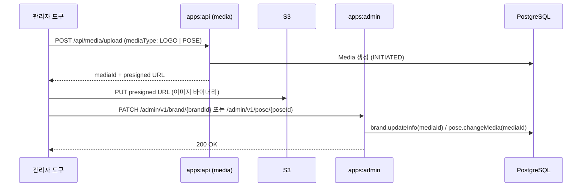

# 어드민 앱 요청 flow

이 문서는 `apps/admin` 앱의 요청 처리 흐름과 apps:api 와의 구조 차이에 대해 다룹니다.

## 모듈 구조

어드민 앱은 도메인 로직을 새로 만들지 않고 `:domain` 의 도메인 서비스를 재사용하는 실행 모듈입니다. api 계층과 인프라 어댑터만 자체로 소유합니다.

```text
apps/admin/src/main/kotlin/com/neki/admin/
├── config/
│   ├── DomainServiceConfig.kt     admin 이 쓰는 도메인 서비스만 명시적으로 빈 등록
│   └── QueryDslConfig.kt
├── map/                           브랜드 관리
│   ├── api/                       Controller, Dto, Mapper
│   ├── application/               Facade
│   └── infra/persist/             BrandRepository 구현 어댑터
└── pose/                          포즈 관리
    ├── api/
    ├── application/
    └── infra/persist/
```

컴포넌트 스캔은 `com.neki.admin` + `com.neki.core` 로 한정합니다. `:domain` 전체를 스캔하면 admin 이 쓰지 않는 도메인 서비스까지 빈으로 올라오고, 그 서비스들의 포트 어댑터를 전부 요구해 기동이 실패하기 때문입니다. 따라서 admin 이 쓰는 `BrandService`, `PoseService` 는 `DomainServiceConfig` 에서 직접 등록합니다.

## 요청 흐름

```text
Request -> Controller -> Mapper(toCommand/toQuery) -> Facade -> 도메인 Service -> Repository 어댑터 -> JPA/QueryDSL
```

- Controller : 요청 검증(`@Valid`)과 `BaseResponse` 래핑만 담당함
- Mapper : `XxxAdminDto.Request` 를 `Command`/`Query` 로 변환하는 top-level 확장 함수
- Facade : 트랜잭션 경계를 잡고 도메인 서비스에 위임함
- 도메인 Service : `:domain` 의 것을 그대로 재사용함 (`BrandService`, `PoseService`)

### apps:api vs. apps:admin

| 항목 | apps:api | apps:admin |
| --- | --- | --- |
| application 계층 | `*UseCase` (기능 단위 클래스) | `*Facade` (도메인 단위 클래스) |
| DTO | `Request`/`Response`/`Converter` 분리 | `XxxAdminDto` object 하위 중첩 + Mapper 확장 함수 |
| 인증 | JWT (`@AuthenticationPrincipal`) | 없음 (userId 를 null 로 저장) |
| media 검증 | `MediaClient.verifyMediasUploaded` 후 보상 롤백 | 없음. 요청의 mediaId 를 그대로 신뢰 |

admin 은 교차 도메인 오케스트레이션이 없어 유스케이스를 기능 단위로 쪼갤 이유가 없습니다. 도메인당 Facade 하나가 조회·등록·수정·삭제를 모두 위임합니다. 그 대가로 기능이 늘어나면 Facade 가 비대해지는 트레이드 오프가 있습니다.

## 리포지터리 어댑터 이원화

`BrandRepository`, `PoseRepository` 인터페이스는 `:domain` 이 소유하고, 구현 어댑터는 apps:api 용(`domain/.../infra/persist`)과 admin 용(`apps/admin/.../infra/persist`)이 따로 존재합니다.

- 각 어댑터는 자기 앱이 쓰는 메서드만 구현하고, 나머지는 `UnsupportedOperationException` 을 던짐
- e.g. `findAll(GetAllPoses)` 는 admin 전용, `listPosesWithScrap` 은 api 전용
- 사용자 컨텍스트(스크랩, 정렬)가 필요한 조회와 관리용 전건 조회를 한 어댑터에 섞지 않는 것이 목적

인터페이스는 하나인데 구현 지원 범위가 앱마다 다르므로, 호출 경로가 없다는 사실이 컴파일 타임에 보장되지 않는 트레이드 오프가 있습니다. 미지원 메서드는 주석으로 전용 범위를 밝힙니다.

## 엔드포인트

| Method | Path | 동작 |
| --- | --- | --- |
| GET | `/admin/v1/brand` | 목록 조회 (supportsQr, exposeToMap 필터) |
| GET | `/admin/v1/brand/search` | keyword 검색 |
| POST | `/admin/v1/brand` | 등록 |
| PATCH | `/admin/v1/brand/{brandId}` | 부분 수정 |
| DELETE | `/admin/v1/brand/{brandId}` | soft delete |
| GET | `/admin/v1/pose` | 목록 조회 (headCount 필터) |
| POST | `/admin/v1/pose` | 일괄 등록 |
| PATCH | `/admin/v1/pose/{poseId}` | 이미지 교체 |

목록 조회는 공통으로 `CountedPage`(전체 건수 + 전체 페이지 수)를 반환합니다. 무한 스크롤용 `Page`(hasNext)와 달리 관리자 화면의 페이지네이션 UI 를 전제로 합니다.

### 부분 수정 규칙

`PATCH /admin/v1/brand/{brandId}` 는 null 필드를 "변경하지 않음"으로 해석합니다.

- 넘긴 필드만 변경함 : name, code, mediaId, supportAndroidQr, supportIosQr, exposeToMap
- 전부 null 이면 `INVALID_PARAMETER` : `BrandCommand.UpdateBrand.hasNoChanges` 가 판정
- 엔티티 변경은 `Brand.updateInfo` 가 담당함 (null 인자는 무시)

## 이미지 변경 flow

이미지 파일 자체는 admin 을 거치지 않습니다. presigned URL 발급과 S3 업로드는 기존 media 도메인 flow(apps:api)를 그대로 사용하고, admin 은 업로드가 끝난 mediaId 를 엔티티에 연결하는 마지막 단계만 담당합니다.



- 브랜드 : `PATCH /admin/v1/brand/{brandId}` 에 `mediaId` 를 포함하면 로고가 교체됨
- 포즈 : `PATCH /admin/v1/pose/{poseId}` 의 body 는 `{ "mediaId": n }` 하나뿐임 (필수)
- 저장은 dirty checking 으로 반영됨. Pose 는 `@DynamicUpdate` 라 media_id 컬럼만 갱신됨

apps:api 의 사진 등록과 달리 admin 은 media 상태 확인(`verifyMediasUploaded`)과 UPLOADED 전이를 수행하지 않습니다. 업로드가 끝나지 않은 mediaId 를 연결하면 조회 화면에서 깨진 이미지가 될 수 있습니다.

## 미결 사항

- 인증이 없습니다. 누구나 호출할 수 있으므로 외부 노출 전에 어드민 인증이 선행되어야 합니다. (계획 : `docs/superpowers/plans/2026-08-16-admin-auth.md`)
- 이미지 교체 시 기존 media 를 정리하지 않습니다. 이전 mediaId 의 TB_MEDIA 레코드와 S3 객체가 고아로 남습니다.
- media 발급이 apps:api 의 JWT 인증을 요구하므로, 인증 없는 admin 단독으로는 업로드 flow 를 완결할 수 없습니다. admin 인증 도입 시 media 발급 경로를 함께 정리해야 합니다.
