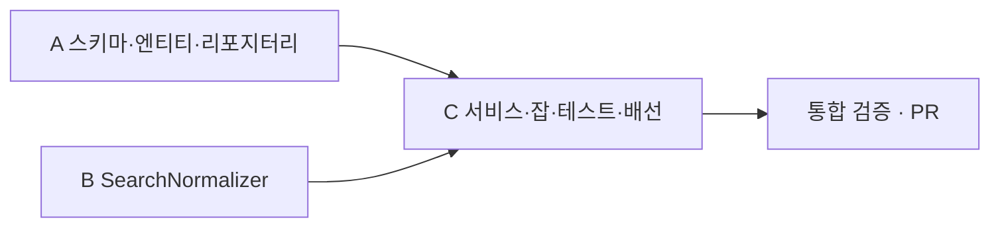

# 검색 색인 searchIndexJob Implementation Plan

이 문서는 BACKEND-65 `searchIndexJob` 을 노드 셋으로 나눠 worktree 에서 병렬 구현하고 순서대로 병합하는 계획을 다룹니다. 완료 판정은 `docs/oracle/search-index-job.md` 가 합니다.

- **작성일** : 2026-09-25
- **티켓** : BACKEND-65 (에픽 BACKEND-40 파이프라인 설계). 입력 계약은 BACKEND-64, 실행 계약은 BACKEND-128
- **통합 브랜치** : `feat/BACKEND-65` (base `feat/BACKEND-128`. batch 모듈이 아직 main 에 없음)
- **T0 baseline** (2026-09-25, `./gradlew test`) : domain 17, apps/batch 7, apps/api 577, 실패 0. 이후 모듈별 테스트 수의 하한

## 무엇을 만드나

`tb_photo_booth_enriched`(Workflow 소유, 현재 세대) 의 8열을 읽어 검색 카드 `tb_photo_booth_search` 와 1km 안 역 연결 테이블 `tb_photo_booth_search_station` 을 한 트랜잭션에서 전량 재생성하는 Spring Batch 잡입니다. 외부 호출은 없습니다. 정규화 규칙은 `domain/search` 의 Kotlin 함수 한 곳에 두어 뒤에 검색 API 가 질의 시점에 같은 함수를 씁니다.

```text
tb_photo_booth_enriched (8열)  ─┐
tb_brand (platform 으로 조인)    ├─> SearchIndexService.rebuild(businessDate) ─> DELETE + INSERT (한 트랜잭션)
tb_subway_station (좌표)        ─┘        │                                        tb_photo_booth_search
                                          └ SearchNormalizer (branchName, normalize, searchText, regionIds, siteKey)
                                                                                    tb_photo_booth_search_station
```

## 티켓 스펙과 다르게 정한 것

- `region_ids` 는 `CHAR(10)[]` 대신 `VARCHAR(10)[]` : Hibernate 가 `Array<String>` 을 `varchar[]` 로 바인딩함. `tb_legal_dong.code`(CHAR(10)) 와의 `@>` 비교는 PostgreSQL 이 text 로 맞춰 주므로 질의에 영향 없음
- 역 매핑은 PostGIS `ST_DWithin` 대신 Kotlin 의 `UserLocation.distanceTo`(haversine, 이미 `domain/search` 에 있음) : 카드 수천 x 역 수천의 전수 비교로 충분하고, H2 테스트에서 그대로 검증되며, 검색 API 가 사용자 거리에 쓰는 함수와 같음. 1km 경계에서 spheroid 와 수 m 차이가 날 수 있음
- `platform -> brand` 매핑은 Kotlin 상수표가 아니라 `tb_brand.platform` 컬럼(V32) : 브랜드 목록은 DB 에 있으므로 매핑도 DB 에 둠. Workflow 의 `Platform` 값과 `tb_brand.code` 가 다름(`LIFE_FOUR_CUT` vs `LIFEFOURCUTS`). V3 가 넣은 브랜드 6개는 마이그레이션이 채우고, 나머지 5개(`BROOM_STUDIO`, `DONT_LXXK_UP`, `MONO_MANSION`, `PHOTO_LAB_PLUS`, `PICDOT`)는 운영에서 `UPDATE` 로 채움. 비어 있는 platform 은 잡이 경고하고 건너뜀
- 연결 테이블의 `station_name VARCHAR(60)`, `line_name VARCHAR(40)` : 원천 `tb_subway_station` 과 같은 길이
- 연결 테이블은 별도 엔티티가 아니라 `PhotoBoothSearch` 의 `@ElementCollection` : 복합키 엔티티의 merge-select 를 피하고 부모와 함께 INSERT 됨
- 입력이 0건이면 실패 (직전 카드 수와 무관). enrich 가 아직 안 돈 상태를 0건 카드로 덮지 않기 위함

## DAG



A 와 B 는 파일이 겹치지 않고 데이터 의존도 없어 병렬입니다. C 는 A 의 포트/엔티티와 B 의 함수 시그니처에 컴파일이 걸리므로 두 노드가 통합 브랜치에 병합된 뒤 시작합니다.

## 핫 파일 영역 배정

| 파일 | A | B | C |
|---|---|---|---|
| `domain/.../map/models/Brand.kt` | 31-32행(`code`) 뒤에 `platform` 프로퍼티 추가. 그 외 금지 | - | - |
| `domain/.../search/models/SearchVO.kt` | - | 금지 (읽기만) | 금지 (읽기만. `UserLocation.distanceTo` 재사용) |
| `apps/batch/.../NekiBatchApplication.kt` | - | - | 21행 주석 예시, 26행 주석, 28행 `scanBasePackages` |
| `apps/batch/src/test/.../ExitCodeTest.kt` | - | - | `sampleJob` 문자열이 있는 30, 44, 46, 47행과 `FailingJobConfig` 클래스 |
| `.claude/CLAUDE.md`, `README.md` | - | - | `sampleJob` 예시 명령 줄만 (CLAUDE.md 11행, README 103행) |

그 밖의 파일은 전부 신규이거나 노드 하나만 만집니다. 세 노드가 같은 줄을 고치는 곳은 없습니다.

## 병합 순서

1. B (가장 작은 diff, 신규 파일 2개)
2. A (마이그레이션 2 + 신규 7 + `Brand.kt` 두 줄)
3. C (A, B 병합 뒤 통합 브랜치에서 worktree 를 새로 떠서 시작)

`--no-ff` 로 통합 브랜치 `feat/BACKEND-65` 에 병합하고, 병합마다 `./gradlew spotlessCheck :domain:test :apps:batch:test` 를 돌립니다.

---

## Task A : 스키마, 엔티티, 리포지터리 (오라클 O-A)

**Files**
- Create `modules/postgres/src/main/resources/db/migration/V32__add_platform_to_brand.sql`
- Create `modules/postgres/src/main/resources/db/migration/V33__create_photo_booth_search_tables.sql`
- Modify `domain/src/main/kotlin/com/neki/domain/map/models/Brand.kt` (`code` 뒤에 `platform`)
- Create `domain/src/main/kotlin/com/neki/domain/search/models/PhotoBoothSearch.kt` (엔티티 + `@Embeddable NearbyStation`)
- Create `domain/src/main/kotlin/com/neki/domain/search/models/PhotoBoothEnriched.kt` (`@Immutable`, `@EmbeddedId PhotoBoothEnrichedId(platform, idx)`)
- Create `domain/src/main/kotlin/com/neki/domain/search/models/SubwayStation.kt` (`@Immutable`, `@EmbeddedId SubwayStationId(name, lineName)`, `location: Point`)
- Create `domain/src/main/kotlin/com/neki/domain/search/repository/PhotoBoothSearchRepository.kt` (포트)
- Create `domain/src/main/kotlin/com/neki/domain/search/infra/persist/jpa/JpaPhotoBoothSearchRepository.kt`, `JpaPhotoBoothEnrichedRepository.kt`, `JpaSubwayStationRepository.kt`
- Create `domain/src/main/kotlin/com/neki/domain/search/infra/persist/PhotoBoothSearchRepositoryAdapter.kt`

**V32** : `ALTER TABLE TB_BRAND ADD COLUMN platform VARCHAR(32) NULL` + `COMMENT` + `CREATE UNIQUE INDEX uk_brand_platform ON TB_BRAND (platform) WHERE deleted_at IS NULL` + 6개 `UPDATE` (`PHOTOISM`, `PLANB_STUDIO` 는 code 그대로, `LIFEFOURCUTS -> LIFE_FOUR_CUT`, `PHOTOGRAY -> PHOTO_GRAY`, `PHOTOSIGNATURE -> PHOTO_SIGNATURE`, `HARUFILM -> HARU_FILM`, 전부 `deleted_at IS NULL` 조건). 나머지 5개 platform 은 주석으로 남김.

**V33** (소문자 테이블명, 티켓 DDL 기준에 위 변경 반영)

```sql
CREATE TABLE tb_photo_booth_search (
    id                     BIGSERIAL PRIMARY KEY,
    platform               VARCHAR(32)   NOT NULL,
    idx                    VARCHAR(64)   NOT NULL,
    brand_id               BIGINT        NOT NULL,
    brand_name             VARCHAR(100)  NOT NULL,
    brand_code             VARCHAR(50)   NOT NULL,
    branch_name            VARCHAR(255)  NOT NULL,
    address                VARCHAR(255),
    location               geometry(Point, 4326) NOT NULL,
    normalized_brand_name  VARCHAR(100)  NOT NULL,
    normalized_branch_name VARCHAR(255)  NOT NULL,
    search_text            TEXT          NOT NULL,
    region_ids             VARCHAR(10)[] NOT NULL DEFAULT '{}',
    site_key               VARCHAR(40)   NOT NULL,
    source_dt              DATE          NOT NULL,
    business_date          DATE          NOT NULL,
    indexed_at             TIMESTAMP     NOT NULL,
    CONSTRAINT uq_photo_booth_search_platform_idx UNIQUE (platform, idx)
);
CREATE INDEX ix_photo_booth_search_region_ids ON tb_photo_booth_search USING GIN (region_ids);
CREATE INDEX ix_photo_booth_search_location   ON tb_photo_booth_search USING GIST (location);
CREATE INDEX ix_photo_booth_search_site_key   ON tb_photo_booth_search (site_key);

CREATE TABLE tb_photo_booth_search_station (
    search_id    BIGINT      NOT NULL REFERENCES tb_photo_booth_search (id) ON DELETE CASCADE,
    station_name VARCHAR(60) NOT NULL,
    line_name    VARCHAR(40) NOT NULL,
    distance_m   INTEGER     NOT NULL,
    PRIMARY KEY (search_id, station_name, line_name)
);
CREATE INDEX ix_photo_booth_search_station_station ON tb_photo_booth_search_station (station_name, line_name);
```

컬럼 `COMMENT` 는 V3 처럼 한국어로 붙입니다.

**엔티티 계약** (C 가 이 시그니처에 맞춰 짬. 바꾸면 보고)

```kotlin
// PhotoBoothSearch.kt
@Entity @Table(name = "tb_photo_booth_search")
class PhotoBoothSearch(
    @Id @GeneratedValue(strategy = GenerationType.IDENTITY) val id: Long? = null,
    val platform: String, val idx: String,
    val brandId: Long, val brandName: String, val brandCode: String,
    val branchName: String, val address: String?,
    @Column(name = "location", nullable = false, columnDefinition = "geometry(Point, 4326)") val location: Point,
    val normalizedBrandName: String, val normalizedBranchName: String,
    @Column(name = "search_text", nullable = false, columnDefinition = "TEXT") val searchText: String,
    @Column(name = "region_ids", nullable = false) val regionIds: Array<String>,
    val siteKey: String, val sourceDt: LocalDate, val businessDate: LocalDate, val indexedAt: LocalDateTime,
    @ElementCollection(fetch = FetchType.LAZY)
    @CollectionTable(name = "tb_photo_booth_search_station", joinColumns = [JoinColumn(name = "search_id")])
    val stations: List<NearbyStation> = emptyList(),
)
@Embeddable class NearbyStation(val stationName: String, val lineName: String, val distanceM: Int)

// PhotoBoothEnriched.kt (8열 계약만 매핑. 다른 열은 모름)
@Entity @Immutable @Table(name = "tb_photo_booth_enriched")
class PhotoBoothEnriched(
    @EmbeddedId val id: PhotoBoothEnrichedId,
    val name: String, val address: String?, val longitude: Double?, val latitude: Double?,
    val sourceDt: LocalDate,
    @Column(name = "b_code", columnDefinition = "CHAR(10)") val bCode: String?,
)
@Embeddable data class PhotoBoothEnrichedId(val platform: String, val idx: String) : Serializable

// SubwayStation.kt
@Entity @Immutable @Table(name = "tb_subway_station")
class SubwayStation(@EmbeddedId val id: SubwayStationId, val location: Point)
@Embeddable data class SubwayStationId(val name: String, val lineName: String) : Serializable

// PhotoBoothSearchRepository.kt (포트)
interface PhotoBoothSearchRepository {
    fun findAllEnriched(): List<PhotoBoothEnriched>
    fun findAllStations(): List<SubwayStation>
    fun count(): Long
    /** 연결 테이블, 카드 순으로 비우고 cards 를 넣는다. 호출자의 트랜잭션 안에서 돈다 */
    fun replaceAll(cards: List<PhotoBoothSearch>)
}
```

- 모든 컬럼은 `@Column(name = "snake_case")` 명시. `unique = true` 금지 (Flyway 가 제약을 소유)
- `JpaPhotoBoothSearchRepository` 에 `@Modifying @Query(value = "DELETE FROM tb_photo_booth_search_station", nativeQuery = true) fun deleteAllStations()`. `replaceAll` 은 `deleteAllStations()` -> `deleteAllInBatch()` -> `saveAll(cards)` 순서 (H2 는 `ON DELETE CASCADE` 가 없으므로 자식 먼저)
- `PhotoBoothEnriched`, `SubwayStation` 은 Workflow 레포가 소유하는 테이블이라 읽기 전용(`@Immutable`) 이며 이 레포 Flyway 에 DDL 을 두지 않음. 테스트(H2, `ddl-auto: create-drop`)에서는 Hibernate 가 만들어 줌
- `Brand.kt` : `@Column(name = "platform", length = 32) var platform: String? = null,` 한 프로퍼티. `updateInfo`, `of` 는 건드리지 않음

**Verify** : `./gradlew spotlessApply :domain:compileKotlin :domain:test :apps:batch:test` 종료코드 0. batch 테스트가 H2 에서 새 엔티티의 DDL(geometry, varchar array, TEXT) 을 실제로 만들어 보는 검증입니다. 그 다음 오라클 O-A 를 그대로 실행.

---

## Task B : SearchNormalizer (오라클 O-B)

**Files**
- Create `domain/src/main/kotlin/com/neki/domain/search/SearchNormalizer.kt`
- Create `domain/src/test/kotlin/com/neki/domain/search/SearchNormalizerTest.kt` (Kotest `FunSpec`, `UserBrandOrderTest` 와 같은 스타일)

**시그니처** (C 와 검색 API 가 그대로 씀. 바꾸면 보고)

```kotlin
object SearchNormalizer {
    /** 소문자, 공백·`-`·`_` 제거. 색인과 질의가 같은 함수를 쓴다 */
    fun normalize(text: String): String

    /** name 에서 브랜드명 접두를 뗀 지점명. 접두가 없으면 원문 trim. 떼고 나서 비면 원문 trim */
    fun branchName(brandName: String, name: String): String

    /** normalize(brandName + branchName + address) */
    fun searchText(brandName: String, branchName: String, address: String?): String

    /** 법정동 코드 10자리 -> {시도, 시군구, 읍면동, 법정동} 을 중복 없이. null 이나 10자리가 아니면 빈 목록 */
    fun regionIds(bCode: String?): List<String>

    /** "<b_code>:<lon 소수 5자리>,<lat 소수 5자리>". b_code 가 null 이면 앞을 비움 (":127.02760,37.49790") */
    fun siteKey(bCode: String?, longitude: Double, latitude: Double): String
}
```

- `branchName` 판정은 정규화 기준 : `normalize(name)` 이 `normalize(brandName)` 으로 시작하면, 원문 `name` 을 앞에서부터 읽어 정규화 누적이 브랜드와 같아지는 위치까지 잘라내고 앞 공백·구분자를 뗌. `"포토시그니처 고현점"` -> `"고현점"`, `"포토 시그니처-고현점"` -> `"고현점"`, `"서울 북촌한옥마을점"` -> 그대로, `"포토시그니처"` -> `"포토시그니처"`(비면 원문)
- `regionIds("1168010100")` -> `["1100000000", "1168000000", "1168010100"]`. 리 코드가 있으면(`"4113511101"`) 읍면동 `"4113511100"` 이 하나 더 들어가 4개
- `siteKey` 는 `String.format(Locale.ROOT, "%.5f", ...)`
- 테스트는 위 예시를 그대로 케이스로 둠 (최소 6 케이스)

**Verify** : `./gradlew spotlessApply :domain:test` 종료코드 0, domain 테스트 수 >= 17 + 6. 오라클 O-B 실행.

---

## Task C : 서비스, 클라이언트, 잡, 테스트, 배선 (오라클 O-C)

A, B 병합 뒤 시작합니다.

**Files**
- Create `domain/src/main/kotlin/com/neki/domain/search/client/BrandClient.kt` (`interface BrandClient { fun findAll(): List<SearchBrand> }`)
- Create `domain/src/main/kotlin/com/neki/domain/search/models/SearchBrand.kt` (`data class SearchBrand(val id: Long, val name: String, val code: String, val platform: String?)`)
- Create `domain/src/main/kotlin/com/neki/domain/search/service/SearchIndexService.kt` (`@Service`, `@Transactional fun rebuild(businessDate: LocalDate): SearchIndexResult`)
- Create `apps/batch/src/main/kotlin/com/neki/batch/search/BrandClientAdapter.kt` (`@Component`, `com.neki.domain.map.repository.BrandRepository.findAll()` 을 `SearchBrand` 로. 다른 도메인 연결은 앱 모듈이 맡는 기존 패턴, `apps/api/.../map/infra/client/MapMediaClient.kt` 참조)
- Create `apps/batch/src/main/kotlin/com/neki/batch/search/SearchIndexJobConfig.kt` (`searchIndexJob`, `RunIdIncrementer`, tasklet step 하나)
- Delete `apps/batch/src/main/kotlin/com/neki/batch/sample/SampleJobConfig.kt`
- Delete `apps/batch/src/test/kotlin/com/neki/batch/NekiBatchApplicationTest.kt` (두 케이스는 아래 새 테스트가 대신함)
- Create `apps/batch/src/test/kotlin/com/neki/batch/search/SearchIndexJobTest.kt`
- Modify `apps/batch/src/test/kotlin/com/neki/batch/ExitCodeTest.kt` (`sampleJob` -> 테스트 설정 안의 `succeedingJob`. `FailingJobConfig` 를 `TestJobsConfig` 로 바꿔 두 잡을 둠)
- Modify `apps/batch/src/main/kotlin/com/neki/batch/NekiBatchApplication.kt` (`scanBasePackages` 에 `"com.neki.domain.search"`, `"com.neki.domain.map.infra.persist"` 추가, 21행·26행 주석 갱신)
- Modify `apps/batch/src/main/resources/application.yaml` 17행 주석, `.claude/CLAUDE.md` 11행, `README.md` 103행의 `sampleJob` -> `searchIndexJob`

**SearchIndexService.rebuild 알고리즘**

1. `brands = brandClient.findAll().filter { it.platform != null }.associateBy { it.platform!! }`
2. `enriched = repository.findAllEnriched()`, `stations = repository.findAllStations()` (역 좌표는 `location.y` 위도, `location.x` 경도)
3. 행마다
   - `brands[platform]` 이 없으면 건너뛰고 platform 별 건수 집계 (경고 로그는 platform 당 한 번)
   - `longitude` 나 `latitude` 가 null 이면 건너뛰고 건수 집계
   - `branchName = SearchNormalizer.branchName(brand.name, name)`, `normalizedBrandName = normalize(brand.name)`, `normalizedBranchName = normalize(branchName)`, `searchText`, `regionIds(bCode).toTypedArray()`, `siteKey`
   - 역 : `UserLocation(latitude, longitude).distanceTo(station.location.y, station.location.x) <= 1000` 인 역을 `NearbyStation(name, lineName, distance)` 로. 전수 비교이며 `ponytail:` 주석으로 상한(카드 x 역) 과 승급 경로(PostGIS `ST_DWithin`) 를 남김
   - `location = GeometryFactory(PrecisionModel(), 4326).createPoint(Coordinate(longitude, latitude))`, `sourceDt` 는 행 값, `businessDate` 는 인자, `indexedAt = LocalDateTime.now()`
4. `previous = repository.count()`. 카드가 0건이면 `IllegalStateException`("색인할 지점이 없습니다..."), `cards.size * 2 < previous` 면 `IllegalStateException`(하한 미달, 직전 카드를 그대로 둠)
5. `repository.replaceAll(cards)`. 결과 `SearchIndexResult(indexed, stationLinks, skippedNoCoordinate, skippedNoBrand: Map<String, Int>)` 를 돌려주고 잡이 로그로 남김

예외는 tasklet 밖으로 그대로 던져 step FAILED -> job FAILED -> 종료 코드 0 이 아님 (BACKEND-128 계약). `@Transactional` 이 tasklet 의 트랜잭션에 참여하므로 DELETE 와 INSERT 는 한 트랜잭션입니다.

**SearchIndexJobConfig** : `SampleJobConfig` 와 같은 골격. tasklet 은 `jobParameters["businessDate"]` 를 `LocalDate.parse` 하고(없으면 `IllegalArgumentException`) `searchIndexService.rebuild(...)` 를 부른 뒤 결과를 `log.info` 로 남김. `JOB_NAME = "searchIndexJob"`.

**SearchIndexJobTest** (`@SpringBootTest`, `@ActiveProfiles("test")`, H2). `JpaBrandRepository`, `JpaPhotoBoothEnrichedRepository`, `JpaSubwayStationRepository`, `JpaPhotoBoothSearchRepository` 로 준비하고 `@AfterEach` 에서 전부 지움. `NekiBatchApplicationTest.launch` 의 파라미터 구성(`JobParametersBuilder(jobExplorer).getNextJobParameters(job).addString("businessDate", ...)`) 을 그대로 씀. 케이스 :

1. 브랜드 접두를 떼고 카드가 생기며 `region_ids`, `site_key`, `search_text` 가 규칙대로 (`b_code = 1168010100`, 좌표 127.0276/37.4979 -> `site_key = "1168010100:127.02760,37.49790"`)
2. 1km 안 역만 연결 테이블에 들어가고 `distance_m` 이 있음 (강남역 좌표 127.027926/37.497952 는 들어가고, 5km 밖 역은 안 들어감)
3. `b_code` NULL 인 지점도 카드가 있고 `region_ids` 가 비어 있으며 역은 채워짐
4. 좌표 NULL 인 지점은 카드가 없음
5. `platform` 이 어느 브랜드에도 없으면 그 지점은 카드가 없음
6. 같은 `businessDate` 로 두 번 돌려도 카드 수·역 연결 수·`site_key` 집합이 같고, JobInstance 는 새로 생김
7. enriched 가 비면 job FAILED 이고 직전 카드가 남아 있음
8. 입력이 직전 카드 수의 절반 미만이면 job FAILED 이고 직전 카드가 남아 있음

**ExitCodeTest** : `boot("sampleJob", ...)` 를 `boot(TestJobsConfig.SUCCEEDING_JOB, ...)` 로. `TestJobsConfig` 에 `succeedingJob`(no-op tasklet, `RunIdIncrementer`) 과 기존 `failingJob` 을 둠. 케이스 수 5 는 그대로.

**Verify** : `./gradlew spotlessApply :domain:test :apps:batch:test` 종료코드 0, batch 테스트 수 >= 13 (ExitCodeTest 5 + SearchIndexJobTest 8). `grep -rn sampleJob --exclude-dir=build --exclude-dir=.git --exclude-dir=docs .` 출력 없음. 오라클 O-C 실행.

---

## 통합 검증 (메인 워킹 카피, 통합 브랜치 체크아웃)

`./gradlew spotlessCheck test :apps:batch:bootJar` 와 오라클 O-0 전부, 그리고 A, B, C 의 auto 항목 전부. 통과하면 `feat/BACKEND-128` 을 base 로 PR 을 열고 CI 를 기다립니다. 머지와 배포는 이 계획의 범위 밖입니다 (사용자 지시 없음).

## 열어 둔 것

- `tb_brand.platform` 5개 브랜드의 값 (운영 UPDATE). 채우기 전까지 그 브랜드는 색인에서 빠짐
- 검색 API 가 mock 대신 `tb_photo_booth_search` 를 읽는 작업 (통합 검색 API 에픽, 별도 티켓)
- 지점 마스터(`TB_PHOTO_BOOTH_LOCATION`) 교체 여부 (티켓의 열어 둔 결정 그대로)
