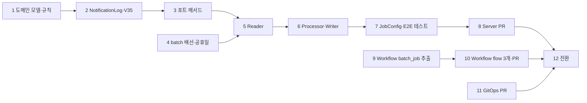

# 알림 발송 배치 이관 Implementation Plan

> **For agentic workers:** REQUIRED SUB-SKILL: Use superpowers:subagent-driven-development (recommended) or superpowers:executing-plans to implement this plan task-by-task. Steps use checkbox (`- [ ]`) syntax for tracking.

**Goal:** Team-Neki-Notification 의 푸시 알림 배치 3종을 `apps/batch` 로 옮기고(jOOQ -> JPA), 스케줄을 Prefect deployment 3개로 빼고, Notification 저장소와 Deployment 를 폐기할 수 있게 한다.

**Architecture:** 도메인 규칙(톤, 문구, 중복 판정)과 `notification_log` 엔티티는 `domain/notification` 에, 업로드 집계는 `domain/photo` 포트에 두고 `apps/batch` 의 잡 3개(`weeklyReminderJob`, `weekendExploreJob`, `holidayExploreJob`)가 포트를 조합한다. 실행은 Prefect 가 k8s Job 으로 띄우는 one-shot 계약(BACKEND-128) 그대로이며 FCM 은 기존 `FcmPushNotificationAdapter` 를 쓴다. 설계는 `docs/hld/2026-10-06-notification-push-hld.md`, 잡별 동작은 `docs/lld/notification-push/`, 완료 판정은 `docs/oracle/notification-push-jobs.md`.

**Tech Stack:** Kotlin 2.0, Spring Boot 3.5.8, Spring Batch 5.2, Spring Data JPA + QueryDSL, Flyway, H2(테스트), Kotest matcher, Prefect 3.8.5 + prefect-kubernetes 0.7.12, kustomize

---

- **작성일** : 2026-10-06
- **티켓** : BACKEND-135 (에픽 BACKEND-134 Notification 레포 이관)
- **브랜치** : Server `feat/BACKEND-135` (worktree `.claude/worktrees/BACKEND-135`), Workflow `feat/BACKEND-135`, GitOps `feat/BACKEND-135`
- **T0 baseline** : `./gradlew test -q` 의 모듈별 테스트 수 (domain, apps/batch, apps/api). 작업 시작 시 측정해 아래 표에 적고, 끝에 모듈별 수가 이 값 이상인지 본다 (오라클 O-0-2)

| 모듈 | T0 테스트 수 (2026-10-06, `b6fe62af`) | 실패 |
|---|---|---|
| domain | 92 | 0 |
| apps/batch | 18 | 0 |
| apps/api | 656 | 0 |

## 무엇을 만드나

```text
Prefect deployment 3개 (cron)  -> k8s Job (neki-batch) --spring.batch.job.name=<잡> businessDate=<D>
  weeklyReminderJob   : 동의자 페이지 -> D-7 당일 업로드자만 + [최근 업로드 요일]
  weekendExploreJob   : 동의자 페이지 전원
  holidayExploreJob   : 발송일이면 동의자 페이지 -> 최근 1달 업로드자만 + [공휴일명], 아니면 0건
  공통 : alreadySent 판정 -> 톤 배정 -> 문구 렌더 -> FCM -> notification_log -> (SUCCESS) tb_notification_hist, chunk=1
```

## 파일 구조

| 저장소 | 파일 | 책임 |
|---|---|---|
| Server | `domain/.../notification/models/{NotificationType,MessageTone,MessageVariable,RenderedMessage,SendTarget,SendDecision,FcmSendStatus}.kt` | 순수 모델 (Notification 에서 이식) |
| Server | `domain/.../notification/{MessageRenderer,ToneAssignmentPolicy,NotificationProcessor}.kt` | 순수 규칙 (이식) |
| Server | `domain/.../notification/models/NotificationLog.kt`, `repository/NotificationLogRepository.kt`, `infra/persist/NotificationLogRepositoryAdapter.kt`, `infra/persist/jpa/JpaNotificationLogRepository.kt` | 발송 이력 |
| Server | `domain/.../notification/repository/NotificationRepository.kt` (+adapter, jpa) | 동의자 페이지 |
| Server | `domain/.../photo/repository/PhotoImageRepository.kt` (+adapter, `PhotoImageQueryRepository`) | 업로드 집계 |
| Server | `modules/postgres/.../V35__create_notification_log_table.sql` | 편입 |
| Server | `apps/batch/.../notification/job/NotificationPushJobConfig.kt` | 잡 3개 조립 |
| Server | `apps/batch/.../notification/step/{SendTargetReader,PagingSendTargetItemReader,WeeklyReminderTargetReader,WeekendExploreTargetReader,HolidayExploreTargetReader}.kt` | 대상 조회 |
| Server | `apps/batch/.../notification/step/{PreparedNotification,NotificationItemProcessor,NotificationItemWriter}.kt` | 판정, 발송·적재 |
| Server | `apps/batch/.../notification/holiday/{Holiday,HolidayCalendar}.kt`, `resources/holidays.csv` | 공휴일 |
| Workflow | `flows/common/batch_job.py` | k8s Job 띄우기 (search-index 와 공유) |
| Workflow | `flows/{weekly_reminder,weekend_explore,holiday_explore}/{__init__,flow,job}.py`, `deployments/{weekly_reminder,weekend_explore,holiday_explore}.py` | flow 3개, 스케줄 3개 |
| Workflow | `docs/spec/notification-push.md`, `tests/test_notification_push.py` | 정본, 테스트 |
| GitOps | `overlays/prefect/workflow-secret.example.yaml`, `overlays/prod/{kustomization.yaml,notification-deployment.yaml}` | Secret 키, Notification 제거 |

## DAG



Server(1~8), Workflow(9~10), GitOps(11)는 서로 파일이 겹치지 않아 병렬이다. 12 는 세 PR 이 머지된 뒤 HLD 11절 순서로 사람이 한다.

---

## Task 1 : 도메인 모델과 순수 규칙 (오라클 O-A-6, O-B)

**Files**
- Create: `domain/src/main/kotlin/com/neki/domain/notification/models/NotificationType.kt`
- Create: `domain/src/main/kotlin/com/neki/domain/notification/models/MessageTone.kt`
- Create: `domain/src/main/kotlin/com/neki/domain/notification/models/MessageVariable.kt`
- Create: `domain/src/main/kotlin/com/neki/domain/notification/models/RenderedMessage.kt`
- Create: `domain/src/main/kotlin/com/neki/domain/notification/models/SendTarget.kt`
- Create: `domain/src/main/kotlin/com/neki/domain/notification/models/SendDecision.kt`
- Create: `domain/src/main/kotlin/com/neki/domain/notification/models/FcmSendStatus.kt`
- Create: `domain/src/main/kotlin/com/neki/domain/notification/MessageRenderer.kt`
- Create: `domain/src/main/kotlin/com/neki/domain/notification/ToneAssignmentPolicy.kt`
- Create: `domain/src/main/kotlin/com/neki/domain/notification/NotificationProcessor.kt`
- Test: `domain/src/test/kotlin/com/neki/domain/notification/{EnumContractTest,MessageRendererTest,ToneAssignmentPolicyTest,NotificationProcessorTest}.kt`

- [ ] **Step 1: 실패하는 테스트 4개를 쓴다** (Notification 저장소 `domain/src/test` 이식. 패키지와 단언만 바꿈)

```kotlin
// domain/src/test/kotlin/com/neki/domain/notification/EnumContractTest.kt
package com.neki.domain.notification

import com.neki.domain.notification.models.MessageTone
import com.neki.domain.notification.models.MessageVariable
import com.neki.domain.notification.models.NotificationType
import com.neki.domain.notification.models.SendTarget
import io.kotest.matchers.collections.shouldContainExactly
import io.kotest.matchers.maps.shouldBeEmpty
import io.kotest.matchers.shouldBe
import org.junit.jupiter.api.Test

/** MessageTone 선언 순서(톤 배정이 index 로 쓴다), 종류별 폴백 톤, 변수 토큰, SendTarget 기본값 */
class EnumContractTest {

    @Test
    fun `MessageTone 순서는 INFORMATIVE, FRIENDLY, SUGGESTIVE 로 고정이다`() {
        MessageTone.entries shouldContainExactly listOf(MessageTone.INFORMATIVE, MessageTone.FRIENDLY, MessageTone.SUGGESTIVE)
    }

    @Test
    fun `종류별 폴백 톤`() {
        NotificationType.WEEKLY_REMINDER.fallbackTone shouldBe MessageTone.INFORMATIVE
        NotificationType.WEEKEND_EXPLORE.fallbackTone shouldBe MessageTone.INFORMATIVE
        NotificationType.HOLIDAY_EXPLORE.fallbackTone shouldBe MessageTone.SUGGESTIVE
    }

    @Test
    fun `변수 토큰`() {
        MessageVariable.RECENT_UPLOAD_DAY.token shouldBe "최근 업로드 요일"
        MessageVariable.HOLIDAY_NAME.token shouldBe "공휴일명"
    }

    @Test
    fun `SendTarget 의 변수는 기본이 빈 맵이다`() {
        val target = SendTarget(userId = 42L, fcmToken = "token-abc")
        target.variables.shouldBeEmpty()
    }

    @Test
    fun `SendTarget 은 받은 변수를 그대로 든다`() {
        val vars = mapOf(MessageVariable.RECENT_UPLOAD_DAY to "지난 토요일")
        SendTarget(userId = 7L, fcmToken = "token-xyz", variables = vars).variables shouldBe vars
    }
}
```

```kotlin
// domain/src/test/kotlin/com/neki/domain/notification/MessageRendererTest.kt
package com.neki.domain.notification

import com.neki.domain.notification.models.MessageTone
import com.neki.domain.notification.models.MessageVariable
import com.neki.domain.notification.models.NotificationType
import com.neki.domain.notification.models.RenderedMessage
import io.kotest.matchers.shouldBe
import org.junit.jupiter.api.Nested
import org.junit.jupiter.api.Test

/** 문구는 docs/lld/notification-push/ 의 잡별 문서 표와 글자 그대로 같아야 한다 (공백, 느낌표 포함). 주석 안에 슬래시-별표가 오면 Kotlin 이 중첩 주석으로 읽으니 와일드카드를 쓰지 않는다 */
class MessageRendererTest {

    private fun render(type: NotificationType, tone: MessageTone, variables: Map<MessageVariable, String?> = emptyMap()): RenderedMessage =
        MessageRenderer.render(type, tone, variables)

    private fun RenderedMessage.shouldRender(title: String, body: String, tone: MessageTone, applied: Boolean) {
        this.title shouldBe title
        this.body shouldBe body
        this.actualTone shouldBe tone
        this.variableApplied shouldBe applied
    }

    @Nested
    inner class VariableFreeTemplates {
        @Test
        fun `WEEKLY_REMINDER INFORMATIVE`() = render(NotificationType.WEEKLY_REMINDER, MessageTone.INFORMATIVE)
            .shouldRender("일주일 전 사진이 있어요", "네키에 저장한 네컷을 다시 확인해보세요.", MessageTone.INFORMATIVE, false)

        @Test
        fun `WEEKLY_REMINDER FRIENDLY`() = render(NotificationType.WEEKLY_REMINDER, MessageTone.FRIENDLY)
            .shouldRender("벌써 일주일 전 네컷이에요", "지난 사진을 네키에서 다시 꺼내보세요.", MessageTone.FRIENDLY, false)

        @Test
        fun `WEEKEND_EXPLORE INFORMATIVE`() = render(NotificationType.WEEKEND_EXPLORE, MessageTone.INFORMATIVE)
            .shouldRender("주말 전 포토부스 확인하기", "가까운 포토부스를 네키 지도에서 확인해보세요.", MessageTone.INFORMATIVE, false)

        @Test
        fun `WEEKEND_EXPLORE FRIENDLY`() = render(NotificationType.WEEKEND_EXPLORE, MessageTone.FRIENDLY)
            .shouldRender("이번 주말엔 어디서 찍을까요?", "약속 전에 근처 포토부스를 미리 찾아보세요.", MessageTone.FRIENDLY, false)

        @Test
        fun `WEEKEND_EXPLORE SUGGESTIVE`() = render(NotificationType.WEEKEND_EXPLORE, MessageTone.SUGGESTIVE)
            .shouldRender("약속 전에 미리 찾아보세요", "가까운 포토부스를 네키 지도에서 확인해보세요.", MessageTone.SUGGESTIVE, false)

        @Test
        fun `HOLIDAY_EXPLORE SUGGESTIVE`() = render(NotificationType.HOLIDAY_EXPLORE, MessageTone.SUGGESTIVE)
            .shouldRender("쉬는 날 가기 좋은 포토부스", "네키 지도에서 가까운 포토부스를 확인해보세요.", MessageTone.SUGGESTIVE, false)
    }

    @Nested
    inner class VariableSubstitution {
        @Test
        fun `WEEKLY_REMINDER SUGGESTIVE 는 최근 업로드 요일을 치환한다`() =
            render(NotificationType.WEEKLY_REMINDER, MessageTone.SUGGESTIVE, mapOf(MessageVariable.RECENT_UPLOAD_DAY to "지난 토요일"))
                .shouldRender("지난 토요일처럼 오늘도 남겨볼까요?", "오늘 찍은 사진도 네키에 정리해보세요.", MessageTone.SUGGESTIVE, true)

        @Test
        fun `HOLIDAY_EXPLORE INFORMATIVE 는 공휴일명을 치환한다`() =
            render(NotificationType.HOLIDAY_EXPLORE, MessageTone.INFORMATIVE, mapOf(MessageVariable.HOLIDAY_NAME to "어린이날"))
                .shouldRender("어린이날 포토부스 확인하기", "쉬는 날 방문할 포토부스를 네키 지도에서 확인해보세요.", MessageTone.INFORMATIVE, true)

        @Test
        fun `HOLIDAY_EXPLORE FRIENDLY 는 공휴일명을 치환한다 (본문 끝 느낌표)`() =
            render(NotificationType.HOLIDAY_EXPLORE, MessageTone.FRIENDLY, mapOf(MessageVariable.HOLIDAY_NAME to "어린이날"))
                .shouldRender("어린이날에 약속 있으신가요?", "약속 전에 근처 포토부스를 미리 확인해보세요!", MessageTone.FRIENDLY, true)
    }

    @Nested
    inner class FallbackOnMissingVariable {
        private fun weeklyFallsBack(variables: Map<MessageVariable, String?>) =
            render(NotificationType.WEEKLY_REMINDER, MessageTone.SUGGESTIVE, variables)
                .shouldRender("일주일 전 사진이 있어요", "네키에 저장한 네컷을 다시 확인해보세요.", MessageTone.INFORMATIVE, false)

        private fun holidayFallsBack(tone: MessageTone, variables: Map<MessageVariable, String?>) =
            render(NotificationType.HOLIDAY_EXPLORE, tone, variables)
                .shouldRender("쉬는 날 가기 좋은 포토부스", "네키 지도에서 가까운 포토부스를 확인해보세요.", MessageTone.SUGGESTIVE, false)

        @Test
        fun `키가 없으면 폴백`() = weeklyFallsBack(emptyMap())

        @Test
        fun `값이 null 이면 폴백`() = weeklyFallsBack(mapOf(MessageVariable.RECENT_UPLOAD_DAY to null))

        @Test
        fun `값이 빈 문자열이면 폴백`() = weeklyFallsBack(mapOf(MessageVariable.RECENT_UPLOAD_DAY to ""))

        @Test
        fun `값이 공백이면 폴백`() = weeklyFallsBack(mapOf(MessageVariable.RECENT_UPLOAD_DAY to "   "))

        @Test
        fun `HOLIDAY_EXPLORE INFORMATIVE 는 공휴일명이 없으면 SUGGESTIVE 로 폴백`() =
            holidayFallsBack(MessageTone.INFORMATIVE, mapOf(MessageVariable.HOLIDAY_NAME to null))

        @Test
        fun `HOLIDAY_EXPLORE FRIENDLY 도 공휴일명이 없으면 SUGGESTIVE 로 폴백`() =
            holidayFallsBack(MessageTone.FRIENDLY, emptyMap())
    }

    @Test
    fun `WEEKEND_EXPLORE 는 변수가 들어와도 어느 톤에서도 쓰지 않는다`() {
        val populated = mapOf(MessageVariable.RECENT_UPLOAD_DAY to "지난 토요일", MessageVariable.HOLIDAY_NAME to "어린이날")
        for (tone in MessageTone.entries) {
            val result: RenderedMessage = render(NotificationType.WEEKEND_EXPLORE, tone, populated)
            result.variableApplied shouldBe false
            result.actualTone shouldBe tone
        }
    }
}
```

```kotlin
// domain/src/test/kotlin/com/neki/domain/notification/ToneAssignmentPolicyTest.kt
package com.neki.domain.notification

import com.neki.domain.notification.models.MessageTone
import io.kotest.matchers.shouldBe
import org.junit.jupiter.api.Test
import java.time.LocalDate

/** tone = entries[floorMod(userId + businessDate.epochDay, 3)]. 0 INFORMATIVE, 1 FRIENDLY, 2 SUGGESTIVE */
class ToneAssignmentPolicyTest {

    /** epochDay 0 이라 톤이 userId % 3 과 같다 */
    private val epochDay0 = LocalDate.of(1970, 1, 1)

    @Test
    fun `같은 유저라도 발송일이 하루씩 지나면 톤이 순환한다`() {
        ToneAssignmentPolicy.assign(0L, epochDay0) shouldBe MessageTone.INFORMATIVE
        ToneAssignmentPolicy.assign(0L, epochDay0.plusDays(1)) shouldBe MessageTone.FRIENDLY
        ToneAssignmentPolicy.assign(0L, epochDay0.plusDays(2)) shouldBe MessageTone.SUGGESTIVE
        ToneAssignmentPolicy.assign(0L, epochDay0.plusDays(3)) shouldBe MessageTone.INFORMATIVE
    }

    @Test
    fun `같은 날에는 userId 가 1 늘 때마다 톤이 한 칸씩 밀린다`() {
        listOf(
            0L to MessageTone.INFORMATIVE,
            1L to MessageTone.FRIENDLY,
            2L to MessageTone.SUGGESTIVE,
            3L to MessageTone.INFORMATIVE,
            999_999_999_999L to MessageTone.INFORMATIVE,
            999_999_999_998L to MessageTone.SUGGESTIVE,
        ).forEach { (userId, expected) -> ToneAssignmentPolicy.assign(userId, epochDay0) shouldBe expected }
    }

    @Test
    fun `실제 날짜도 epochDay 를 더해 계산한다`() {
        val date = LocalDate.of(2026, 9, 23) // epochDay 20719, floorMod 1
        date.toEpochDay() shouldBe 20719L
        ToneAssignmentPolicy.assign(0L, date) shouldBe MessageTone.FRIENDLY
        ToneAssignmentPolicy.assign(1L, date) shouldBe MessageTone.SUGGESTIVE
        ToneAssignmentPolicy.assign(2L, date) shouldBe MessageTone.INFORMATIVE
    }

    @Test
    fun `userId 가 Long 최대값이어도 덧셈 오버플로 없이 수학적 합의 mod 를 따른다`() {
        // floorMod(MAX, 3) = 1, epochDay 1 -> 2 -> SUGGESTIVE. 그냥 더하면 MIN 으로 감싸져 FRIENDLY 가 된다
        ToneAssignmentPolicy.assign(Long.MAX_VALUE, epochDay0.plusDays(1)) shouldBe MessageTone.SUGGESTIVE
    }

    @Test
    fun `음수 userId 도 floorMod 로 안전하다`() {
        listOf(-1L to MessageTone.SUGGESTIVE, -2L to MessageTone.FRIENDLY, -3L to MessageTone.INFORMATIVE, -4L to MessageTone.SUGGESTIVE)
            .forEach { (userId, expected) -> ToneAssignmentPolicy.assign(userId, epochDay0) shouldBe expected }
    }
}
```

```kotlin
// domain/src/test/kotlin/com/neki/domain/notification/NotificationProcessorTest.kt
package com.neki.domain.notification

import com.neki.domain.notification.models.MessageTone
import com.neki.domain.notification.models.MessageVariable
import com.neki.domain.notification.models.NotificationType
import com.neki.domain.notification.models.SendDecision
import com.neki.domain.notification.models.SendTarget
import com.neki.domain.notification.models.SkipReason
import io.kotest.matchers.shouldBe
import io.kotest.matchers.types.shouldBeInstanceOf
import org.junit.jupiter.api.Test
import java.time.LocalDate

/** 중복이면 Skip, 아니면 톤 배정 + 렌더. 동의는 읽기 쿼리가 보므로 여기서 다루지 않는다 */
class NotificationProcessorTest {

    /** epochDay 20718 은 3 의 배수라 이 날의 톤은 userId % 3 과 같다 */
    private val businessDate = LocalDate.of(2026, 9, 22)

    private fun target(userId: Long, variables: Map<MessageVariable, String?> = emptyMap()) =
        SendTarget(userId = userId, fcmToken = "token-$userId", variables = variables)

    @Test
    fun `이미 발송됐으면 ALREADY_SENT 로 스킵`() {
        NotificationProcessor.decide(target(1L), NotificationType.WEEKEND_EXPLORE, alreadySent = true, businessDate) shouldBe
            SendDecision.Skip(SkipReason.ALREADY_SENT)
    }

    @Test
    fun `미중복이고 변수 없는 종류면 기본 문구로 발송`() {
        val send = NotificationProcessor.decide(target(0L), NotificationType.WEEKEND_EXPLORE, alreadySent = false, businessDate)
            .shouldBeInstanceOf<SendDecision.Send>()
        send.message.actualTone shouldBe MessageTone.INFORMATIVE
        send.message.title shouldBe "주말 전 포토부스 확인하기"
        send.message.variableApplied shouldBe false
    }

    @Test
    fun `톤은 businessDate 를 반영한다`() {
        val nextDay = businessDate.plusDays(1) // userId 2 + epochDay 20719 -> 0 -> INFORMATIVE
        val send = NotificationProcessor.decide(target(2L), NotificationType.WEEKEND_EXPLORE, alreadySent = false, nextDay)
            .shouldBeInstanceOf<SendDecision.Send>()
        send.message.actualTone shouldBe ToneAssignmentPolicy.assign(2L, nextDay)
        send.message.actualTone shouldBe MessageTone.INFORMATIVE
    }

    @Test
    fun `변수값이 있으면 개인화 문구로 발송`() {
        val send = NotificationProcessor.decide(
            target(2L, mapOf(MessageVariable.RECENT_UPLOAD_DAY to "지난 토요일")),
            NotificationType.WEEKLY_REMINDER,
            alreadySent = false,
            businessDate,
        ).shouldBeInstanceOf<SendDecision.Send>()
        send.message.actualTone shouldBe MessageTone.SUGGESTIVE
        send.message.variableApplied shouldBe true
        send.message.title shouldBe "지난 토요일처럼 오늘도 남겨볼까요?"
    }

    @Test
    fun `변수값이 없으면 폴백 톤 기본 문구로 발송`() {
        val send = NotificationProcessor.decide(target(2L), NotificationType.WEEKLY_REMINDER, alreadySent = false, businessDate)
            .shouldBeInstanceOf<SendDecision.Send>()
        send.message.actualTone shouldBe MessageTone.INFORMATIVE
        send.message.variableApplied shouldBe false
        send.message.title shouldBe "일주일 전 사진이 있어요"
    }
}
```

- [ ] **Step 2: 실패를 확인한다**

Run: `./gradlew :domain:compileTestKotlin -q`
Expected: `Unresolved reference` 로 컴파일 실패

- [ ] **Step 3: 모델과 규칙을 만든다**

```kotlin
// domain/src/main/kotlin/com/neki/domain/notification/models/NotificationType.kt
package com.neki.domain.notification.models

/**
 * fileName       : NotificationType
 * author         : koo
 * date           : 2026. 10. 6.
 * description    : 배치가 보내는 알림 종류. 잡 하나가 종류 하나를 맡는다
 */
enum class NotificationType {
    WEEKLY_REMINDER,
    WEEKEND_EXPLORE,
    HOLIDAY_EXPLORE,
    ;

    /** 필요 변수가 비었을 때 내려가는 톤. 폴백 톤의 템플릿은 변수를 쓰지 않는다 */
    val fallbackTone: MessageTone
        get() = when (this) {
            WEEKLY_REMINDER -> MessageTone.INFORMATIVE
            WEEKEND_EXPLORE -> MessageTone.INFORMATIVE
            HOLIDAY_EXPLORE -> MessageTone.SUGGESTIVE
        }
}
```

```kotlin
// domain/src/main/kotlin/com/neki/domain/notification/models/MessageTone.kt
package com.neki.domain.notification.models

/**
 * fileName       : MessageTone
 * author         : koo
 * date           : 2026. 10. 6.
 * description    : 문구 톤. 선언 순서가 유효하다. ToneAssignmentPolicy 가 entries 를 index 로 고른다
 */
enum class MessageTone {
    INFORMATIVE,
    FRIENDLY,
    SUGGESTIVE,
}
```

```kotlin
// domain/src/main/kotlin/com/neki/domain/notification/models/MessageVariable.kt
package com.neki.domain.notification.models

/**
 * fileName       : MessageVariable
 * author         : koo
 * date           : 2026. 10. 6.
 * description    : 문구 치환 변수. 템플릿 안에서는 {토큰} 으로 쓴다
 */
enum class MessageVariable(val token: String) {
    RECENT_UPLOAD_DAY("최근 업로드 요일"),
    HOLIDAY_NAME("공휴일명"),
}
```

```kotlin
// domain/src/main/kotlin/com/neki/domain/notification/models/RenderedMessage.kt
package com.neki.domain.notification.models

/**
 * fileName       : RenderedMessage
 * author         : koo
 * date           : 2026. 10. 6.
 * description    : 렌더된 문구. actualTone 은 폴백이 일어났으면 배정 톤과 다르다
 */
data class RenderedMessage(
    val title: String,
    val body: String,
    val actualTone: MessageTone,
    val variableApplied: Boolean,
)
```

```kotlin
// domain/src/main/kotlin/com/neki/domain/notification/models/SendTarget.kt
package com.neki.domain.notification.models

/**
 * fileName       : SendTarget
 * author         : koo
 * date           : 2026. 10. 6.
 * description    : 발송 대상 1건. 동의자 페이지를 잡 조건으로 거르고 변수를 채운 결과
 */
data class SendTarget(
    val userId: Long,
    val fcmToken: String,
    val variables: Map<MessageVariable, String?> = emptyMap(),
)
```

```kotlin
// domain/src/main/kotlin/com/neki/domain/notification/models/SendDecision.kt
package com.neki.domain.notification.models

/**
 * fileName       : SendDecision
 * author         : koo
 * date           : 2026. 10. 6.
 * description    : 대상 1건의 처리 판정. Send 는 렌더된 문구를 들고 발송으로, Skip 은 사유와 함께 제외
 */
sealed interface SendDecision {
    data class Send(val message: RenderedMessage) : SendDecision

    data class Skip(val reason: SkipReason) : SendDecision
}

/** 동의 필터는 읽기 쿼리(push_agreed = true)가 맡으므로 여기엔 중복 사유만 있다 */
enum class SkipReason {
    ALREADY_SENT,
}
```

```kotlin
// domain/src/main/kotlin/com/neki/domain/notification/models/FcmSendStatus.kt
package com.neki.domain.notification.models

/**
 * fileName       : FcmSendStatus
 * author         : koo
 * date           : 2026. 10. 6.
 * description    : notification_log.fcm_result. SKIPPED 는 Notification 앱이 남긴 기존 행을 위해 남겨 두며 새로 쓰지 않는다
 */
enum class FcmSendStatus {
    SUCCESS,
    FAILED,
    SKIPPED,
}
```

```kotlin
// domain/src/main/kotlin/com/neki/domain/notification/MessageRenderer.kt
package com.neki.domain.notification

import com.neki.domain.notification.models.MessageTone
import com.neki.domain.notification.models.MessageVariable
import com.neki.domain.notification.models.NotificationType
import com.neki.domain.notification.models.RenderedMessage

/**
 * fileName       : MessageRenderer
 * author         : koo
 * date           : 2026. 10. 6.
 * description    : 종류·톤별 문구 템플릿과 치환·폴백 규칙. 두 단계 when 이라 조합이 빠지면 컴파일이 막는다.
 *                  문구 표는 docs/lld/notification-push/<잡>.md
 */
object MessageRenderer {

    private data class Template(
        val title: String,
        val body: String,
        val requiredVariable: MessageVariable? = null,
    )

    private fun templateFor(type: NotificationType, tone: MessageTone): Template = when (type) {
        NotificationType.WEEKLY_REMINDER -> when (tone) {
            MessageTone.INFORMATIVE -> Template(
                title = "일주일 전 사진이 있어요",
                body = "네키에 저장한 네컷을 다시 확인해보세요.",
            )
            MessageTone.FRIENDLY -> Template(
                title = "벌써 일주일 전 네컷이에요",
                body = "지난 사진을 네키에서 다시 꺼내보세요.",
            )
            MessageTone.SUGGESTIVE -> Template(
                title = "{최근 업로드 요일}처럼 오늘도 남겨볼까요?",
                body = "오늘 찍은 사진도 네키에 정리해보세요.",
                requiredVariable = MessageVariable.RECENT_UPLOAD_DAY,
            )
        }

        NotificationType.WEEKEND_EXPLORE -> when (tone) {
            MessageTone.INFORMATIVE -> Template(
                title = "주말 전 포토부스 확인하기",
                body = "가까운 포토부스를 네키 지도에서 확인해보세요.",
            )
            MessageTone.FRIENDLY -> Template(
                title = "이번 주말엔 어디서 찍을까요?",
                body = "약속 전에 근처 포토부스를 미리 찾아보세요.",
            )
            MessageTone.SUGGESTIVE -> Template(
                title = "약속 전에 미리 찾아보세요",
                body = "가까운 포토부스를 네키 지도에서 확인해보세요.",
            )
        }

        NotificationType.HOLIDAY_EXPLORE -> when (tone) {
            MessageTone.INFORMATIVE -> Template(
                title = "{공휴일명} 포토부스 확인하기",
                body = "쉬는 날 방문할 포토부스를 네키 지도에서 확인해보세요.",
                requiredVariable = MessageVariable.HOLIDAY_NAME,
            )
            MessageTone.FRIENDLY -> Template(
                title = "{공휴일명}에 약속 있으신가요?",
                body = "약속 전에 근처 포토부스를 미리 확인해보세요!",
                requiredVariable = MessageVariable.HOLIDAY_NAME,
            )
            MessageTone.SUGGESTIVE -> Template(
                title = "쉬는 날 가기 좋은 포토부스",
                body = "네키 지도에서 가까운 포토부스를 확인해보세요.",
            )
        }
    }

    /**
     * 1. 필요 변수가 없으면 그대로 2. 값이 있으면 치환 3. 값이 없거나 blank 면 폴백 톤 템플릿 (변수 불필요)
     */
    fun render(
        type: NotificationType,
        assignedTone: MessageTone,
        variables: Map<MessageVariable, String?>,
    ): RenderedMessage {
        val template: Template = templateFor(type, assignedTone)
        val required: MessageVariable = template.requiredVariable
            ?: return RenderedMessage(template.title, template.body, assignedTone, variableApplied = false)

        val value: String? = variables[required]
        if (!value.isNullOrBlank()) {
            return RenderedMessage(
                title = template.title.replace("{${required.token}}", value),
                body = template.body.replace("{${required.token}}", value),
                actualTone = assignedTone,
                variableApplied = true,
            )
        }

        val fallback: Template = templateFor(type, type.fallbackTone)
        return RenderedMessage(fallback.title, fallback.body, type.fallbackTone, variableApplied = false)
    }
}
```

```kotlin
// domain/src/main/kotlin/com/neki/domain/notification/ToneAssignmentPolicy.kt
package com.neki.domain.notification

import com.neki.domain.notification.models.MessageTone
import java.time.LocalDate

/**
 * fileName       : ToneAssignmentPolicy
 * author         : koo
 * date           : 2026. 10. 6.
 * description    : 발송 건마다 결정적으로 톤을 배정한다. 같은 유저라도 발송일이 바뀌면 순환한다.
 *                  두 항을 각각 mod 한 뒤 더하는 이유는 userId 가 Long.MAX_VALUE 근처면 그냥 더할 때 오버플로가 나기 때문
 */
object ToneAssignmentPolicy {

    fun assign(userId: Long, businessDate: LocalDate): MessageTone =
        MessageTone.entries[
            Math.floorMod(Math.floorMod(userId, 3) + Math.floorMod(businessDate.toEpochDay(), 3), 3),
        ]
}
```

```kotlin
// domain/src/main/kotlin/com/neki/domain/notification/NotificationProcessor.kt
package com.neki.domain.notification

import com.neki.domain.notification.models.NotificationType
import com.neki.domain.notification.models.RenderedMessage
import com.neki.domain.notification.models.SendDecision
import com.neki.domain.notification.models.SendTarget
import com.neki.domain.notification.models.SkipReason
import java.time.LocalDate

/**
 * fileName       : NotificationProcessor
 * author         : koo
 * date           : 2026. 10. 6.
 * description    : 대상 1건의 판정. 중복이면 Skip, 아니면 톤 배정 + 렌더. 동의는 읽기 쿼리가 보므로 재확인하지 않는다.
 *                  이력 조회는 호출자가 하고 그 결과(alreadySent)만 받는다
 */
object NotificationProcessor {

    fun decide(
        target: SendTarget,
        type: NotificationType,
        alreadySent: Boolean,
        businessDate: LocalDate,
    ): SendDecision {
        if (alreadySent) {
            return SendDecision.Skip(SkipReason.ALREADY_SENT)
        }
        val message: RenderedMessage =
            MessageRenderer.render(type, ToneAssignmentPolicy.assign(target.userId, businessDate), target.variables)
        return SendDecision.Send(message)
    }
}
```

- [ ] **Step 4: 통과를 확인한다**

Run: `./gradlew :domain:test --tests 'com.neki.domain.notification.*' -q`
Expected: 종료 코드 0

- [ ] **Step 5: 커밋**

```bash
git add domain/src/main/kotlin/com/neki/domain/notification domain/src/test/kotlin/com/neki/domain/notification
git commit -m "feat: 알림 발송 문구·톤·중복 판정 규칙을 domain/notification 에 둔다"
```

---

## Task 2 : NotificationLog 엔티티, 포트, 어댑터, V35 (오라클 O-A-1~4, O-A-7)

**Files**
- Create: `modules/postgres/src/main/resources/db/migration/V35__create_notification_log_table.sql`
- Create: `domain/src/main/kotlin/com/neki/domain/notification/models/NotificationLog.kt`
- Create: `domain/src/main/kotlin/com/neki/domain/notification/repository/NotificationLogRepository.kt`
- Create: `domain/src/main/kotlin/com/neki/domain/notification/infra/persist/jpa/JpaNotificationLogRepository.kt`
- Create: `domain/src/main/kotlin/com/neki/domain/notification/infra/persist/NotificationLogRepositoryAdapter.kt`

- [ ] **Step 1: 마이그레이션**

```sql
-- modules/postgres/src/main/resources/db/migration/V35__create_notification_log_table.sql
-- 알림 배치 발송 이력. Team-Neki-Notification 이 전용 history(flyway_schema_history_notification)로 만든
-- 테이블을 이 저장소의 Flyway 에 편입한다. prod 에는 이미 있고(발송 이력 데이터 포함) staging/local 에는
-- 없으므로 IF NOT EXISTS 로 둔다 (V31 의 BATCH_* 와 같은 방식). DDL 은 Notification V1 과 동일하다.
--
-- 이름에 TB_ 접두가 없는 이유: Notification 앱이 폐기 전까지 같은 테이블에 쓰므로 지금 바꾸면 전환 중
-- 두 앱이 다른 테이블을 본다. rename 과 flyway_schema_history_notification 정리는 폐기 뒤 후속 마이그레이션.
--
-- 중복 발송 방지의 최종 방어선: UNIQUE (user_id, notification_type, business_date)

CREATE TABLE IF NOT EXISTS notification_log (
    id                BIGINT GENERATED BY DEFAULT AS IDENTITY PRIMARY KEY,
    user_id           BIGINT       NOT NULL,
    notification_type VARCHAR(32)  NOT NULL,
    message_tone      VARCHAR(16)  NOT NULL,
    variable_applied  BOOLEAN      NOT NULL,
    title             VARCHAR(255) NOT NULL,
    body              VARCHAR(500) NOT NULL,
    business_date     DATE         NOT NULL,
    fcm_result        VARCHAR(16)  NOT NULL,
    sent_at           TIMESTAMP(6) WITH TIME ZONE NOT NULL,
    CONSTRAINT uq_notification_log_user_type_date UNIQUE (user_id, notification_type, business_date)
);

CREATE INDEX IF NOT EXISTS ix_notification_log_business_date ON notification_log (business_date);
```

- [ ] **Step 2: 엔티티와 포트**

```kotlin
// domain/src/main/kotlin/com/neki/domain/notification/models/NotificationLog.kt
package com.neki.domain.notification.models

import jakarta.persistence.Column
import jakarta.persistence.Entity
import jakarta.persistence.EnumType
import jakarta.persistence.Enumerated
import jakarta.persistence.GeneratedValue
import jakarta.persistence.GenerationType
import jakarta.persistence.Id
import jakarta.persistence.Index
import jakarta.persistence.Table
import jakarta.persistence.UniqueConstraint
import java.time.Instant
import java.time.LocalDate

/**
 * fileName       : NotificationLog
 * author         : koo
 * date           : 2026. 10. 6.
 * description    : 배치 발송 이력 (notification_log, V35). 전 결과를 남기며 (user_id, type, business_date) 가 중복 방지 키다.
 *                  created_at/updated_at 이 없는 테이블이라 BaseTimeEntity 를 상속하지 않는다
 */
@Entity
@Table(
    name = "notification_log",
    uniqueConstraints = [
        UniqueConstraint(
            name = "uq_notification_log_user_type_date",
            columnNames = ["user_id", "notification_type", "business_date"],
        ),
    ],
    indexes = [Index(name = "ix_notification_log_business_date", columnList = "business_date")],
)
class NotificationLog(
    @Id
    @GeneratedValue(strategy = GenerationType.IDENTITY)
    val id: Long? = null,

    @Column(name = "user_id", nullable = false)
    val userId: Long,

    @Enumerated(EnumType.STRING)
    @Column(name = "notification_type", nullable = false, length = 32)
    val notificationType: NotificationType,

    @Enumerated(EnumType.STRING)
    @Column(name = "message_tone", nullable = false, length = 16)
    val messageTone: MessageTone,

    @Column(name = "variable_applied", nullable = false)
    val variableApplied: Boolean,

    @Column(name = "title", nullable = false, length = 255)
    val title: String,

    @Column(name = "body", nullable = false, length = 500)
    val body: String,

    @Column(name = "business_date", nullable = false)
    val businessDate: LocalDate,

    @Enumerated(EnumType.STRING)
    @Column(name = "fcm_result", nullable = false, length = 16)
    val fcmResult: FcmSendStatus,

    @Column(name = "sent_at", nullable = false)
    val sentAt: Instant,
) {
    companion object {
        fun of(
            target: SendTarget,
            type: NotificationType,
            message: RenderedMessage,
            businessDate: LocalDate,
            fcmResult: FcmSendStatus,
        ): NotificationLog = NotificationLog(
            userId = target.userId,
            notificationType = type,
            messageTone = message.actualTone,
            variableApplied = message.variableApplied,
            title = message.title,
            body = message.body,
            businessDate = businessDate,
            fcmResult = fcmResult,
            sentAt = Instant.now(),
        )
    }
}
```

```kotlin
// domain/src/main/kotlin/com/neki/domain/notification/repository/NotificationLogRepository.kt
package com.neki.domain.notification.repository

import com.neki.domain.notification.models.NotificationLog
import com.neki.domain.notification.models.NotificationType
import java.time.LocalDate

/**
 * fileName       : NotificationLogRepository
 * author         : koo
 * date           : 2026. 10. 6.
 * description    : 배치 발송 이력 포트. exists 는 fcm_result 와 무관하게 키 존재만 본다 (FAILED 도 당일 재발송 없음)
 */
interface NotificationLogRepository {

    fun exists(userId: Long, type: NotificationType, businessDate: LocalDate): Boolean

    fun save(log: NotificationLog): NotificationLog
}
```

```kotlin
// domain/src/main/kotlin/com/neki/domain/notification/infra/persist/jpa/JpaNotificationLogRepository.kt
package com.neki.domain.notification.infra.persist.jpa

import com.neki.domain.notification.models.NotificationLog
import com.neki.domain.notification.models.NotificationType
import org.springframework.data.jpa.repository.JpaRepository
import java.time.LocalDate

interface JpaNotificationLogRepository : JpaRepository<NotificationLog, Long> {

    fun existsByUserIdAndNotificationTypeAndBusinessDate(
        userId: Long,
        notificationType: NotificationType,
        businessDate: LocalDate,
    ): Boolean
}
```

```kotlin
// domain/src/main/kotlin/com/neki/domain/notification/infra/persist/NotificationLogRepositoryAdapter.kt
package com.neki.domain.notification.infra.persist

import com.neki.domain.notification.infra.persist.jpa.JpaNotificationLogRepository
import com.neki.domain.notification.models.NotificationLog
import com.neki.domain.notification.models.NotificationType
import com.neki.domain.notification.repository.NotificationLogRepository
import org.springframework.stereotype.Repository
import java.time.LocalDate

@Repository
class NotificationLogRepositoryAdapter(private val jpaRepository: JpaNotificationLogRepository) : NotificationLogRepository {

    override fun exists(userId: Long, type: NotificationType, businessDate: LocalDate): Boolean =
        jpaRepository.existsByUserIdAndNotificationTypeAndBusinessDate(userId, type, businessDate)

    override fun save(log: NotificationLog): NotificationLog = jpaRepository.save(log)
}
```

- [ ] **Step 3: api 가 H2 에 DDL 을 만들고 기동하는지 본다**

Run: `./gradlew :apps:api:test --tests 'com.neki.api.rule.ArchitectureRulesTest' -q`
Expected: 종료 코드 0

- [ ] **Step 4: 커밋**

```bash
git add modules/postgres/src/main/resources/db/migration/V35__create_notification_log_table.sql domain/src/main/kotlin/com/neki/domain/notification
git commit -m "feat: notification_log 를 V35 로 편입하고 NotificationLog 엔티티와 포트를 둔다"
```

---

## Task 3 : 동의자 페이지와 업로드 집계 포트 (오라클 O-A-5, O-0-6)

**Files**
- Modify: `domain/src/main/kotlin/com/neki/domain/notification/repository/NotificationRepository.kt`
- Modify: `domain/src/main/kotlin/com/neki/domain/notification/infra/persist/jpa/JpaNotificationRepository.kt`
- Modify: `domain/src/main/kotlin/com/neki/domain/notification/infra/persist/NotificationRepositoryAdapter.kt`
- Modify: `domain/src/main/kotlin/com/neki/domain/photo/repository/PhotoImageRepository.kt`
- Modify: `domain/src/main/kotlin/com/neki/domain/photo/infra/persist/jpa/PhotoImageQueryRepository.kt`
- Modify: `domain/src/main/kotlin/com/neki/domain/photo/infra/persist/PhotoImageRepositoryAdapter.kt`

- [ ] **Step 1: notification 포트**

`NotificationRepository` 에 추가 :

```kotlin
    /** 배치 발송 대상의 단일 출처. push_agreed = true 이고 user_id > afterUserId 인 행을 user_id 오름차순으로 limit 건 */
    fun findPushAgreedAfter(afterUserId: Long, limit: Int): List<Notification>
```

`JpaNotificationRepository` 에 추가 (`import org.springframework.data.domain.Limit`) :

```kotlin
    fun findByPushAgreedTrueAndUserIdGreaterThanOrderByUserIdAsc(userId: Long, limit: Limit): List<Notification>
```

`NotificationRepositoryAdapter` 에 추가 :

```kotlin
    override fun findPushAgreedAfter(afterUserId: Long, limit: Int): List<Notification> =
        jpaRepository.findByPushAgreedTrueAndUserIdGreaterThanOrderByUserIdAsc(afterUserId, Limit.of(limit))
```

- [ ] **Step 2: photo 포트**

`PhotoImageRepository` 의 `조회` 절에 추가 (`import java.time.LocalDateTime`) :

```kotlin
    /** userIds 중 [start, endExclusive) 에 올린 사진이 있는 user_id. 삭제된 사진은 @SQLRestriction 이 뺀다 */
    fun findUserIdsUploadedBetween(userIds: Collection<Long>, start: LocalDateTime, endExclusive: LocalDateTime): Set<Long>

    /** userIds 마다 삭제되지 않은 사진의 마지막 업로드 시각. 사진이 없는 유저는 키가 없다 */
    fun findLastUploadedAtByUserIds(userIds: Collection<Long>): Map<Long, LocalDateTime>
```

`PhotoImageQueryRepository` 에 추가 (`import java.time.LocalDateTime`) :

```kotlin
    fun findUserIdsUploadedBetween(userIds: Collection<Long>, start: LocalDateTime, endExclusive: LocalDateTime): Set<Long> {
        if (userIds.isEmpty()) return emptySet()
        return queryFactory.select(photoImage.userId).distinct()
            .from(photoImage)
            .where(
                photoImage.userId.`in`(userIds),
                photoImage.createdAt.goe(start),
                photoImage.createdAt.lt(endExclusive),
            )
            .fetch()
            .toSet()
    }

    fun findLastUploadedAtByUserIds(userIds: Collection<Long>): Map<Long, LocalDateTime> {
        if (userIds.isEmpty()) return emptyMap()
        val lastUploadedAt = photoImage.createdAt.max()
        return queryFactory.select(photoImage.userId, lastUploadedAt)
            .from(photoImage)
            .where(photoImage.userId.`in`(userIds))
            .groupBy(photoImage.userId)
            .fetch()
            .associate { it.get(photoImage.userId)!! to it.get(lastUploadedAt)!! }
    }
```

`PhotoImageRepositoryAdapter` 에 추가 :

```kotlin
    override fun findUserIdsUploadedBetween(userIds: Collection<Long>, start: LocalDateTime, endExclusive: LocalDateTime): Set<Long> =
        queryRepository.findUserIdsUploadedBetween(userIds, start, endExclusive)

    override fun findLastUploadedAtByUserIds(userIds: Collection<Long>): Map<Long, LocalDateTime> =
        queryRepository.findLastUploadedAtByUserIds(userIds)
```

- [ ] **Step 3: 컴파일과 api 회귀**

Run: `./gradlew :domain:compileKotlin :apps:api:test --tests 'com.neki.api.rule.ArchitectureRulesTest' -q`
Expected: 종료 코드 0

- [ ] **Step 4: 커밋**

```bash
git add domain/src/main/kotlin/com/neki/domain/notification domain/src/main/kotlin/com/neki/domain/photo
git commit -m "feat: 배치 대상 조회를 위한 동의자 페이지·업로드 집계 포트를 더한다"
```

---

## Task 4 : batch 배선과 공휴일 (오라클 O-C-8, O-C-9)

**Files**
- Modify: `apps/batch/build.gradle.kts`
- Modify: `apps/batch/src/main/kotlin/com/neki/batch/NekiBatchApplication.kt`
- Modify: `apps/batch/src/main/resources/application.yaml`
- Create: `apps/batch/src/main/resources/holidays.csv` (Notification 의 파일 그대로)
- Create: `apps/batch/src/main/kotlin/com/neki/batch/notification/holiday/Holiday.kt`
- Create: `apps/batch/src/main/kotlin/com/neki/batch/notification/holiday/HolidayCalendar.kt`
- Modify: `apps/batch/src/test/resources/application-test.yml`
- Create: `apps/batch/src/test/resources/holidays-test.csv`
- Test: `apps/batch/src/test/kotlin/com/neki/batch/notification/holiday/HolidayCalendarTest.kt`

- [ ] **Step 1: 테스트 CSV 와 실패하는 테스트**

```text
# apps/batch/src/test/resources/holidays-test.csv
# 테스트용 공휴일. HolidayCalendarTest 와 NotificationPushJobsTest 가 읽는다
holiday_date,name,notify_offset_days

2026-06-18,테스트공휴일,0
2026-06-20,전날알림,-1
2026-12-25,성탄절
```

```kotlin
// apps/batch/src/test/kotlin/com/neki/batch/notification/holiday/HolidayCalendarTest.kt
package com.neki.batch.notification.holiday

import io.kotest.matchers.nulls.shouldBeNull
import io.kotest.matchers.shouldBe
import org.junit.jupiter.api.Test
import java.time.LocalDate

/** holidays-test.csv 에는 주석, 헤더, 빈 줄, offset 생략 행이 섞여 있어 파싱도 같이 검증된다 */
class HolidayCalendarTest {

    private val calendar = HolidayCalendar("holidays-test.csv")

    @Test
    fun `발송일이면 그 공휴일을 돌려준다`() {
        calendar.holidayOn(LocalDate.parse("2026-06-18"))?.name shouldBe "테스트공휴일"
    }

    @Test
    fun `notify_offset_days 가 발송일에 반영된다`() {
        calendar.holidayOn(LocalDate.parse("2026-06-19"))?.name shouldBe "전날알림"
        calendar.holidayOn(LocalDate.parse("2026-06-20")).shouldBeNull()
    }

    @Test
    fun `offset 을 생략하면 당일이다`() {
        calendar.holidayOn(LocalDate.parse("2026-12-25"))?.name shouldBe "성탄절"
    }

    @Test
    fun `발송일이 아니면 null`() {
        calendar.holidayOn(LocalDate.parse("2026-06-17")).shouldBeNull()
    }
}
```

- [ ] **Step 2: 공휴일 코드**

```kotlin
// apps/batch/src/main/kotlin/com/neki/batch/notification/holiday/Holiday.kt
package com.neki.batch.notification.holiday

import java.time.LocalDate

/** 공휴일 한 날. 발송일 = date + notifyOffsetDays (전날 -1, 당일 0) */
data class Holiday(
    val date: LocalDate,
    val name: String,
    val notifyOffsetDays: Int,
) {
    val notifyDate: LocalDate
        get() = date.plusDays(notifyOffsetDays.toLong())
}
```

```kotlin
// apps/batch/src/main/kotlin/com/neki/batch/notification/holiday/HolidayCalendar.kt
package com.neki.batch.notification.holiday

import org.slf4j.LoggerFactory
import org.springframework.beans.factory.annotation.Value
import org.springframework.core.io.ClassPathResource
import org.springframework.stereotype.Component
import java.time.LocalDate
import kotlin.math.abs

/**
 * fileName       : HolidayCalendar
 * author         : koo
 * date           : 2026. 10. 6.
 * description    : 클래스패스 holidays.csv 를 읽어 발송일을 판정한다. one-shot 이라 기동 시 한 번 읽으면 끝이다.
 *                  형식: holiday_date,name,notify_offset_days (ISO 날짜). 주석(#), 빈 줄, 헤더 허용. offset 생략 시 0.
 *                  파일이 없거나 형식이 틀리면 빈 생성에서 실패해 잡이 FAILED 로 끝난다. 조용히 0건이 되지 않는다
 */
@Component
class HolidayCalendar(
    @Value("\${neki.batch.holiday-csv}") resourcePath: String,
) {
    private val log = LoggerFactory.getLogger(javaClass)

    private val holidays: List<Holiday> = load(resourcePath)

    /** businessDate 가 발송일인 공휴일. 없으면 null. 둘 이상이면 파일 순서상 첫 행 */
    fun holidayOn(businessDate: LocalDate): Holiday? = holidays.firstOrNull { it.notifyDate == businessDate }

    private fun load(path: String): List<Holiday> {
        val loaded: List<Holiday> = ClassPathResource(path).inputStream.bufferedReader(Charsets.UTF_8).useLines { lines ->
            lines
                .map { it.trim() }
                .filter { it.isNotEmpty() && !it.startsWith("#") && !it.startsWith(HEADER_PREFIX) }
                .map(::parse)
                .toList()
        }
        loaded
            .filter { abs(it.notifyOffsetDays) > MAX_OFFSET_DAYS }
            .forEach { log.warn("공휴일 '{}' 의 notify_offset_days={} 가 +-{} 일을 넘습니다. CSV 를 점검하세요", it.name, it.notifyOffsetDays, MAX_OFFSET_DAYS) }
        return loaded
    }

    private fun parse(line: String): Holiday {
        val cols: List<String> = line.split(",").map { it.trim() }
        return Holiday(
            date = LocalDate.parse(cols[0]),
            name = cols[1],
            notifyOffsetDays = cols.getOrNull(2)?.takeIf { it.isNotEmpty() }?.toInt() ?: 0,
        )
    }

    private companion object {
        const val HEADER_PREFIX = "holiday_date"

        /** 전날(-1)·당일(0) 에 여유를 둔 데이터 위생 경고 기준. 판정은 막지 않는다 */
        const val MAX_OFFSET_DAYS = 2
    }
}
```

- [ ] **Step 3: 배선**

`apps/batch/build.gradle.kts` 의 `implementation(project(":modules:jasypt"))` 아래에 :

```kotlin
    // 알림 발송 잡이 FirebaseConfig 의 FirebaseMessaging 빈을 쓴다 (키 파일이 있을 때만 뜬다)
    implementation(project(":modules:firebase"))
```

`NekiBatchApplication.scanBasePackages` 에 세 줄 추가하고 주석을 고친다 :

```kotlin
        "com.neki.domain.search",
        "com.neki.domain.map.infra.persist",
        // 알림 발송 잡. notification 은 모델·포트·FCM 어댑터 전부, photo 는 업로드 집계 어댑터만, firebase 는 FirebaseMessaging 빈
        "com.neki.domain.notification",
        "com.neki.domain.photo.infra.persist",
        "com.neki.config.firebase",
```

주석 예시 명령에 알림 잡을 덧붙인다 :

```kotlin
//   java -jar neki-batch.jar --spring.batch.job.name=searchIndexJob businessDate=2026-09-25
//   java -jar neki-batch.jar --spring.batch.job.name=weekendExploreJob businessDate=2026-10-06
```

`apps/batch/src/main/resources/application.yaml` :

```yaml
  config:
    import:
      - classpath:application-postgres.yaml
      - classpath:application-jasypt.yaml
      # firebase.credentials-location. staging/prod 는 /etc/firebase/firebase-service-account.json (batch Job 파드가 Secret 을 마운트)
      - classpath:application-firebase.yaml
```

파일 끝에 :

```yaml
neki:
  batch:
    # holidayExploreJob 의 공휴일 원천. 클래스패스 CSV. 갱신은 배포다
    holiday-csv: holidays.csv
```

`apps/batch/src/test/resources/application-test.yml` 끝에 :

```yaml
neki:
  batch:
    holiday-csv: holidays-test.csv
```

`apps/batch/src/main/resources/holidays.csv` 는 Notification 저장소 `apps/batch/src/main/resources/holidays.csv` 를 그대로 복사한다.

- [ ] **Step 4: 통과와 기동 회귀**

Run: `./gradlew :apps:batch:test --tests 'com.neki.batch.notification.holiday.HolidayCalendarTest' --tests 'com.neki.batch.ExitCodeTest' -q`
Expected: 종료 코드 0 (스캔 범위가 늘어도 컨텍스트가 뜬다)

- [ ] **Step 5: 커밋**

```bash
git add apps/batch
git commit -m "feat: batch 가 notification·photo 어댑터와 Firebase 를 스캔하고 공휴일 CSV 를 읽는다"
```

---

## Task 5 : Reader (오라클 O-C-4, O-C-5)

**Files**
- Create: `apps/batch/src/main/kotlin/com/neki/batch/notification/step/SendTargetReader.kt`
- Create: `apps/batch/src/main/kotlin/com/neki/batch/notification/step/PagingSendTargetItemReader.kt`
- Create: `apps/batch/src/main/kotlin/com/neki/batch/notification/step/WeekendExploreTargetReader.kt`
- Create: `apps/batch/src/main/kotlin/com/neki/batch/notification/step/WeeklyReminderTargetReader.kt`
- Create: `apps/batch/src/main/kotlin/com/neki/batch/notification/step/HolidayExploreTargetReader.kt`

검증은 Task 7 의 잡 E2E 가 한다 (Reader 는 포트 조합이라 단독 테스트의 값이 작다).

- [ ] **Step 1: 계약과 페이징**

```kotlin
// apps/batch/src/main/kotlin/com/neki/batch/notification/step/SendTargetReader.kt
package com.neki.batch.notification.step

import com.neki.domain.notification.models.Notification
import com.neki.domain.notification.models.SendTarget

/**
 * 잡별 대상 조회. 모든 구현은 NotificationRepository.findPushAgreedAfter 로 동의자 페이지를 받아
 * 자기 조건으로 거르고 변수를 채운다. 동의 필터는 그 한 곳이 단일 출처다
 */
fun interface SendTargetReader {
    fun readPage(afterUserId: Long, size: Int): SendTargetPage
}

/**
 * 한 페이지의 결과. nextCursor 는 거르기 전 동의자 페이지의 마지막 user_id 이고 null 이면 소진이다.
 * targets 가 비어도 nextCursor 가 있으면 소진이 아니다 (조건이 좁은 잡은 한 페이지가 통째로 걸러질 수 있다)
 */
data class SendTargetPage(
    val targets: List<SendTarget>,
    val nextCursor: Long?,
) {
    companion object {
        val EXHAUSTED = SendTargetPage(emptyList(), null)

        /** 동의자 페이지가 size 보다 작으면 마지막 페이지다 */
        fun cursorOf(page: List<Notification>, size: Int): Long? =
            if (page.size < size) null else page.last().userId
    }
}
```

```kotlin
// apps/batch/src/main/kotlin/com/neki/batch/notification/step/PagingSendTargetItemReader.kt
package com.neki.batch.notification.step

import com.neki.domain.notification.models.SendTarget
import org.springframework.batch.item.ItemReader

/**
 * keyset 페이징 ItemReader. 버퍼가 비고 소진이 아닌 동안 다음 페이지를 당겨 1건씩 흘린다.
 * 상태를 가지므로 @StepScope 빈으로만 쓴다 (실행마다 새 인스턴스). 단일 쓰레드 전제
 */
class PagingSendTargetItemReader(
    private val reader: SendTargetReader,
    private val pageSize: Int,
) : ItemReader<SendTarget> {

    private val buffer = ArrayDeque<SendTarget>()
    private var cursor = 0L
    private var exhausted = false

    override fun read(): SendTarget? {
        while (buffer.isEmpty() && !exhausted) {
            val page: SendTargetPage = reader.readPage(cursor, pageSize)
            buffer.addAll(page.targets)
            val next: Long? = page.nextCursor
            if (next == null) exhausted = true else cursor = next
        }
        return buffer.removeFirstOrNull()
    }
}
```

- [ ] **Step 2: 잡별 Reader**

```kotlin
// apps/batch/src/main/kotlin/com/neki/batch/notification/step/WeekendExploreTargetReader.kt
package com.neki.batch.notification.step

import com.neki.domain.notification.models.Notification
import com.neki.domain.notification.models.SendTarget
import com.neki.domain.notification.repository.NotificationRepository

/** WEEKEND_EXPLORE: 동의자 전원, 변수 없음 (docs/lld/notification-push/weekend-explore-job.md) */
class WeekendExploreTargetReader(
    private val notificationRepository: NotificationRepository,
) : SendTargetReader {

    override fun readPage(afterUserId: Long, size: Int): SendTargetPage {
        val page: List<Notification> = notificationRepository.findPushAgreedAfter(afterUserId, size)
        return SendTargetPage(
            targets = page.map { SendTarget(userId = it.userId, fcmToken = it.deviceToken) },
            nextCursor = SendTargetPage.cursorOf(page, size),
        )
    }
}
```

```kotlin
// apps/batch/src/main/kotlin/com/neki/batch/notification/step/WeeklyReminderTargetReader.kt
package com.neki.batch.notification.step

import com.neki.domain.notification.models.MessageVariable
import com.neki.domain.notification.models.Notification
import com.neki.domain.notification.models.SendTarget
import com.neki.domain.notification.repository.NotificationRepository
import com.neki.domain.photo.repository.PhotoImageRepository
import java.time.DayOfWeek
import java.time.LocalDate
import java.time.LocalDateTime

/**
 * WEEKLY_REMINDER: D-7 당일에 (삭제되지 않은) 사진을 올린 동의자. 변수는 마지막 업로드의 요일
 * (docs/lld/notification-push/weekly-reminder-job.md). 삭제 제외는 PhotoImage 의 @SQLRestriction 이 한다
 */
class WeeklyReminderTargetReader(
    businessDate: LocalDate,
    private val notificationRepository: NotificationRepository,
    private val photoImageRepository: PhotoImageRepository,
) : SendTargetReader {

    private val uploadDayStart: LocalDateTime = businessDate.minusDays(7).atStartOfDay()
    private val uploadDayEnd: LocalDateTime = uploadDayStart.plusDays(1)

    override fun readPage(afterUserId: Long, size: Int): SendTargetPage {
        val page: List<Notification> = notificationRepository.findPushAgreedAfter(afterUserId, size)
        val uploaded: Set<Long> =
            photoImageRepository.findUserIdsUploadedBetween(page.map { it.userId }, uploadDayStart, uploadDayEnd)
        val kept: List<Notification> = page.filter { it.userId in uploaded }
        val lastUploadedAt: Map<Long, LocalDateTime> = photoImageRepository.findLastUploadedAtByUserIds(kept.map { it.userId })

        return SendTargetPage(
            targets = kept.map {
                SendTarget(
                    userId = it.userId,
                    fcmToken = it.deviceToken,
                    variables = mapOf(
                        MessageVariable.RECENT_UPLOAD_DAY to
                            lastUploadedAt[it.userId]?.let(::recentUploadLabel),
                    ),
                )
            },
            nextCursor = SendTargetPage.cursorOf(page, size),
        )
    }

    /** [최근 업로드 요일] 표기. "지난 토요일". 카피 톤을 바꾸려면 여기 한 곳 */
    private fun recentUploadLabel(at: LocalDateTime): String = "지난 ${WEEKDAY.getValue(at.dayOfWeek)}"

    companion object {
        private val WEEKDAY: Map<DayOfWeek, String> = mapOf(
            DayOfWeek.MONDAY to "월요일",
            DayOfWeek.TUESDAY to "화요일",
            DayOfWeek.WEDNESDAY to "수요일",
            DayOfWeek.THURSDAY to "목요일",
            DayOfWeek.FRIDAY to "금요일",
            DayOfWeek.SATURDAY to "토요일",
            DayOfWeek.SUNDAY to "일요일",
        )
    }
}
```

```kotlin
// apps/batch/src/main/kotlin/com/neki/batch/notification/step/HolidayExploreTargetReader.kt
package com.neki.batch.notification.step

import com.neki.batch.notification.holiday.Holiday
import com.neki.domain.notification.models.MessageVariable
import com.neki.domain.notification.models.Notification
import com.neki.domain.notification.models.SendTarget
import com.neki.domain.notification.repository.NotificationRepository
import com.neki.domain.photo.repository.PhotoImageRepository
import java.time.LocalDate
import java.time.LocalDateTime

/**
 * HOLIDAY_EXPLORE: businessDate 가 발송일인 공휴일이 있을 때만, D-1개월 이후 (삭제되지 않은) 업로드가 있는 동의자.
 * [공휴일명] 은 실행 단위 값이라 전원 같다 (docs/lld/notification-push/holiday-explore-job.md)
 */
class HolidayExploreTargetReader(
    businessDate: LocalDate,
    private val holiday: Holiday?,
    private val notificationRepository: NotificationRepository,
    private val photoImageRepository: PhotoImageRepository,
) : SendTargetReader {

    private val since: LocalDateTime = businessDate.minusMonths(1).atStartOfDay()

    override fun readPage(afterUserId: Long, size: Int): SendTargetPage {
        if (holiday == null) return SendTargetPage.EXHAUSTED

        val page: List<Notification> = notificationRepository.findPushAgreedAfter(afterUserId, size)
        val lastUploadedAt: Map<Long, LocalDateTime> = photoImageRepository.findLastUploadedAtByUserIds(page.map { it.userId })
        val variables: Map<MessageVariable, String?> = mapOf(MessageVariable.HOLIDAY_NAME to holiday.name)

        return SendTargetPage(
            targets = page
                .filter { (lastUploadedAt[it.userId] ?: return@filter false) >= since }
                .map { SendTarget(userId = it.userId, fcmToken = it.deviceToken, variables = variables) },
            nextCursor = SendTargetPage.cursorOf(page, size),
        )
    }
}
```

- [ ] **Step 3: 컴파일**

Run: `./gradlew :apps:batch:compileKotlin -q`
Expected: 종료 코드 0

- [ ] **Step 4: 커밋**

```bash
git add apps/batch/src/main/kotlin/com/neki/batch/notification/step
git commit -m "feat: 알림 발송 대상 Reader 3종과 keyset 페이징을 둔다"
```

---

## Task 6 : Processor 와 Writer (오라클 O-C-6, O-C-7, O-C-10)

**Files**
- Create: `apps/batch/src/main/kotlin/com/neki/batch/notification/step/PreparedNotification.kt`
- Create: `apps/batch/src/main/kotlin/com/neki/batch/notification/step/NotificationItemProcessor.kt`
- Create: `apps/batch/src/main/kotlin/com/neki/batch/notification/step/NotificationItemWriter.kt`

- [ ] **Step 1: 코드**

```kotlin
// apps/batch/src/main/kotlin/com/neki/batch/notification/step/PreparedNotification.kt
package com.neki.batch.notification.step

import com.neki.domain.notification.models.NotificationType
import com.neki.domain.notification.models.RenderedMessage
import com.neki.domain.notification.models.SendTarget
import java.time.LocalDate

/** Processor -> Writer 로 넘어가는 발송 확정 1건 */
data class PreparedNotification(
    val target: SendTarget,
    val type: NotificationType,
    val message: RenderedMessage,
    val businessDate: LocalDate,
)
```

```kotlin
// apps/batch/src/main/kotlin/com/neki/batch/notification/step/NotificationItemProcessor.kt
package com.neki.batch.notification.step

import com.neki.domain.notification.NotificationProcessor
import com.neki.domain.notification.models.NotificationType
import com.neki.domain.notification.models.SendDecision
import com.neki.domain.notification.models.SendTarget
import com.neki.domain.notification.repository.NotificationLogRepository
import org.springframework.batch.item.ItemProcessor
import java.time.LocalDate

/** 당일 중복을 조회해 도메인 판정에 넘긴다. Skip 이면 null 을 돌려 청크에서 필터된다 */
class NotificationItemProcessor(
    private val type: NotificationType,
    private val businessDate: LocalDate,
    private val notificationLogRepository: NotificationLogRepository,
) : ItemProcessor<SendTarget, PreparedNotification> {

    override fun process(item: SendTarget): PreparedNotification? {
        val alreadySent: Boolean = notificationLogRepository.exists(item.userId, type, businessDate)
        return when (val decision = NotificationProcessor.decide(item, type, alreadySent, businessDate)) {
            is SendDecision.Send -> PreparedNotification(item, type, decision.message, businessDate)
            is SendDecision.Skip -> null
        }
    }
}
```

```kotlin
// apps/batch/src/main/kotlin/com/neki/batch/notification/step/NotificationItemWriter.kt
package com.neki.batch.notification.step

import com.neki.core.code.ResultCode
import com.neki.core.exception.BusinessException
import com.neki.domain.notification.dto.NotificationCommand
import com.neki.domain.notification.external.PushNotificationSender
import com.neki.domain.notification.models.FcmSendStatus
import com.neki.domain.notification.models.NotificationLog
import com.neki.domain.notification.repository.NotificationLogRepository
import com.neki.domain.notification.service.NotificationService
import org.slf4j.LoggerFactory
import org.springframework.batch.item.Chunk
import org.springframework.batch.item.ItemWriter
import org.springframework.stereotype.Component

/**
 * fileName       : NotificationItemWriter
 * author         : koo
 * date           : 2026. 10. 6.
 * description    : 1건을 FCM 으로 보내고 결과로 notification_log 를, SUCCESS 면 tb_notification_hist 를 적재한다.
 *                  트랜잭션은 청크 Step(CHUNK_SIZE=1)이 연다. 발송 뒤 적재라 dual-write 이며 그 창은 1건이다.
 *                  PUSH_SEND_FAILED(토큰 무효 등)만 FAILED 로 삼키고 PUSH_NOT_CONFIGURED 는 그대로 올려 잡을 실패시킨다.
 *                  미설정인데 전 건 건너뛰고 COMPLETED 로 끝나는 조용한 실패를 막기 위함이다
 */
@Component
class NotificationItemWriter(
    private val pushNotificationSender: PushNotificationSender,
    private val notificationLogRepository: NotificationLogRepository,
    private val notificationService: NotificationService,
) : ItemWriter<PreparedNotification> {

    private val log = LoggerFactory.getLogger(javaClass)

    override fun write(chunk: Chunk<out PreparedNotification>) {
        chunk.forEach(::dispatch)
    }

    // ponytail: 건별 동기 발송. 대상이 만 단위로 늘어 flow 타임아웃에 걸리면 FirebaseMessaging.sendEach 로 묶는다
    private fun dispatch(prepared: PreparedNotification) {
        val result: FcmSendStatus = try {
            pushNotificationSender.send(prepared.target.fcmToken, prepared.message.title, prepared.message.body, null)
            FcmSendStatus.SUCCESS
        } catch (e: BusinessException) {
            if (e.resultCode != ResultCode.PUSH_SEND_FAILED) throw e
            log.warn("FCM 발송 실패 userId={} type={}", prepared.target.userId, prepared.type)
            FcmSendStatus.FAILED
        }

        notificationLogRepository.save(
            NotificationLog.of(prepared.target, prepared.type, prepared.message, prepared.businessDate, result),
        )
        if (result == FcmSendStatus.SUCCESS) {
            notificationService.recordSentPush(
                NotificationCommand.SendPush(
                    userId = prepared.target.userId,
                    token = prepared.target.fcmToken,
                    type = prepared.type.name,
                    title = prepared.message.title,
                    body = prepared.message.body,
                    link = null,
                ),
            )
        }
    }
}
```

- [ ] **Step 2: 컴파일**

Run: `./gradlew :apps:batch:compileKotlin -q`
Expected: 종료 코드 0

- [ ] **Step 3: 커밋**

```bash
git add apps/batch/src/main/kotlin/com/neki/batch/notification/step
git commit -m "feat: 알림 발송 Processor(중복 판정)와 Writer(FCM, 이력 적재)를 둔다"
```

---

## Task 7 : 잡 3개 조립과 E2E 테스트 (오라클 O-C-1~3, O-C-12)

**Files**
- Create: `apps/batch/src/main/kotlin/com/neki/batch/notification/job/NotificationPushJobConfig.kt`
- Test: `apps/batch/src/test/kotlin/com/neki/batch/notification/job/NotificationPushJobsTest.kt`

- [ ] **Step 1: 실패하는 E2E 테스트**

```kotlin
// apps/batch/src/test/kotlin/com/neki/batch/notification/job/NotificationPushJobsTest.kt
package com.neki.batch.notification

import com.neki.batch.notification.job.NotificationPushJobConfig
import com.neki.core.code.ResultCode
import com.neki.core.exception.BusinessException
import com.neki.domain.notification.external.PushNotificationSender
import com.neki.domain.notification.infra.persist.jpa.JpaNotificationHistRepository
import com.neki.domain.notification.infra.persist.jpa.JpaNotificationLogRepository
import com.neki.domain.notification.infra.persist.jpa.JpaNotificationRepository
import com.neki.domain.notification.models.FcmSendStatus
import com.neki.domain.notification.models.Notification
import com.neki.domain.notification.models.NotificationLog
import com.neki.domain.notification.models.NotificationType
import com.neki.domain.photo.infra.persist.jpa.JpaPhotoImageRepository
import com.neki.domain.photo.models.PhotoImage
import io.kotest.matchers.collections.shouldBeEmpty
import io.kotest.matchers.collections.shouldContainExactly
import io.kotest.matchers.shouldBe
import io.kotest.matchers.shouldNotBe
import org.junit.jupiter.api.AfterEach
import org.junit.jupiter.api.Test
import org.springframework.batch.core.BatchStatus
import org.springframework.batch.core.Job
import org.springframework.batch.core.JobExecution
import org.springframework.batch.core.JobParameters
import org.springframework.batch.core.JobParametersBuilder
import org.springframework.batch.core.explore.JobExplorer
import org.springframework.batch.core.launch.JobLauncher
import org.springframework.beans.factory.annotation.Autowired
import org.springframework.beans.factory.annotation.Qualifier
import org.springframework.boot.test.context.SpringBootTest
import org.springframework.boot.test.context.TestConfiguration
import org.springframework.context.annotation.Bean
import org.springframework.context.annotation.Primary
import org.springframework.jdbc.core.JdbcTemplate
import org.springframework.test.context.ActiveProfiles
import java.sql.Timestamp
import java.util.concurrent.atomic.AtomicLong

/**
 * 잡 3종을 H2 에서 끝까지 돌린다. FCM 은 RecordingPushSender 로 바꿔 호출 토큰을 기록한다.
 * businessDate 2026-06-18(목) 은 epochDay 20622 가 3 의 배수라 톤이 userId % 3 과 같다.
 * created_at 은 auditing 이 덮어쓰므로 저장 뒤 SQL 로 바꾼다
 */
@SpringBootTest
@ActiveProfiles("test")
class NotificationPushJobsTest {

    @TestConfiguration
    class StubConfig {
        @Bean
        @Primary
        fun recordingPushSender(): RecordingPushSender = RecordingPushSender()
    }

    class RecordingPushSender : PushNotificationSender {
        val sent = mutableListOf<String>()
        var failingTokens: Set<String> = emptySet()
        var configured: Boolean = true

        override fun send(token: String, title: String, body: String, link: String?): String {
            if (!configured) throw BusinessException(ResultCode.PUSH_NOT_CONFIGURED)
            if (token in failingTokens) throw BusinessException(ResultCode.PUSH_SEND_FAILED)
            sent += token
            return "message-${sent.size}"
        }

        fun reset() {
            sent.clear()
            failingTokens = emptySet()
            configured = true
        }
    }

    @Autowired private lateinit var jobLauncher: JobLauncher
    @Autowired private lateinit var jobExplorer: JobExplorer
    @Autowired @Qualifier(NotificationPushJobConfig.WEEKLY_REMINDER_JOB) private lateinit var weeklyReminderJob: Job
    @Autowired @Qualifier(NotificationPushJobConfig.WEEKEND_EXPLORE_JOB) private lateinit var weekendExploreJob: Job
    @Autowired @Qualifier(NotificationPushJobConfig.HOLIDAY_EXPLORE_JOB) private lateinit var holidayExploreJob: Job
    @Autowired private lateinit var notificationRepository: JpaNotificationRepository
    @Autowired private lateinit var photoImageRepository: JpaPhotoImageRepository
    @Autowired private lateinit var logRepository: JpaNotificationLogRepository
    @Autowired private lateinit var histRepository: JpaNotificationHistRepository
    @Autowired private lateinit var jdbcTemplate: JdbcTemplate
    @Autowired private lateinit var pushSender: RecordingPushSender

    @AfterEach
    fun tearDown() {
        pushSender.reset()
        logRepository.deleteAllInBatch()
        histRepository.deleteAllInBatch()
        // deleteAllInBatch 는 @SQLRestriction 때문에 soft-delete 행을 못 지운다
        jdbcTemplate.update("delete from tb_photo_image")
        notificationRepository.deleteAllInBatch()
    }

    @Test
    fun `weekend - 동의자 전원에게 발송하고 log 와 hist 를 적재한다, 미동의는 제외`() {
        givenUsers()

        launch(weekendExploreJob).status shouldBe BatchStatus.COMPLETED

        logUserIds(NotificationType.WEEKEND_EXPLORE) shouldContainExactly listOf(1L, 3L, 4L, 5L)
        logRepository.findAll().map { it.fcmResult }.toSet() shouldBe setOf(FcmSendStatus.SUCCESS)
        pushSender.sent shouldContainExactly listOf("tok-1", "tok-3", "tok-4", "tok-5")
        histUserIds("WEEKEND_EXPLORE") shouldContainExactly listOf(1L, 3L, 4L, 5L)
    }

    @Test
    fun `weekend - 같은 businessDate 로 다시 돌리면 발송 0건이고 새 JobInstance 다`() {
        givenUsers()
        val first: JobExecution = launch(weekendExploreJob)
        pushSender.sent.clear()

        val second: JobExecution = launch(weekendExploreJob)

        second.status shouldBe BatchStatus.COMPLETED
        second.jobInstance.instanceId shouldNotBe first.jobInstance.instanceId
        pushSender.sent.shouldBeEmpty()
        logRepository.count() shouldBe 4
        histRepository.count() shouldBe 4
    }

    @Test
    fun `weekly - D-7 업로드 동의자만, SUGGESTIVE 톤은 요일을 치환한다`() {
        givenUsers()

        launch(weeklyReminderJob).status shouldBe BatchStatus.COMPLETED

        logUserIds(NotificationType.WEEKLY_REMINDER) shouldContainExactly listOf(1L, 5L)
        val user5: NotificationLog = logRepository.findAll().single { it.userId == 5L }
        user5.title shouldBe "지난 목요일처럼 오늘도 남겨볼까요?"
        user5.variableApplied shouldBe true
        val user1: NotificationLog = logRepository.findAll().single { it.userId == 1L }
        user1.title shouldBe "벌써 일주일 전 네컷이에요"
        user1.variableApplied shouldBe false
        histRepository.findAll().single { it.userId == 5L }.title shouldBe "지난 목요일처럼 오늘도 남겨볼까요?"
    }

    @Test
    fun `weekly - soft-delete 된 사진은 업로드 집계에서 빠진다`() {
        givenUsers()
        jdbcTemplate.update(
            "update tb_photo_image set deleted_at = ? where user_id = 1 and created_at = ?",
            Timestamp.valueOf("2026-06-12 00:00:00"),
            Timestamp.valueOf("2026-06-11 10:00:00"),
        )

        launch(weeklyReminderJob).status shouldBe BatchStatus.COMPLETED

        logUserIds(NotificationType.WEEKLY_REMINDER) shouldContainExactly listOf(5L)
    }

    @Test
    fun `weekly - 첫 페이지가 통째로 걸러져도 다음 페이지의 대상이 발송된다`() {
        (101L..250L).forEach { notification(it, agreed = true) }
        upload(250L, "2026-06-11 10:00:00")

        val execution: JobExecution = launch(weeklyReminderJob)

        execution.status shouldBe BatchStatus.COMPLETED
        logUserIds(NotificationType.WEEKLY_REMINDER) shouldContainExactly listOf(250L)
        execution.stepExecutions.single().readCount shouldBe 1
    }

    @Test
    fun `holiday - 발송일이 아니면 아무것도 보내지 않는다`() {
        givenUsers()

        launch(holidayExploreJob, businessDate = "2026-06-17").status shouldBe BatchStatus.COMPLETED

        pushSender.sent.shouldBeEmpty()
        logRepository.count() shouldBe 0
    }

    @Test
    fun `holiday - 발송일이면 최근 1달 업로드 동의자에게 공휴일명을 치환해 보낸다`() {
        givenUsers()

        launch(holidayExploreJob).status shouldBe BatchStatus.COMPLETED

        logUserIds(NotificationType.HOLIDAY_EXPLORE) shouldContainExactly listOf(1L, 4L, 5L)
        logRepository.findAll().single { it.userId == 1L }.title shouldBe "테스트공휴일에 약속 있으신가요?"
    }

    @Test
    fun `발송 실패 건은 FAILED 로 남기고 hist 없이 나머지를 계속 보낸다`() {
        givenUsers()
        pushSender.failingTokens = setOf("tok-3")

        launch(weekendExploreJob).status shouldBe BatchStatus.COMPLETED

        logRepository.findAll().single { it.userId == 3L }.fcmResult shouldBe FcmSendStatus.FAILED
        pushSender.sent shouldContainExactly listOf("tok-1", "tok-4", "tok-5")
        histUserIds("WEEKEND_EXPLORE") shouldContainExactly listOf(1L, 4L, 5L)
    }

    @Test
    fun `FCM 이 설정되지 않았으면 잡이 실패하고 아무것도 적재하지 않는다`() {
        givenUsers()
        pushSender.configured = false

        launch(weekendExploreJob).status shouldBe BatchStatus.FAILED

        logRepository.count() shouldBe 0
    }

    /** 기동 시 JobLauncherApplicationRunner 와 같은 파라미터 구성 (incrementer 뒤 인자 병합). 명령줄 인자는 문자열 */
    private fun launch(job: Job, businessDate: String = BUSINESS_DATE): JobExecution {
        val params: JobParameters = JobParametersBuilder(jobExplorer)
            .getNextJobParameters(job)
            .addString(NotificationPushJobConfig.PARAM_BUSINESS_DATE, businessDate)
            .toJobParameters()
        return jobLauncher.run(job, params)
    }

    /** 유저 1~5. 2 는 미동의. 업로드: 1(06-11, 06-17), 2(06-11), 4(05-29), 5(06-11) */
    private fun givenUsers() {
        notification(1L, agreed = true)
        notification(2L, agreed = false)
        notification(3L, agreed = true)
        notification(4L, agreed = true)
        notification(5L, agreed = true)
        upload(1L, "2026-06-11 10:00:00")
        upload(1L, "2026-06-17 09:00:00")
        upload(2L, "2026-06-11 10:00:00")
        upload(4L, "2026-05-29 12:00:00")
        upload(5L, "2026-06-11 10:00:00")
    }

    private fun notification(userId: Long, agreed: Boolean) {
        notificationRepository.save(Notification(userId = userId, deviceToken = "tok-$userId", pushAgreed = agreed))
    }

    private fun upload(userId: Long, createdAt: String) {
        val saved: PhotoImage = photoImageRepository.save(PhotoImage(userId = userId, mediaId = mediaSeq.incrementAndGet()))
        jdbcTemplate.update("update tb_photo_image set created_at = ? where id = ?", Timestamp.valueOf(createdAt), saved.id)
    }

    private fun logUserIds(type: NotificationType): List<Long> =
        logRepository.findAll().filter { it.notificationType == type }.map { it.userId }.sorted()

    private fun histUserIds(type: String): List<Long> =
        histRepository.findAll().filter { it.type == type }.map { it.userId }.sorted()

    companion object {
        private const val BUSINESS_DATE = "2026-06-18"
        private val mediaSeq = AtomicLong(1_000L)
    }
}
```

- [ ] **Step 2: 실패를 확인한다**

Run: `./gradlew :apps:batch:compileTestKotlin -q`
Expected: `NotificationPushJobConfig` 미해결로 실패

- [ ] **Step 3: 잡 설정**

```kotlin
// apps/batch/src/main/kotlin/com/neki/batch/notification/job/NotificationPushJobConfig.kt
package com.neki.batch.notification.job

import com.neki.batch.notification.holiday.HolidayCalendar
import com.neki.batch.notification.step.HolidayExploreTargetReader
import com.neki.batch.notification.step.PagingSendTargetItemReader
import com.neki.batch.notification.step.WeekendExploreTargetReader
import com.neki.batch.notification.step.WeeklyReminderTargetReader
import com.neki.batch.notification.step.NotificationItemProcessor
import com.neki.batch.notification.step.NotificationItemWriter
import com.neki.batch.notification.step.PreparedNotification
import com.neki.domain.notification.models.NotificationType
import com.neki.domain.notification.models.SendTarget
import com.neki.domain.notification.repository.NotificationLogRepository
import com.neki.domain.notification.repository.NotificationRepository
import com.neki.domain.photo.repository.PhotoImageRepository
import org.springframework.batch.core.Job
import org.springframework.batch.core.Step
import org.springframework.batch.core.configuration.annotation.StepScope
import org.springframework.batch.core.job.builder.JobBuilder
import org.springframework.batch.core.launch.support.RunIdIncrementer
import org.springframework.batch.core.repository.JobRepository
import org.springframework.batch.core.step.builder.StepBuilder
import org.springframework.batch.item.ItemProcessor
import org.springframework.batch.item.ItemReader
import org.springframework.beans.factory.annotation.Qualifier
import org.springframework.beans.factory.annotation.Value
import org.springframework.context.annotation.Bean
import org.springframework.context.annotation.Configuration
import org.springframework.transaction.PlatformTransactionManager
import java.time.LocalDate

/**
 * fileName       : NotificationPushJobConfig
 * author         : koo
 * date           : 2026. 10. 6.
 * description    : 알림 발송 잡 3개. 종류마다 Reader 와 Processor 가 @StepScope 빈이고, Step·Job 조립은 pushJob 하나가 한다.
 *                  RunIdIncrementer: 같은 businessDate 로 다시 돌려도 새 JobInstance. 중복 발송은 Processor 의 alreadySent 와
 *                  notification_log 의 unique 가 막는다. 공통 규칙은 docs/lld/notification-push/pipeline.md
 */
@Configuration
class NotificationPushJobConfig(
    private val jobRepository: JobRepository,
    private val transactionManager: PlatformTransactionManager,
    private val notificationLogRepository: NotificationLogRepository,
    private val writer: NotificationItemWriter,
) {

    @Bean(WEEKLY_REMINDER_READER)
    @StepScope
    fun weeklyReminderItemReader(
        @Value("#{jobParameters['$PARAM_BUSINESS_DATE']}") businessDate: String,
        notificationRepository: NotificationRepository,
        photoImageRepository: PhotoImageRepository,
    ): ItemReader<SendTarget> = PagingSendTargetItemReader(
        WeeklyReminderTargetReader(LocalDate.parse(businessDate), notificationRepository, photoImageRepository),
        PAGE_SIZE,
    )

    @Bean(WEEKLY_REMINDER_PROCESSOR)
    @StepScope
    fun weeklyReminderItemProcessor(
        @Value("#{jobParameters['$PARAM_BUSINESS_DATE']}") businessDate: String,
    ): ItemProcessor<SendTarget, PreparedNotification> = processor(NotificationType.WEEKLY_REMINDER, businessDate)

    @Bean(WEEKLY_REMINDER_JOB)
    fun weeklyReminderJob(
        @Qualifier(WEEKLY_REMINDER_READER) reader: ItemReader<SendTarget>,
        @Qualifier(WEEKLY_REMINDER_PROCESSOR) processor: ItemProcessor<SendTarget, PreparedNotification>,
    ): Job = pushJob(WEEKLY_REMINDER_JOB, reader, processor)

    @Bean(WEEKEND_EXPLORE_READER)
    @StepScope
    fun weekendExploreItemReader(notificationRepository: NotificationRepository): ItemReader<SendTarget> =
        PagingSendTargetItemReader(WeekendExploreTargetReader(notificationRepository), PAGE_SIZE)

    @Bean(WEEKEND_EXPLORE_PROCESSOR)
    @StepScope
    fun weekendExploreItemProcessor(
        @Value("#{jobParameters['$PARAM_BUSINESS_DATE']}") businessDate: String,
    ): ItemProcessor<SendTarget, PreparedNotification> = processor(NotificationType.WEEKEND_EXPLORE, businessDate)

    @Bean(WEEKEND_EXPLORE_JOB)
    fun weekendExploreJob(
        @Qualifier(WEEKEND_EXPLORE_READER) reader: ItemReader<SendTarget>,
        @Qualifier(WEEKEND_EXPLORE_PROCESSOR) processor: ItemProcessor<SendTarget, PreparedNotification>,
    ): Job = pushJob(WEEKEND_EXPLORE_JOB, reader, processor)

    @Bean(HOLIDAY_EXPLORE_READER)
    @StepScope
    fun holidayExploreItemReader(
        @Value("#{jobParameters['$PARAM_BUSINESS_DATE']}") businessDate: String,
        holidayCalendar: HolidayCalendar,
        notificationRepository: NotificationRepository,
        photoImageRepository: PhotoImageRepository,
    ): ItemReader<SendTarget> {
        val date = LocalDate.parse(businessDate)
        return PagingSendTargetItemReader(
            HolidayExploreTargetReader(date, holidayCalendar.holidayOn(date), notificationRepository, photoImageRepository),
            PAGE_SIZE,
        )
    }

    @Bean(HOLIDAY_EXPLORE_PROCESSOR)
    @StepScope
    fun holidayExploreItemProcessor(
        @Value("#{jobParameters['$PARAM_BUSINESS_DATE']}") businessDate: String,
    ): ItemProcessor<SendTarget, PreparedNotification> = processor(NotificationType.HOLIDAY_EXPLORE, businessDate)

    @Bean(HOLIDAY_EXPLORE_JOB)
    fun holidayExploreJob(
        @Qualifier(HOLIDAY_EXPLORE_READER) reader: ItemReader<SendTarget>,
        @Qualifier(HOLIDAY_EXPLORE_PROCESSOR) processor: ItemProcessor<SendTarget, PreparedNotification>,
    ): Job = pushJob(HOLIDAY_EXPLORE_JOB, reader, processor)

    private fun processor(type: NotificationType, businessDate: String): ItemProcessor<SendTarget, PreparedNotification> =
        NotificationItemProcessor(type, LocalDate.parse(businessDate), notificationLogRepository)

    /** 청크 1건 = 트랜잭션 1건. Step 이름은 잡 이름의 Job 을 Step 으로 바꾼 것 (weeklyReminderStep) */
    private fun pushJob(
        name: String,
        reader: ItemReader<SendTarget>,
        processor: ItemProcessor<SendTarget, PreparedNotification>,
    ): Job {
        val step: Step = StepBuilder("${name.removeSuffix("Job")}Step", jobRepository)
            .chunk<SendTarget, PreparedNotification>(CHUNK_SIZE, transactionManager)
            .reader(reader)
            .processor(processor)
            .writer(writer)
            .build()
        return JobBuilder(name, jobRepository)
            .incrementer(RunIdIncrementer())
            .start(step)
            .build()
    }

    companion object {
        const val WEEKLY_REMINDER_JOB = "weeklyReminderJob"
        const val WEEKEND_EXPLORE_JOB = "weekendExploreJob"
        const val HOLIDAY_EXPLORE_JOB = "holidayExploreJob"

        /** Prefect 가 넘기는 잡 파라미터. 발송의 논리적 날짜 (businessDate=2026-10-06) */
        const val PARAM_BUSINESS_DATE = "businessDate"

        /** 발송(외부 부수효과)과 적재가 dual-write 라 1건씩 커밋한다 (pipeline.md 1절) */
        const val CHUNK_SIZE = 1
        const val PAGE_SIZE = 100

        private const val WEEKLY_REMINDER_READER = "weeklyReminderItemReader"
        private const val WEEKLY_REMINDER_PROCESSOR = "weeklyReminderItemProcessor"
        private const val WEEKEND_EXPLORE_READER = "weekendExploreItemReader"
        private const val WEEKEND_EXPLORE_PROCESSOR = "weekendExploreItemProcessor"
        private const val HOLIDAY_EXPLORE_READER = "holidayExploreItemReader"
        private const val HOLIDAY_EXPLORE_PROCESSOR = "holidayExploreItemProcessor"
    }
}
```

- [ ] **Step 4: 통과**

Run: `./gradlew :apps:batch:test -q`
Expected: 종료 코드 0 (NotificationPushJobsTest 9건, HolidayCalendarTest 4건, 기존 SearchIndexJobTest·ExitCodeTest 포함)

- [ ] **Step 5: 커밋**

```bash
git add apps/batch
git commit -m "feat: 알림 발송 잡 3개(weeklyReminder, weekendExplore, holidayExplore)를 apps/batch 에 둔다"
```

---

## Task 8 : 문서 touch, 전체 검증, Server PR (오라클 O-0, O-C-11, O-R-1)

**Files**
- Modify: `.claude/CLAUDE.md` Quick Reference 의 batch bootRun 줄 아래
- Modify: `README.md` 의 batch 실행 예시 줄 아래
- Modify: `docs/hld/2026-10-06-notification-push-hld.md` (T0 측정값 반영은 plan, HLD 는 그대로)

- [ ] **Step 1: 잡 이름을 문서에 적는다**

`.claude/CLAUDE.md` 의 `searchIndexJob` bootRun 줄 아래 :

```bash
./gradlew :apps:batch:bootRun --args="--spring.batch.job.name=weekendExploreJob businessDate=2026-10-06"  # 알림 발송 잡 (weeklyReminderJob, weekendExploreJob, holidayExploreJob)
```

`README.md` 의 같은 자리에 같은 줄.

- [ ] **Step 2: 포맷과 전체 테스트**

Run: `./gradlew spotlessApply -q && ./gradlew spotlessCheck test -q`
Expected: 종료 코드 0. 모듈별 테스트 수가 T0 이상

- [ ] **Step 3: 오라클 auto 항목 전부**

`docs/oracle/notification-push-jobs.md` 의 O-0, O-A, O-B, O-C 명령을 순서대로 돌려 전부 통과를 확인한다.

- [ ] **Step 4: 커밋, push, PR** (`/commit-push-pr` 스킬)

PR 제목 `feat/BACKEND-135 알림 발송 배치를 apps/batch 로 이관한다 (jOOQ -> JPA, 스케줄은 Prefect)`. 본문에 HLD·LLD·오라클 경로, 전환 순서(HLD 11절), Workflow·GitOps PR 링크, "머지 뒤 api 배포로 V35 적용이 먼저" 를 적는다.

---

## Task 9 : Workflow - k8s Job 실행을 `flows/common/batch_job.py` 로 (오라클 O-D-6)

작업 위치 : `~/CodeSpace/team-neki/workflow-BACKEND-135` (Team-Neki-Workflow 의 worktree, 브랜치 `feat/BACKEND-135`)

**Files**
- Create: `flows/common/batch_job.py`
- Modify: `flows/search_index/job.py` (얇게), `flows/search_index/flow.py` (import 만)
- Modify: `tests/test_search_index.py`, `tests/test_search_index_wait.py`
- Modify: `docs/spec/search-index.md` anchor 4줄

- [ ] **Step 1: 공통 모듈**

```python
# flows/common/batch_job.py
"""서버 batch 잡(Team-Neki-Server apps/batch)을 k8s Job 으로 띄우고 끝나기를 기다린다.

search-index 와 알림 발송 3종(weekly-reminder, weekend-explore, holiday-explore)이 같이 쓴다.
띄우고 기다리는 것만 책임지고 잡의 규칙은 서버에 있다.

one-shot 계약(BACKEND-128): --spring.batch.job.name=<잡> businessDate=<사이클> 로 기동해 잡
하나를 돌리고 종료 코드로 성패를 알린다. 같은 businessDate 로 다시 돌려도 결과가 같다(멱등).
재시도는 처음부터 다시 돈다.

이미지는 GitOps overlays/prefect/images.env 의 NEKI_BATCH_IMAGE 를 flow run 파드 환경변수로
받는다(BACKEND-143). 서버 레포의 deploy-batch 가 그 줄을 갱신한다. 없으면 로컬이거나 GitOps 가
아직이므로 경고만 남기고 건너뛴다.

Job 은 flow run 과 같은 네임스페이스에 뜬다. flow run 파드의 SA prefect-worker 가 jobs 생성과
pods/log 조회를 허용한다. 실패한 Job 은 지우지 않는다. 파드 로그가 원인이고
ttlSecondsAfterFinished 가 하루 뒤 치운다.

알림 발송 잡은 Firebase 서비스계정 JSON 이 필요하다. firebase=True 면 Secret prefect-workflow 의
firebase-service-account.json 키를 /etc/firebase 에 마운트한다. 서버의 application-firebase.yaml
이 staging/prod 프로파일에서 그 경로를 읽는다. 키가 Secret 에 없으면 파드가
CreateContainerConfigError 로 뜨지 않아 타임아웃까지 기다린 뒤 flow 가 실패한다.
"""

import asyncio
import os
import re
from datetime import date
from typing import Any
from uuid import uuid4

from prefect import get_run_logger
from prefect_kubernetes.credentials import KubernetesCredentials
from prefect_kubernetes.jobs import KubernetesJob, KubernetesJobRun

IMAGE_ENV = "NEKI_BATCH_IMAGE"

NAMESPACE = "prefect"

# 배치가 앱 DB 에 붙을 때 쓰는 값이 있는 Secret. flow run 파드가 envFrom 으로 받는 것과 같은
# Secret 이다. 통째로 넘기지 않고 필요한 것만 꺼낸다. batch 파드에 Kakao 와 AWS 키까지 넘길 이유가 없다.
SECRET = "prefect-workflow"

FIREBASE_SECRET_KEY = "firebase-service-account.json"
FIREBASE_MOUNT_PATH = "/etc/firebase"

# 완료된 Job 을 k8s 가 치우는 시간. 실패 파드의 로그를 볼 여유다.
FINISHED_JOB_TTL = 86400

# k8s 이름 상한. prefix 가 길면 UUID 뒤쪽이 잘린다. 28자 이상 남으면 충돌 걱정이 없다.
MAX_NAME_LENGTH = 63


def manifest(
    prefix: str,
    job_name: str,
    image: str,
    cycle: date,
    *,
    run_at: str,
    timeout_seconds: int,
    firebase: bool = False,
) -> dict[str, Any]:
    """Job 매니페스트.

    이름이 유일해야 한다. prefect-kubernetes 가 metadata.name 으로 상태를 읽으므로
    generateName 은 못 쓴다. 실행 시각(YYYY-MM-DD_HHMMSS)의 밑줄은 k8s 이름에
    허용되지 않아 하이픈으로 바꾼다.
    """
    if re.fullmatch(r"\d{4}-\d{2}-\d{2}_\d{6}", run_at) is None:
        raise ValueError("run_at은 YYYY-MM-DD_HHMMSS 형식이어야 합니다.")
    # 초 단위 시각이 같아도 실행마다 이름이 다르다.
    name = f"{prefix}-{run_at.replace('_', '-')}-{uuid4().hex}"[:MAX_NAME_LENGTH]
    container: dict[str, Any] = {
        "name": "neki-batch",
        "image": image,
        "args": [
            f"--spring.batch.job.name={job_name}",
            f"businessDate={cycle:%Y-%m-%d}",
        ],
        "env": [
            {"name": "TZ", "value": "Asia/Seoul"},
            {
                "name": "SPRING_PROFILES_ACTIVE",
                "valueFrom": {"secretKeyRef": {"name": SECRET, "key": "SPRING_PROFILES_ACTIVE"}},
            },
            {
                "name": "JASYPT_PASSWORD",
                "valueFrom": {"secretKeyRef": {"name": SECRET, "key": "JASYPT_PASSWORD"}},
            },
        ],
    }
    pod: dict[str, Any] = {"restartPolicy": "Never", "containers": [container]}
    if firebase:
        container["volumeMounts"] = [
            {"name": "firebase-credentials", "mountPath": FIREBASE_MOUNT_PATH, "readOnly": True}
        ]
        pod["volumes"] = [
            {
                "name": "firebase-credentials",
                "secret": {
                    "secretName": SECRET,
                    "items": [{"key": FIREBASE_SECRET_KEY, "path": FIREBASE_SECRET_KEY}],
                },
            }
        ]
    return {
        "apiVersion": "batch/v1",
        "kind": "Job",
        "metadata": {"name": name, "namespace": NAMESPACE},
        "spec": {
            "backoffLimit": 0,
            # flow 가 타임아웃으로 끝나도 Job 은 남는다. 그 사이 flow 를 다시 돌리면
            # concurrency_limit 슬롯은 비어 있어 두 Job 이 겹친다. 같은 상한에서 k8s 가 파드를 끝낸다.
            "activeDeadlineSeconds": timeout_seconds,
            "ttlSecondsAfterFinished": FINISHED_JOB_TTL,
            "template": {"spec": pod},
        },
    }


async def wait_for_completion(run: KubernetesJobRun, timeout_seconds: int) -> None:
    """Pod 생성 전과 로그 읽기를 포함한 대기 전체를 실제 경과 시간으로 제한한다.

    prefect-kubernetes 0.7.12 의 내부 타이머는 active Pod 가 없으면 늘지 않는다.
    """
    async with asyncio.timeout(timeout_seconds):
        await run.await_for_completion(print_func=print)


def run_batch_job(
    prefix: str,
    job_name: str,
    cycle: date,
    *,
    run_at: str,
    timeout_seconds: int,
    firebase: bool = False,
) -> bool:
    """Job 을 띄우고 끝나기를 기다린다. 띄웠으면 True, 이미지가 없어 건너뛰면 False.

    Job 실패는 RuntimeError, 대기 시간 초과는 TimeoutError 로 flow 가 실패한다.
    그것이 계약이다. 재시도를 붙이지 않는다. 잡은 멱등이라 flow 를 다시 돌리면 된다.
    각 flow 의 @task 가 이 함수를 감싼다. task 이름이 UI 에 보이도록 flow 마다 둔다.
    """
    logger = get_run_logger()

    image = os.environ.get(IMAGE_ENV)
    if not image:
        logger.warning(
            "%s 가 없어 %s Job 을 띄우지 않습니다. 로컬이거나 GitOps 의 neki-images "
            "ConfigMap 이 아직 없는 것입니다.",
            IMAGE_ENV,
            job_name,
        )
        return False

    job = KubernetesJob(
        v1_job=manifest(
            prefix, job_name, image, cycle, run_at=run_at, timeout_seconds=timeout_seconds, firebase=firebase
        ),
        credentials=KubernetesCredentials(),
        namespace=NAMESPACE,
        timeout_seconds=timeout_seconds,
        delete_after_completion=False,
    )
    name = job.v1_job["metadata"]["name"]
    logger.info("%s Job 시작: %s (%s, businessDate=%s)", job_name, name, image, cycle)

    run = job.trigger()
    # 파드 로그를 줄 단위로 print 해 flow 로그(log_prints)에 남긴다.
    asyncio.run(wait_for_completion(run, timeout_seconds))

    logger.info("%s Job 완료: %s", job_name, name)
    return True
```

- [ ] **Step 2: search_index 를 얇게**

```python
# flows/search_index/job.py (전체 교체)
"""서버의 검색 색인 잡을 k8s Job 으로 띄운다. 띄우고 기다리는 것은 flows/common/batch_job 이 한다.

색인(BACKEND-65)은 Python 이 아니라 Team-Neki-Server apps/batch 의 Spring Batch
잡(searchIndexJob)이다. 정규화 규칙이 색인과 검색 질의에서 같은 Kotlin 함수여야
하기 때문이다.

enrich flow 안에서 부르지 않는다. 묶으면 enrich 재시도가 색인을 되풀이하고 색인
실패가 enrich 를 실패로 만든다. collect 와 enrich 처럼 별도 deployment 로 두고
시각으로 순서를 맞춘다. 색인은 그 시점의 tb_photo_booth_enriched 현재 세대를
읽는다.
"""

from datetime import date

from prefect import task

from flows.common.batch_job import run_batch_job

JOB_NAME = "searchIndexJob"

# 색인은 수천 건이라 초 단위다. 그래도 파드가 안 뜨는 경우(이미지 없음 등)에
# 무한정 기다리지 않게 상한을 둔다.
TIMEOUT_SECONDS = 1800


@task
def run_search_index(cycle: date, *, run_at: str) -> bool:
    """색인 Job 을 띄우고 끝나기를 기다린다. 띄웠으면 True, 이미지가 없어 건너뛰면 False."""
    return run_batch_job("search-index", JOB_NAME, cycle, run_at=run_at, timeout_seconds=TIMEOUT_SECONDS)
```

`flows/search_index/flow.py` 는 그대로 (`run_search_index` 를 계속 import 한다).

- [ ] **Step 3: 테스트를 옮긴다**

```python
# tests/test_search_index.py (전체 교체)
"""색인 Job 매니페스트의 순수한 부분만 확인한다. k8s 는 부르지 않는다."""

from datetime import date
import re

import pytest

from deployments.search_index import build
from flows.common.batch_job import manifest
from flows.search_index.job import JOB_NAME, TIMEOUT_SECONDS


def search_manifest(image: str = "ghcr.io/team-neki/neki-batch:x", run_at: str = "2026-09-25_053012"):
    return manifest("search-index", JOB_NAME, image, date(2026, 9, 25), run_at=run_at, timeout_seconds=TIMEOUT_SECONDS)


def test_manifest_name_is_a_valid_k8s_name_and_args_follow_the_contract():
    m = search_manifest()
    assert re.fullmatch(r"search-index-2026-09-25-053012-[0-9a-f]{32}", m["metadata"]["name"])
    assert len(m["metadata"]["name"]) == 63
    assert "_" not in m["metadata"]["name"]
    container = m["spec"]["template"]["spec"]["containers"][0]
    assert container["args"] == [
        "--spring.batch.job.name=searchIndexJob",
        "businessDate=2026-09-25",
    ]
    assert m["spec"]["backoffLimit"] == 0
    assert m["spec"]["activeDeadlineSeconds"] == TIMEOUT_SECONDS
    assert {e["name"] for e in container["env"]} == {
        "TZ",
        "SPRING_PROFILES_ACTIVE",
        "JASYPT_PASSWORD",
    }
    # 색인은 Firebase 가 필요 없다. 키가 없는 Secret 에도 떠야 한다.
    assert "volumeMounts" not in container
    assert "volumes" not in m["spec"]["template"]["spec"]


def test_same_second_runs_get_distinct_job_names():
    names = {search_manifest(image="image")["metadata"]["name"] for _ in range(10)}
    assert len(names) == 10


@pytest.mark.parametrize("run_at", ["x" * 100, "2026-09-25_053012/invalid", ""])
def test_invalid_run_timestamp_is_rejected(run_at):
    with pytest.raises(ValueError, match="run_at"):
        search_manifest(image="image", run_at=run_at)


def test_deployment_is_serial():
    deployment = build()
    assert deployment.name == "search-index"
    assert deployment.concurrency_limit == 1
```

`tests/test_search_index_wait.py` 는 `from flows.search_index import job` 과 `job.manifest(...)`, `job._wait_for_completion(run)`, `job.TIMEOUT_SECONDS`, `job.KubernetesJob`, `job.KubernetesCredentials`, `job.get_run_logger`, `job.IMAGE_ENV` 를 쓴다. 다음으로 바꾼다.

```python
# tests/test_search_index_wait.py 상단 import
from flows.common import batch_job
from flows.search_index import job
```

- `job.manifest("image", date(2026, 9, 27), run_at=...)` -> `batch_job.manifest("search-index", job.JOB_NAME, "image", date(2026, 9, 27), run_at="2026-09-27_053000", timeout_seconds=1800)`
- `monkeypatch.setattr(job, "TIMEOUT_SECONDS", 0.03)` 와 `job._wait_for_completion(run)` -> `batch_job.wait_for_completion(run, 0.03)` (첫 테스트), `batch_job.wait_for_completion(run, 1800)` (둘째, 셋째)
- 넷째 테스트의 `monkeypatch.setenv(job.IMAGE_ENV, ...)`, `setattr(job, "KubernetesJob", ...)`, `setattr(job, "KubernetesCredentials", ...)`, `setattr(job, "get_run_logger", Mock)` -> 전부 `batch_job` 로. `monkeypatch.setattr(job, "TIMEOUT_SECONDS", 0)` 는 그대로 (task 가 이 값을 `run_batch_job` 에 넘긴다). `job.run_search_index.fn(...)` 그대로

- [ ] **Step 4: spec anchor 를 옮긴다**

`docs/spec/search-index.md` 의 anchor 4줄을 새 위치로 바꾼다 (줄 번호는 `make spec-check` 가 알려주는 값으로) :

```text
구현 : `flows/common/batch_job.py:<n>` `IMAGE_ENV`,
`flows/common/batch_job.py:<n>` `def manifest`,
`flows/common/batch_job.py:<n>` `async def wait_for_completion`,
`flows/search_index/job.py:<n>` `def run_search_index`
```

본문의 "`flows/search_index/job.py` 의 `_wait_for_completion`" 같은 언급이 있으면 `flows/common/batch_job.py` 로 고친다.

- [ ] **Step 5: 검증**

Run: `make check`
Expected: deployment 수 변동 없음, pytest 통과, spec anchor 전부 일치

- [ ] **Step 6: 커밋**

```bash
git add flows/common/batch_job.py flows/search_index/job.py tests docs/spec/search-index.md
git commit -m "refactor: 서버 batch 잡을 k8s Job 으로 띄우는 공통 모듈을 flows/common/batch_job 로 뺀다 (BACKEND-135)"
```

---

## Task 10 : Workflow - 알림 flow 3개, deployment 3개, spec, PR (오라클 O-D-1~5, O-D-7)

**Files**
- Create: `flows/weekly_reminder/{__init__.py,flow.py,job.py}`, `flows/weekend_explore/{...}`, `flows/holiday_explore/{...}`
- Create: `deployments/weekly_reminder.py`, `deployments/weekend_explore.py`, `deployments/holiday_explore.py`
- Create: `docs/spec/notification-push.md`
- Test: `tests/test_notification_push.py`
- Modify: `AGENTS.md` (구조 트리, 정본 목록, 알림 절), `Makefile` (수동 실행 타깃 3개는 선택)

- [ ] **Step 1: 실패하는 테스트**

```python
# tests/test_notification_push.py
"""알림 발송 flow 3종의 매니페스트와 스케줄의 순수한 부분만 확인한다. k8s 는 부르지 않는다."""

from datetime import date

import pytest

from deployments import holiday_explore, weekend_explore, weekly_reminder
from flows.common.batch_job import FIREBASE_MOUNT_PATH, FIREBASE_SECRET_KEY, SECRET, manifest
from flows.holiday_explore.job import JOB_NAME as HOLIDAY_JOB
from flows.weekend_explore.job import JOB_NAME as WEEKEND_JOB
from flows.weekly_reminder.job import JOB_NAME as WEEKLY_JOB, TIMEOUT_SECONDS

CASES = [
    (weekly_reminder, "weekly-reminder", WEEKLY_JOB, "weeklyReminderJob", "0 20 * * *"),
    (weekend_explore, "weekend-explore", WEEKEND_JOB, "weekendExploreJob", "0 18 * * 5,6,0"),
    (holiday_explore, "holiday-explore", HOLIDAY_JOB, "holidayExploreJob", "0 9 * * *"),
]


@pytest.mark.parametrize("module, name, job_name, expected_job, cron", CASES)
def test_manifest_runs_the_right_job_with_firebase_mounted(module, name, job_name, expected_job, cron):
    m = manifest(name, job_name, "img", date(2026, 10, 6), run_at="2026-10-06_200000", timeout_seconds=TIMEOUT_SECONDS, firebase=True)
    assert len(m["metadata"]["name"]) <= 63
    assert m["metadata"]["name"].startswith(f"{name}-2026-10-06-200000-")
    pod = m["spec"]["template"]["spec"]
    container = pod["containers"][0]
    assert container["args"] == [f"--spring.batch.job.name={expected_job}", "businessDate=2026-10-06"]
    assert container["volumeMounts"] == [
        {"name": "firebase-credentials", "mountPath": FIREBASE_MOUNT_PATH, "readOnly": True}
    ]
    assert pod["volumes"][0]["secret"] == {
        "secretName": SECRET,
        "items": [{"key": FIREBASE_SECRET_KEY, "path": FIREBASE_SECRET_KEY}],
    }
    assert m["spec"]["activeDeadlineSeconds"] == TIMEOUT_SECONDS


@pytest.mark.parametrize("module, name, job_name, expected_job, cron", CASES)
def test_deployment_is_serial_and_scheduled_in_kst(module, name, job_name, expected_job, cron):
    deployment = module.build()
    assert deployment.name == name
    assert deployment.concurrency_limit == 1
    [schedule] = deployment.schedules
    assert schedule.schedule.cron == cron
    assert schedule.schedule.timezone == "Asia/Seoul"


def test_push_jobs_wait_longer_than_search_index():
    from flows.search_index.job import TIMEOUT_SECONDS as SEARCH_TIMEOUT

    assert TIMEOUT_SECONDS > SEARCH_TIMEOUT
```

- [ ] **Step 2: flow 3개** (셋이 같은 모양. 이름과 잡 이름, cron 만 다르다)

```python
# flows/weekly_reminder/__init__.py
"""아카이빙 1주일 리마인드 발송 워크플로."""

from flows.weekly_reminder.flow import weekly_reminder

__all__ = ["weekly_reminder"]
```

```python
# flows/weekly_reminder/job.py
"""서버의 weeklyReminderJob 을 k8s Job 으로 띄운다. 띄우고 기다리는 것은 flows/common/batch_job 이 한다.

대상 조건과 문구는 Team-Neki-Server docs/lld/notification-push/weekly-reminder-job.md 에 있다.
"""

from datetime import date

from prefect import task

from flows.common.batch_job import run_batch_job

JOB_NAME = "weeklyReminderJob"

# 발송은 청크 1건마다 FCM 왕복과 커밋이라 대상 수에 비례한다. 색인(1,800초)보다 길게 둔다.
# 대상 1만 명이면 수십 분이다. 이 상한에 걸리기 시작하면 서버 쪽이 sendEach 로 묶을 차례다.
TIMEOUT_SECONDS = 3600


@task
def run_weekly_reminder(cycle: date, *, run_at: str) -> bool:
    """발송 Job 을 띄우고 끝나기를 기다린다. 띄웠으면 True, 이미지가 없어 건너뛰면 False."""
    return run_batch_job(
        "weekly-reminder", JOB_NAME, cycle, run_at=run_at, timeout_seconds=TIMEOUT_SECONDS, firebase=True
    )
```

```python
# flows/weekly_reminder/flow.py
"""서버의 아카이빙 1주일 리마인드 잡(weeklyReminderJob)을 k8s Job 으로 띄운다.

이 flow 가 하는 일은 Job 을 만들고 끝나기를 기다리는 것뿐이다. 누구에게 무엇을 보낼지는
Team-Neki-Server apps/batch 에 있다(BACKEND-135). 같은 businessDate 로 다시 돌려도 이미 보낸
유저는 서버가 걸러 중복 발송이 없다.
"""

from datetime import date
from typing import Any

from prefect import flow, get_run_logger

from flows.common.manifest import target_date as cycle_date
from flows.common.storage import run_at
from flows.weekly_reminder.job import run_weekly_reminder


@flow(name="weekly-reminder", log_prints=True)
def weekly_reminder(target_date: date | None = None) -> dict[str, Any]:
    """발송 Job 을 띄우고 완료를 기다린다. Job 이 실패하면 flow 도 실패한다.

    target_date 는 batch 에 넘기는 businessDate 다. 비우면 이 run 의 예약 시각(KST)이다.
    """
    logger = get_run_logger()

    cycle = target_date or cycle_date()
    launched = run_weekly_reminder(cycle, run_at=run_at())
    if launched:
        logger.info("발송 완료 (businessDate=%s)", cycle)

    return {"cycle": f"{cycle:%Y-%m-%d}", "launched": launched}
```

`flows/weekend_explore/` 는 `weekly_reminder` -> `weekend_explore`, `run_weekly_reminder` -> `run_weekend_explore`, `JOB_NAME = "weekendExploreJob"`, flow name `"weekend-explore"`, 문서 참조 `weekend-explore-job.md`, `job.py` 의 `TIMEOUT_SECONDS` 는 `from flows.weekly_reminder.job import TIMEOUT_SECONDS` 로 가져온다 (세 잡이 같은 상한). `flows/holiday_explore/` 도 같은 치환 (`holidayExploreJob`, `"holiday-explore"`, `holiday-explore-job.md`). holiday flow 의 docstring 에는 "매일 돌되 발송일이 아니면 서버가 0건으로 끝낸다" 를 적는다.

- [ ] **Step 3: deployment 3개**

```python
# deployments/weekly_reminder.py
"""아카이빙 1주일 리마인드 발송 스케줄. 매일 20:00 KST.

Prefect cron 은 timezone 을 주지 않으면 UTC 라 명시한다. businessDate 는 run 예약 시각의
KST 날짜라 20:00 KST 가 11:00 UTC 여도 날짜가 밀리지 않는다.

동시 실행은 concurrency_limit=1 로 막는다. 두 run 이 겹치면 같은 유저에게 두 번 보낼 수 있다.
서버의 중복 판정은 커밋된 이력만 보기 때문이다.

전환 뒤 Notification 앱이 내려가기 전까지는 UI 에서 pause 해 둔다. deploy.py 가 pause 를 보존한다.
"""

from prefect.deployments.runner import RunnerDeployment
from prefect.schedules import Cron

from flows.weekly_reminder import weekly_reminder


def build() -> RunnerDeployment:
    return weekly_reminder.to_deployment(
        name="weekly-reminder",
        schedule=Cron("0 20 * * *", timezone="Asia/Seoul"),
        concurrency_limit=1,
    )
```

`deployments/weekend_explore.py` : `"weekend-explore"`, `Cron("0 18 * * 5,6,0", timezone="Asia/Seoul")` (금·토·일 18:00). `deployments/holiday_explore.py` : `"holiday-explore"`, `Cron("0 9 * * *", timezone="Asia/Seoul")` (매일 09:00, 발송일 판정은 서버).

- [ ] **Step 4: spec 과 AGENTS.md**

`docs/spec/notification-push.md` 를 `docs/spec/search-index.md` 와 같은 형식으로 쓴다. 절 : "서버 잡 3개를 deployment 3개가 띄운다" (잡 이름·cron 표, concurrency_limit, businessDate), "Job 계약" (search-index 와 같되 Firebase 마운트와 타임아웃 3,600초), "외부 의존과 장애" (Secret 키 없음 -> 타임아웃 실패, 종료 코드 1 -> flow 실패), "변경 검증" (`make check`, staging 수동 실행), "정리". 항목마다 `` `경로:줄` `심볼` `` anchor 를 단다 (`def weekly_reminder`, `JOB_NAME`, `firebase=True`, `Cron(` 등). 줄 번호는 `make spec-check` 로 맞춘다.

`AGENTS.md` : "정본은 docs/spec" 목록에 `docs/spec/notification-push.md` 한 줄, 구조 트리에 `weekly_reminder/ weekend_explore/ holiday_explore/`, `common/batch_job.py` 한 줄씩, "검색 색인 (search-index)" 절 아래에 "알림 발송 (weekly-reminder, weekend-explore, holiday-explore)" 절을 두고 요점 4개 (서버 잡을 띄울 뿐 / Firebase 키는 Secret `prefect-workflow` / 타임아웃 3,600초 / 전환 전엔 pause).

- [ ] **Step 5: 검증**

Run: `make check`
Expected: `deployment N+3 건` 에 `weekly-reminder/weekly-reminder`, `weekend-explore/weekend-explore`, `holiday-explore/holiday-explore`, pytest 통과, spec anchor 일치

Run: `make image` (Dockerfile 이 `flows/` 전체를 COPY 하므로 추가 등록은 없다)
Expected: `deployment N+3 건`

- [ ] **Step 6: 커밋, push, PR**

```bash
git add flows deployments tests docs/spec AGENTS.md
git commit -m "feat: 알림 발송 잡 3종을 Prefect deployment 로 띄운다 (BACKEND-135)"
git push -u origin feat/BACKEND-135
gh pr create --title "feat: 알림 발송 잡 3종을 Prefect deployment 로 띄운다 (BACKEND-135)" --body "..."
```

PR 본문에 Server PR 링크, "Server batch 이미지가 배포되고 Secret 에 Firebase 키가 들어간 뒤 머지. 머지 직후 UI 에서 3개를 pause" 를 적는다.

---

## Task 11 : GitOps - Secret 예시와 Notification Deployment 제거, PR (오라클 O-E)

작업 위치 : `~/CodeSpace/team-neki/gitops-BACKEND-135` (Team-Neki-GitOps 의 worktree, 브랜치 `feat/BACKEND-135`)

**Files**
- Modify: `overlays/prefect/workflow-secret.example.yaml`
- Delete: `overlays/prod/notification-deployment.yaml`
- Modify: `overlays/prod/kustomization.yaml`

- [ ] **Step 1: Secret 예시에 키 3개**

`stringData` 끝에 :

```yaml
  # Team-Neki-Server batch Job 파드(search-index, 알림 발송 3종)가 읽는 값.
  # flows/common/batch_job.py 가 secretKeyRef 로 둘만 꺼낸다. 어느 앱 DB 를 보는지가 이 값으로 정해진다.
  #   SPRING_PROFILES_ACTIVE : staging | prod (application-postgres.yaml 의 그 프로파일 datasource)
  #   JASYPT_PASSWORD        : 그 프로파일의 ENC(...) 복호화 키 (prod 의 neki-secrets jasypt-password 와 같은 값)
  SPRING_PROFILES_ACTIVE: "staging"
  JASYPT_PASSWORD: ""

  # 알림 발송 잡(weekly-reminder, weekend-explore, holiday-explore)의 Firebase 서비스계정 JSON.
  # batch_job.py 가 firebase=True 로 /etc/firebase/firebase-service-account.json 에 파일로 마운트한다.
  # 값은 prod/neki-secrets 의 firebase-service-account.json 과 같다. 이 키가 없으면 알림 Job 파드가
  # CreateContainerConfigError 로 뜨지 않아 flow 가 타임아웃(3,600초)까지 기다린 뒤 실패한다.
  # search-index 는 이 키를 마운트하지 않으므로 없어도 돈다.
  firebase-service-account.json: |
    {"type": "service_account", "...": "..."}
```

파일 상단 주석의 "키를 추가할 때는 이 파일도 같이 갱신한다" 아래에 "클러스터 반영: `kubectl -n prefect apply -f overlays/prefect/workflow-secret.yaml`. Job 파드가 뜰 때 읽으므로 다음 flow run 부터" 를 둔다.

- [ ] **Step 2: Notification Deployment 제거**

```bash
git rm overlays/prod/notification-deployment.yaml
```

`overlays/prod/kustomization.yaml` 의 `- notification-deployment.yaml` 줄을 지우고 그 자리에 주석 한 줄 :

```yaml
  # neki-notification Deployment 는 BACKEND-135 로 Server apps/batch + Prefect 로 옮겨져 제거됨
```

- [ ] **Step 3: 검증**

Run: `kubectl kustomize overlays/prod | grep -c neki-notification`
Expected: 0 (`kubectl` 이 없으면 `kustomize build overlays/prod`)

- [ ] **Step 4: 커밋, push, PR**

```bash
git add overlays
git commit -m "chore(prefect, prod): 알림 발송을 Prefect 로 옮기며 Secret 키를 문서화하고 neki-notification Deployment 를 내린다 (BACKEND-135)"
git push -u origin feat/BACKEND-135
```

PR 본문에 "머지 = ArgoCD 가 prod 의 neki-notification 파드를 삭제. HLD 11절 7단계(Prefect 수동 실행과 기기 확인 뒤)에 머지" 를 굵게 적고, Secret 수동 apply 절차를 적는다.

---

## Task 12 : 전환 (manual, HLD 11절, 오라클 O-R)

세 PR 이 올라온 뒤 사람이 순서대로 한다. 각 단계의 확인은 `docs/oracle/notification-push-jobs.md` O-R-3 ~ O-R-9.

1. O-R-3 로 Prefect 가 prod 를 가리키는지 확인. staging 이면 여기서 멈추고 Prefect 환경 승격을 먼저 한다
2. Server PR 머지 -> api staging·prod 배포 (V35) -> O-R-4
3. `deploy-batch.yml` 실행 -> `images.env` 갱신
4. 노드에서 `prefect-workflow` Secret 에 `firebase-service-account.json` 키 추가 (`workflow-secret.yaml` 갱신 뒤 apply) -> GitOps PR 의 example 변경분은 함께 머지되지만 Deployment 삭제는 7단계이므로 **GitOps PR 은 아직 머지하지 않는다**. example 갱신만 먼저 머지하려면 PR 을 둘로 나눈다
5. Workflow PR 머지 -> build.yml -> worker 재기동 -> 등록 직후 UI 에서 3개 pause -> O-R-5
6. `prefect deployment run weekend-explore/weekend-explore` -> O-R-6, O-R-7. 기기에서 표시·탭 확인
7. GitOps PR 머지 -> ArgoCD 가 neki-notification 삭제 -> 3개 unpause -> O-R-8
8. Notification 저장소 README 에 이관 안내 후 아카이브, BACKEND-135 DONE -> O-R-9

---

## Self-Review

- Spec coverage : HLD R-1 (Task 5, 7), R-2 (Task 3, 6), R-3 (Task 6), R-4 (Task 7 `RunIdIncrementer`, 기존 `NekiBatchApplication`), R-5 (Task 10, 12), R-6 (Task 2 `IF NOT EXISTS`). DEC-1 (Task 7), DEC-2 (Task 10), DEC-3 (Task 3, 5), DEC-4 (Task 6), DEC-5 (Task 6 같은 트랜잭션), DEC-6 (Task 2 `exists`), DEC-7 (Task 4), DEC-8 (Task 2). 전환 순서 (Task 12)
- Placeholder : Task 10 Step 4 의 spec anchor 줄 번호와 Task 9 Step 4 의 `<n>` 은 `make spec-check` 출력으로 채우는 값이라 남겨 둔다. 그 외 TBD 없음
- Type consistency : `SendTargetPage.cursorOf(page: List<Notification>, size)` (Task 5) 를 세 Reader 가 같은 시그니처로 쓴다. `NotificationLogRepository.exists(userId, type, businessDate)` (Task 2) 를 Processor (Task 6) 가, `findPushAgreedAfter(afterUserId, limit)` (Task 3) 를 Reader (Task 5) 가 같은 이름으로 쓴다. `run_batch_job(prefix, job_name, cycle, *, run_at, timeout_seconds, firebase)` (Task 9) 를 Task 10 의 job.py 가 같은 키워드로 부른다
