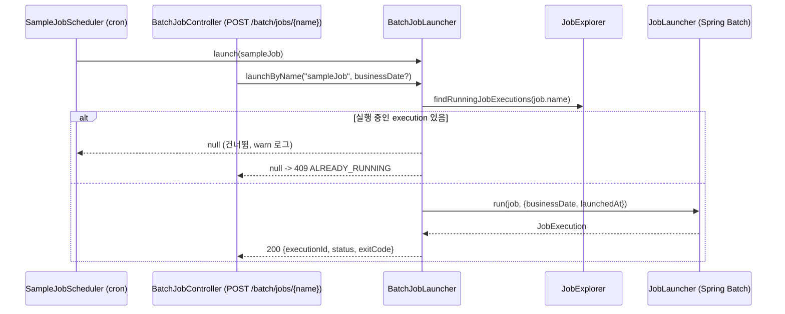

# apps/batch 실행 모듈 설계

- **작성일**: 2026-09-23
- **티켓**: BACKEND-128 (에픽 BACKEND-41 백엔드 멀티 모듈 분리)
- **브랜치**: `feat/BACKEND-128`
- **목표**: Team-Neki-Notification 의 배치 앱 구조를 이 레포의 관례에 맞춰 `apps/batch` 실행 모듈로 가져온다. 알림 발송 로직은 가져오지 않는다.

이 문서는 `apps/batch` 모듈의 경계, 조립 방식, 설정, 메타 테이블 소유, 배포 배선에 대해 다룹니다.

---

## 1. 배경

Team-Neki-Notification 은 별도 레포의 Spring Batch 앱으로, 서버 앱과 같은 PostgreSQL 을 공유하면서 jOOQ 로 서버 소유 테이블을 읽습니다. 구조 자체(cron 스케줄러, 잡 런처, 수동 트리거 API, 기능 플래그, Flyway 가 소유하는 메타 테이블, actuator 프로브)는 잘 잡혀 있지만, 도메인 모델과 리포지터리를 서버 레포와 두 벌로 유지해야 하는 트레이드 오프가 있습니다.

이 레포에 `apps/batch` 를 두면 `:domain` 의 엔티티, 리포지터리, 도메인 서비스를 그대로 재사용할 수 있습니다. 첫 단계에서는 골격과 배선 검증용 no-op 잡만 두고, 실제 잡은 후속 티켓에서 추가합니다.

---

## 2. 모듈 토폴로지

```text
root
├── core                 공유 커널
├── domain               엔티티, 도메인 서비스, 자기 도메인 infra 어댑터
├── apps/api             REST API 실행 모듈 (기존)
├── apps/batch           배치 실행 모듈 (신규, bootJar 만 생성)
└── modules/*            외부 의존성 연결 설정
```

`:apps:batch` 의존:

- `:core`, `:domain` : 도메인 재사용
- `:modules:postgres` : DataSource, JPA, QueryDSL, Flyway
- `:modules:jasypt` : staging/prod 의 `ENC(...)` 복호화
- `spring-boot-starter-batch` : Job, Step, JobLauncher, JobRepository
- `spring-boot-starter-web`, `spring-boot-starter-actuator` : k8s 프로브용 `/actuator/health/{liveness,readiness}` 와 수동 트리거 API
- `logstash-logback-encoder` (runtimeOnly) : staging/prod JSON 로그

`:domain` 이 `modules:{aws,redis,discord,firebase,kakao}` 와 spring-security 를 `implementation` 으로 갖고 있어, 이들이 batch 의 runtime classpath 에 전이로 올라옵니다. 이를 어떻게 다루는지는 4절에서 다룹니다.

---

## 3. 패키지 구조

Notification 은 헥사고날 `adapter/in`, `adapter/out` 을 쓰지만, 이 레포는 `apps/api` 의 `com.neki.api.common.<기능>` 관례를 따르므로 그에 맞춥니다.

```text
apps/batch/src/main/kotlin/com/neki/batch/
├── NekiBatchApplication.kt
├── common/
│   ├── config/SchedulingConfig.kt        @EnableScheduling + 운영 타임존 Clock
│   ├── job/BatchJobLauncher.kt           잡 기동 공용 서비스
│   └── api/
│       ├── controller/BatchJobController.kt  수동 트리거 API (플래그 게이트)
│       └── dto/BatchJobResponse.kt           트리거 API 응답
└── sample/
    ├── SampleJobConfig.kt                Tasklet 하나짜리 no-op sampleJob
    └── SampleJobScheduler.kt             cron 스케줄러 (플래그 게이트)
```

Notification 대응표:

| Notification (`com.neki.notification.batch`)        | 이 레포 (`com.neki.batch`)          |
|------------------------------------------------------|--------------------------------------|
| `modules/scheduling/SchedulingConfiguration`         | `common/config/SchedulingConfig`     |
| `adapter/in/NotificationJobLauncher`                 | `common/job/BatchJobLauncher`        |
| `adapter/in/web/TestNotificationController`          | `common/api/controller/BatchJobController` |
| `adapter/in/scheduler/NotificationJobScheduler`      | `sample/SampleJobScheduler`          |
| `adapter/in/batch/*Job` + `NotificationStepFactory`  | `sample/SampleJobConfig` (팩토리 없음) |

실제 잡이 추가될 때는 `com.neki.batch.<domain>/` 아래에 `*JobConfig` 와 `*JobScheduler` 를 두는 것을 기본으로 합니다. 잡이 여럿 생겨 Reader, Processor, Writer 조립이 반복될 때 그때 팩토리를 도입합니다.

---

## 4. 애플리케이션 조립

### 컴포넌트 스캔 범위를 왜 좁히는가?

`apps/api` 는 `scanBasePackages = ["com.neki"]` 로 classpath 전체를 스캔합니다. batch 가 같은 방식을 쓰면 `:domain` 의 `user/infra/security/config/SecurityConfig` 가 올라오고, 이 설정은 `apps/api` 에만 있는 `CorsConfigurationSource` 빈을 요구하므로 기동이 실패합니다. 또한 `com.neki.config.{aws,redis,firebase,discord}` 의 연결 설정이 각자의 yaml 과 외부 시스템을 요구하게 됩니다.

따라서 batch 는 필요한 것만 스캔합니다.

- `scanBasePackages` : `com.neki.batch`, `com.neki.core`, `com.neki.config.postgres`, `com.neki.config.jasypt`
- `@EntityScan("com.neki.domain", "com.neki.core")` : 엔티티 메타모델
- `@EnableJpaRepositories("com.neki.domain")` : `Jpa*Repository` 프록시 (외부 의존 없음)

실제 잡이 도메인 서비스와 어댑터를 쓰게 되면, 그 도메인 패키지(e.g. `com.neki.domain.photo`)를 `scanBasePackages` 에 명시적으로 추가합니다. 스캔 범위가 곧 batch 가 의존하는 도메인 목록이 되므로, 무엇을 쓰는지가 앱 클래스 한 곳에 드러나는 장점이 있습니다.

### 자동 설정 제외

runtime classpath 에 전이로 올라오는 스타터가 Boot 자동 설정을 켜므로 아래를 명시적으로 제외합니다.

- `SecurityAutoConfiguration`, `UserDetailsServiceAutoConfiguration`, `ManagementWebSecurityAutoConfiguration` : 기본 보안 체인이 actuator 프로브를 401 로 막는 것을 방지
- `RedisAutoConfiguration`, `RedisRepositoriesAutoConfiguration` : `application-redis.yaml` 을 import 하지 않으므로 localhost 로 향하는 유령 커넥션 팩토리와 health indicator 제거

수동 트리거 API 는 인증이 없습니다. Notification 과 같은 전제로, `neki.batch.trigger-api-enabled=true` 인 pod 에서만 빈이 등록되며 k8s Service/Ingress 로 외부에 노출하지 않습니다.

---

## 5. 설정과 기능 플래그

`application.yaml` 은 `application-postgres.yaml`, `application-jasypt.yaml` 만 import 합니다. api 처럼 local/staging/prod 프로파일 문서를 같은 파일 안에 둡니다.

| 키                                    | 기본    | local | staging | prod  | 효과                                          |
|---------------------------------------|---------|-------|---------|-------|-----------------------------------------------|
| `spring.batch.job.enabled`            | `false` | 동일  | 동일    | 동일  | 기동 시 모든 Job 자동 실행 금지                |
| `spring.batch.jdbc.initialize-schema` | `never` | 동일  | 동일    | 동일  | 메타 테이블은 Flyway 가 소유                   |
| `neki.batch.zone`                     | `Asia/Seoul` | 동일 | 동일 | 동일 | `Clock` 과 `@Scheduled` cron 의 타임존       |
| `neki.batch.scheduling-enabled`       | `false` | `false` | `false` | `false` | 스케줄러 빈 등록. 실제 잡이 생기면 운영에서 켬 |
| `neki.batch.trigger-api-enabled`      | `false` | `true` | `true` | `false` | 수동 트리거 API 빈 등록 (pod 내부 전용)       |
| `neki.batch.cron.sample`              | `0 0 4 * * *` | 동일 | 동일 | 동일 | sampleJob cron                             |

플래그는 `@ConditionalOnProperty` 로 기동 시 1회만 평가되므로 값 변경은 pod 재시작으로만 반영됩니다.

테스트(`application-test.yml`)는 api 와 같이 H2 + `ddl-auto: create-drop` + Flyway 비활성이며, 메타 테이블은 `initialize-schema: always` 로 Spring Batch 의 H2 스크립트가 만듭니다.

---

## 6. Spring Batch 메타 테이블과 Flyway

### 공유 DB 에 이미 있는 테이블

Notification 앱은 같은 prod DB 에 자기 전용 history 테이블(`flyway_schema_history_notification`)로 `BATCH_*` 테이블 6개와 시퀀스 3개를 이미 만들어 두었습니다. staging 과 local 에는 없습니다.

이 레포의 Flyway 가 `V31` 으로 같은 테이블을 `CREATE TABLE` 하면 prod 에서만 실패합니다. 선택지는 두 가지였습니다.

| 선택지                                  | 장점                                   | 트레이드 오프                                        |
|-----------------------------------------|----------------------------------------|------------------------------------------------------|
| `spring.batch.jdbc.table-prefix` 분리   | 두 앱의 소유가 완전히 분리됨           | 같은 DB 에 같은 모양의 테이블이 두 벌 생김            |
| 기본 prefix 유지 + `IF NOT EXISTS`      | 테이블 한 벌, Notification 대체 시 자연스럽게 인계 | 두 앱이 같은 테이블을 소유하는 결합. 스키마 변경 시 양쪽 확인 필요 |

**기존 테이블을 이 레포의 Flyway 에 편입하는 후자를 택합니다.** Spring Batch 5.2.2 (Boot 3.5.8) 의 `schema-postgresql.sql` 과 Notification 의 `V2__spring_batch_schema.sql` 이 공백을 제외하고 동일함을 확인했으므로, `V31__create_spring_batch_meta_tables.sql` 은 그 스키마에 `IF NOT EXISTS` 만 붙입니다.

`modules/postgres` 의 마이그레이션은 api 와 batch 가 공유하므로, 먼저 배포되는 앱이 V31 을 적용합니다. 두 앱이 동시에 기동해도 Flyway 락이 직렬화합니다.

---

## 7. 잡 기동 흐름



- `businessDate` : `LocalDate.now(clock)` 기본, 트리거 API 는 쿼리 파라미터로 지정 가능
- `launchedAt` : `clock.millis()`. 매 기동마다 JobInstance 를 유일하게 만들어 "이미 완료된 인스턴스" 예외를 피함
- 중복 기동 방어는 단일 JVM 전제. GitOps Deployment 는 Notification 과 같이 `replicas: 1`, `strategy: Recreate` 로 둬야 함

---

## 8. 테스트

- `NekiBatchApplicationTest` (`@SpringBootTest(RANDOM_PORT)`, H2)
  - 컨텍스트 기동
  - `GET /actuator/health/liveness` 가 인증 없이 200 (보안 자동 설정 제외 검증)
  - `BatchJobLauncher.launch(sampleJob)` 이 `COMPLETED`
  - `POST /batch/jobs/sampleJob` 이 200 (test 프로파일에서 trigger-api 활성)
- `BatchJobLauncherTest` (MockK) : 실행 중인 execution 이 있으면 `null` 을 반환하고 `JobLauncher.run` 을 호출하지 않음

---

## 9. 배포

- `Dockerfile` : `ARG APP_MODULE=api` 로 `COPY apps/${APP_MODULE}/build/libs/*.jar`. 기본값이 api 라 기존 워크플로는 그대로 동작
- `deploy-staging.yml`, `deploy-prod.yml` : `workflow_dispatch` 입력 `app` (`api` | `batch`, 기본 `api`) 을 추가하고, 첫 스텝에서 Gradle 모듈, 이미지 이름, GitOps 경로를 분기
  - api : `yapp-dev` / `neki-prod`, `overlays/<env>/deployment.yaml` (기존 그대로)
  - batch : `neki-batch-dev` / `neki-batch-prod`, `overlays/<env>/batch-deployment.yaml`
- `deploy-prod.yml` 의 `push: main` 자동 배포는 입력이 없으므로 api 로 동작. batch prod 배포는 수동 dispatch 만

이미지 이름 `neki-batch-prod` 는 Notification 레포가 지금 쓰는 이름과 같습니다. 버전 태그(1.0.0 vs 0.0.1-SNAPSHOT)는 겹치지 않지만 `latest` 는 덮어씁니다. GitOps 는 버전 태그를 고정해 쓰므로 실사용 영향은 없으나, **이 batch 가 Notification 을 대체하기 전까지 prod dispatch 는 보류합니다.**

GitOps 레포의 `overlays/{staging,prod}/batch-deployment.yaml` 은 이 작업 범위 밖입니다. 워크플로를 실행하기 전에 매니페스트가 있어야 하며, `image:` 라인은 `sed` 패턴(`image: .*neki-batch-(dev|prod):.*`)과 맞아야 합니다.

---

## 10. 범위 밖

- GitOps 매니페스트 (별도 레포)
- 실제 배치 잡. sampleJob 은 배선 검증용이며 실제 잡이 들어오면 삭제
- ArchUnit 규칙. Gradle 모듈 그래프가 `apps/batch -> apps/api` 의존을 이미 막고, 패키지가 하나뿐이라 지금은 검증할 경계가 없음
- Notification 레포의 알림 잡 이관
