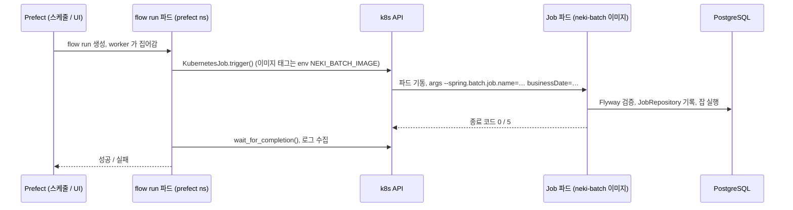

# apps/batch 실행 모듈 설계

- **작성일**: 2026-09-23
- **티켓**: BACKEND-128 (에픽 BACKEND-41 백엔드 멀티 모듈 분리)
- **브랜치**: `feat/BACKEND-128`
- **목표**: Team-Neki-Notification 의 배치 앱 구조를 이 레포의 관례에 맞춰 `apps/batch` 실행 모듈로 가져온다. 알림 발송 로직은 가져오지 않는다.
- **변경 이력**: 처음에는 Notification 과 같은 상주 프로세스(cron 스케줄러, 수동 트리거 API, actuator 프로브)로 설계했으나, 같은 날 Prefect 가 k8s Job 으로 띄우는 one-shot 프로세스로 바꿨다. 상주 모드는 쓰지 않는다.

이 문서는 `apps/batch` 모듈의 경계, 조립 방식, 실행 계약, 메타 테이블 소유, 배포 경로에 대해 다룹니다.

---

## 1. 배경

Team-Neki-Notification 은 별도 레포의 Spring Batch 앱으로, 서버 앱과 같은 PostgreSQL 을 공유하면서 jOOQ 로 서버 소유 테이블을 읽습니다. 구조 자체(Flyway 가 소유하는 메타 테이블, 기능 플래그, 잡 조립)는 잘 잡혀 있지만, 도메인 모델과 리포지터리를 서버 레포와 두 벌로 유지해야 하는 트레이드 오프가 있습니다.

이 레포에 `apps/batch` 를 두면 `:domain` 의 엔티티, 리포지터리, 도메인 서비스를 그대로 재사용할 수 있습니다. 첫 단계에서는 골격과 배선 검증용 no-op 잡만 두고, 실제 잡은 후속 티켓에서 추가합니다.

---

## 2. 모듈 토폴로지

```text
root
├── core                 공유 커널
├── domain               엔티티, 도메인 서비스, 자기 도메인 infra 어댑터
├── apps/api             REST API 실행 모듈 (기존)
├── apps/batch           배치 실행 모듈 (신규, bootJar 만 생성)
└── modules/*            외부 의존성 연결 설정
```

`:apps:batch` 의존:

- `:core`, `:domain` : 도메인 재사용
- `:modules:postgres` : DataSource, JPA, QueryDSL, Flyway
- `:modules:jasypt` : staging/prod 의 `ENC(...)` 복호화
- `spring-boot-starter-batch` : Job, Step, JobRepository, 기동 시 실행하는 `JobLauncherApplicationRunner`
- `logstash-logback-encoder` (runtimeOnly) : staging/prod JSON 로그

web 과 actuator 는 없습니다. 프로세스가 잡을 돌리고 끝나므로 프로브도 HTTP 도 필요 없습니다. `:domain` 이 `spring-boot-starter-web` 과 spring-security, `modules:{aws,redis,discord,firebase,kakao}` 를 `implementation` 으로 갖고 있어 이들이 runtime classpath 에 전이로 올라오는데, 이를 어떻게 다루는지는 4절에서 다룹니다.

---

## 3. 패키지 구조

```text
apps/batch/src/main/kotlin/com/neki/batch/
├── NekiBatchApplication.kt     스캔 범위, 자동 설정 제외, 종료 코드 반영
└── sample/
    └── SampleJobConfig.kt      Tasklet 하나짜리 no-op sampleJob (배선 검증용)
```

Notification 의 스케줄러, 잡 런처, 수동 트리거 API 는 가져오지 않습니다. 그 역할은 Prefect 가 맡습니다 (7절).

실제 잡이 추가될 때는 `com.neki.batch.<domain>/` 아래에 `*JobConfig` 를 두는 것을 기본으로 합니다. 잡이 여럿 생겨 Reader, Processor, Writer 조립이 반복될 때 그때 팩토리를 도입합니다.

---

## 4. 애플리케이션 조립

### 컴포넌트 스캔 범위를 왜 좁히는가?

`apps/api` 는 `scanBasePackages = ["com.neki"]` 로 classpath 전체를 스캔합니다. batch 가 같은 방식을 쓰면 `:domain` 의 `user/infra/security/config/SecurityConfig` 가 올라오고, 이 설정은 `apps/api` 에만 있는 `CorsConfigurationSource` 빈을 요구하므로 기동이 실패합니다. 또한 `com.neki.config.{aws,redis,firebase,discord}` 의 연결 설정이 각자의 yaml 과 외부 시스템을 요구하게 됩니다.

따라서 batch 는 필요한 것만 스캔합니다.

- `scanBasePackages` : `com.neki.batch`, `com.neki.core`, `com.neki.config.postgres`, `com.neki.config.jasypt`
- `@EntityScan("com.neki.domain", "com.neki.core")` : 엔티티 메타모델
- `@EnableJpaRepositories("com.neki.domain")` : `Jpa*Repository` 프록시 (외부 의존 없음)

실제 잡이 도메인 서비스와 어댑터를 쓰게 되면, 그 도메인 패키지(e.g. `com.neki.domain.photo`)를 `scanBasePackages` 에 명시적으로 추가합니다. 스캔 범위가 곧 batch 가 의존하는 도메인 목록이 되므로, 무엇을 쓰는지가 앱 클래스 한 곳에 드러나는 장점이 있습니다.

### 전이 의존성 다루기

- `spring.main.web-application-type: none` : `starter-web` 이 classpath 에 있어도 Tomcat 을 띄우지 않는다
- `SecurityAutoConfiguration`, `UserDetailsServiceAutoConfiguration` 제외 : 쓰지 않는 spring-security 가 기본 사용자와 비밀번호를 만들지 않게 한다
- `RedisAutoConfiguration`, `RedisRepositoriesAutoConfiguration` 제외 : `application-redis.yaml` 을 import 하지 않으므로 localhost 로 향하는 커넥션 팩토리를 만들지 않는다

---

## 5. 실행 계약

프로세스는 기동, 잡 실행, 종료 세 단계로 끝납니다.

```text
java -jar neki-batch.jar --spring.batch.job.name=sampleJob businessDate=2026-09-23
```

- `spring.batch.job.enabled: true` : Boot 의 `JobLauncherApplicationRunner` 가 기동 시 Job 을 실행한다
- `--spring.batch.job.name` : 실행할 Job. Job 이 둘 이상 등록된 상태에서 이름이 없으면 Boot 가 기동을 거부한다
- 나머지 `key=value` 인자 : JobParameters (기본 String)
- 종료 코드 : `main` 이 `exitProcess(SpringApplication.exit(context))` 로 끝나며, Boot 가 등록한 `JobExecutionExitCodeGenerator` 가 Job 상태를 종료 코드로 바꾼다. `COMPLETED` 는 0, `FAILED` 는 0 이 아닌 값. `exit()` 를 거치지 않으면 실패해도 0 으로 끝나므로 빠뜨리면 안 된다
- 재실행 : Job 에 `RunIdIncrementer` 를 둔다. 같은 `businessDate` 로 다시 기동해도 새 JobInstance 로 돌고, 직전 실행이 `FAILED` 면 같은 인스턴스를 재시작한다. 없으면 두 번째 기동이 `JobInstanceAlreadyCompleteException` 으로 죽는다
- 중복 실행 방지 : 프로세스 밖의 책임이다. Prefect deployment 의 concurrency limit 이나 스케줄 간격으로 막는다

`spring.profiles.active` 기본은 `local` 이며 운영은 환경변수 `SPRING_PROFILES_ACTIVE` 로 넘깁니다. `application.yaml` 은 `application-postgres.yaml`, `application-jasypt.yaml` 만 import 합니다.

테스트(`application-test.yml`)는 api 와 같이 H2 + `ddl-auto: create-drop` + Flyway 비활성이며, 메타 테이블은 `initialize-schema: always` 로 Spring Batch 의 H2 스크립트가 만듭니다. 컨텍스트 기동 시 자동 실행은 끄고(`spring.batch.job.enabled: false`) 테스트가 직접 기동합니다.

---

## 6. Spring Batch 메타 테이블과 Flyway

### 공유 DB 에 이미 있는 테이블

Notification 앱은 같은 prod DB 에 자기 전용 history 테이블(`flyway_schema_history_notification`)로 `BATCH_*` 테이블 6개와 시퀀스 3개를 이미 만들어 두었습니다. staging 과 local 에는 없습니다.

이 레포의 Flyway 가 같은 테이블을 `CREATE TABLE` 하면 prod 에서만 실패합니다. 선택지는 두 가지였습니다.

| 선택지                                  | 장점                                   | 트레이드 오프                                        |
|-----------------------------------------|----------------------------------------|------------------------------------------------------|
| `spring.batch.jdbc.table-prefix` 분리   | 두 앱의 소유가 완전히 분리됨           | 같은 DB 에 같은 모양의 테이블이 두 벌 생김            |
| 기본 prefix 유지 + `IF NOT EXISTS`      | 테이블 한 벌, Notification 대체 시 자연스럽게 인계 | 두 앱이 같은 테이블을 소유하는 결합. 스키마 변경 시 양쪽 확인 필요 |

**기존 테이블을 이 레포의 Flyway 에 편입하는 후자를 택합니다.** Spring Batch 5.2.2 (Boot 3.5.8) 의 `schema-postgresql.sql` 과 Notification 의 `V2__spring_batch_schema.sql` 이 공백을 제외하고 동일함을 확인했으므로, `V31__create_spring_batch_meta_tables.sql` 은 그 스키마에 `IF NOT EXISTS` 만 붙입니다.

`modules/postgres` 의 마이그레이션은 api 와 batch 가 공유하므로, 먼저 기동하는 앱이 V31 을 적용합니다. 두 앱이 동시에 기동해도 Flyway 락이 직렬화합니다.

### 새 DB 에서 V1 이 건너뛰어지는 문제

로컬 postgis 이미지는 init 시 `public` 에 `spatial_ref_sys` 를 만듭니다. Flyway 는 history 테이블이 없고 스키마가 비어 있지 않으면 `baseline-on-migrate` 로 버전 1 을 baseline 으로 잡아 V1(`TB_USERS` 생성)을 건너뛰고, V6 의 `ALTER TABLE tb_users` 에서 실패합니다. `application-postgres.yaml` 의 `baseline-version: "0"` 이 이를 막습니다. history 가 이미 있는 DB 에는 영향이 없습니다.

---

## 7. 실행 경로



- 이미지 태그의 원천은 GitOps 다. Server 의 빌드 워크플로가 `overlays/prefect/images.env` 의 `NEKI_BATCH_IMAGE` 를 갱신하고, kustomize 가 ConfigMap 으로 만들어 flow run 파드 env 로 주입한다. flow 는 환경변수만 읽는다
- Job 은 `prefect` 네임스페이스에 만든다. flow run 파드의 ServiceAccount 를 `prefect-worker` 로 두면 기존 Role(Job create/watch/delete, pods/log)로 충분하다
- `JASYPT_PASSWORD` 와 `SPRING_PROFILES_ACTIVE` 는 `prefect-workflow` Secret 과 Job manifest 로 넘긴다
- 이미지는 `ghcr.io/team-neki/neki-batch`, 태그 `<version>-<sha7>`. 패키지는 public (클러스터에 pull secret 없음)

### 배포 워크플로

`.github/workflows/deploy-batch.yml` 이 batch 전용입니다. api 의 `deploy-api-staging.yml`, `deploy-api-prod.yml` (Docker Hub, Deployment 매니페스트. 이번에 `deploy-staging.yml`, `deploy-prod.yml` 에서 개명) 과는 별개로 둡니다.

- `workflow_dispatch` 전용. main 머지 시 자동 배포하지 않는다. `ref` 입력으로 머지 전 브랜치를 올릴 수 있고, `:main` 태그는 main 을 배포할 때만 옮긴다
- bootJar, `APP_MODULE=batch` 로 docker build, `GITHUB_TOKEN` 으로 GHCR push
- GitOps `overlays/prefect/images.env` 의 `NEKI_BATCH_IMAGE=` 줄이 정확히 하나 있는지 확인한 뒤 태그를 바꾸고 커밋한다. 다른 레포의 CI 도 같은 GitOps 레포에 커밋하므로 push 직전 rebase 하고 3회 재시도한다
- GitOps 커밋이 겹치지 않도록 `concurrency` 로 직렬화한다
- Discord 알림은 `DISCORD_WEBHOOK_PROD_URL` 하나로 성공/실패를 보낸다

Prefect flow 와 GitOps `overlays/prefect` 변경(images.env, ConfigMap, base job template, flow run SA, Secret)은 이 티켓 범위 밖이며 별도 티켓으로 진행합니다. 워크플로는 images.env 가 준비되기 전에는 명시적인 오류로 멈춥니다.

---

## 8. 테스트

- `NekiBatchApplicationTest` (`@SpringBootTest`, H2)
  - `sampleJob` 을 `businessDate` 로 기동하면 `COMPLETED`
  - 같은 `businessDate` 로 다시 기동해도 새 JobInstance 로 돈다 (`RunIdIncrementer`)
- `ExitCodeTest` : 기동 시 자동 실행 + `SpringApplication.exit` 경로. 완료된 Job 은 0, 실패한 Job 은 0 이 아닌 종료 코드

---

## 9. 범위 밖

- Prefect flow (Team-Neki-Workflow), GitOps `overlays/prefect` 변경, api 의 GHCR 이관 (deploy-batch.yml 을 본뜨면 됨)
- 실제 배치 잡. sampleJob 은 배선 검증용이며 실제 잡이 들어오면 삭제
- ArchUnit 규칙. Gradle 모듈 그래프가 `apps/batch -> apps/api` 의존을 이미 막고, 패키지가 하나뿐이라 지금은 검증할 경계가 없음
- Notification 레포의 알림 잡 이관
